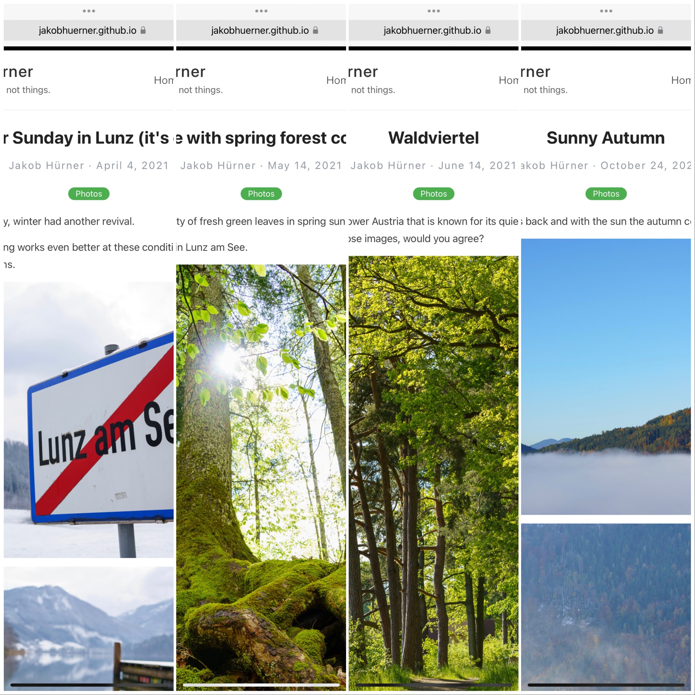

On these pages, [jakobh](https://www.twitter.com/jakobh) shares selected photos and writes about his thoughts and experiences with digital photography.

Focus: How casual photographers can make their photographic lives remarkably lean & easy nowadays, allowing them to focus more on the __moment__ (pictures), and less on __things__ (equipment).

## Where should I start?

I recommend to start with a photographic trip through the seasons!

- Starting with [winter](../easter_sunday_winter_lunz_2021/),
- continuing with [spring](../spring_forest/),
- and when [summer](../waldviertel_impressions/) is in full glory,
- [autumn](../autumn/) is soon here as well.

Alternatively, you can check out my technical posts about [The leanest & highest quality casual photography setup (2020)](../leanest_highest_quality_casual_photography_setup/).
Or you read some history lessons about [how I got into photography](../my_personal_photography_history/).

Have fun and feel free to reach out to [me](https://www.twitter.com/jakobh).

  
    <article class="post">
      <a href="{{ site.baseurl }}{{ post.url }}">
        <h1>{{ post.title }}</h1>

        

          
{{ post.date | date: "%B %e, %Y" }}

        

      </a>
      

        {{ post.excerpt }}
      

      <a href="{{ site.baseurl }}{{ post.url }}" class="read-more">Read More</a>
    </article>
  

  <!-- pagination -->
  
  

    
      <a href="{{ paginator.previous_page_path | prepend: site.baseurl | replace: '//', '/' }}">&laquo; Prev</a>
    
      &laquo; Prev
    

    
      
        {{ page }}
      
        <a href="{{ '/' | prepend: site.baseurl | replace: '//', '/' }}">{{ page }}</a>
      
        <a href="{{ site.paginate_path | prepend: site.baseurl | replace: '//', '/' | replace: ':num', page }}">{{ page }}</a>
      
    

    
      <a href="{{ paginator.next_page_path | prepend: site.baseurl | replace: '//', '/' }}">Next &raquo;</a>
    
      Next &raquo;
    
  

  

