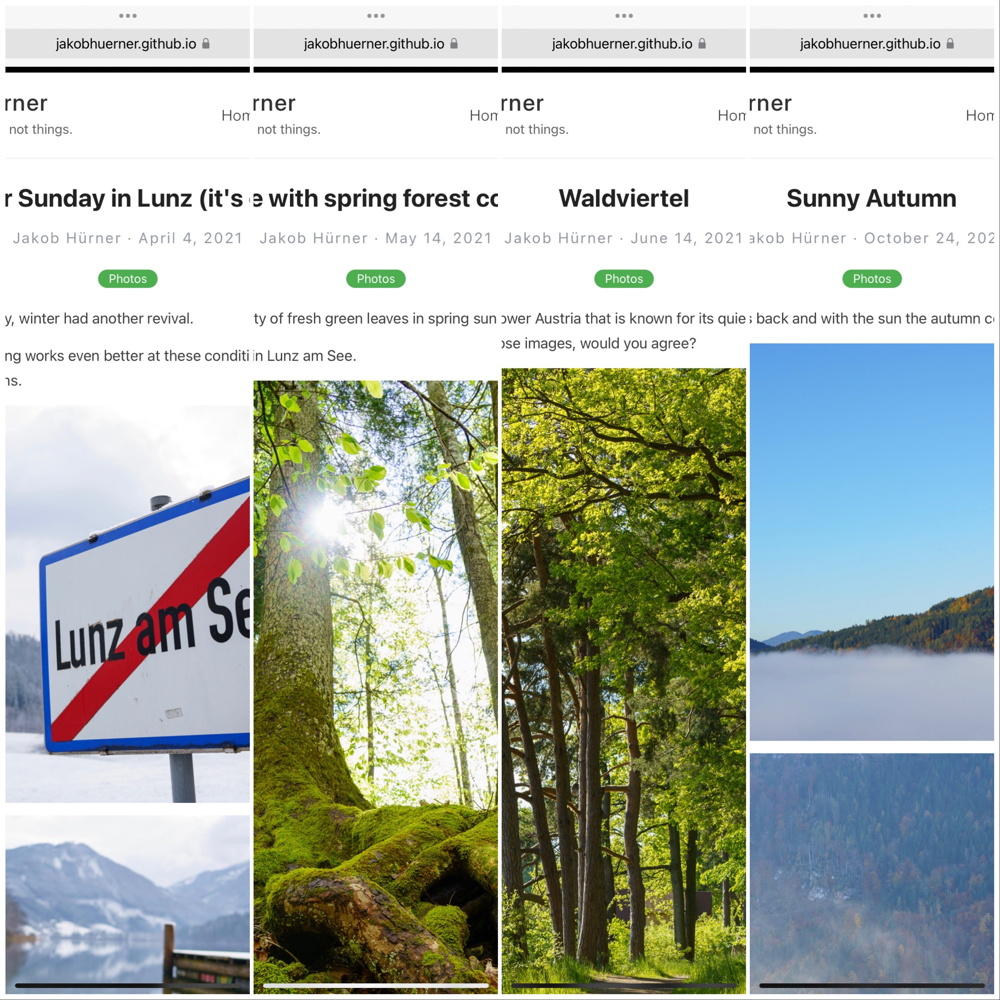

On these pages, I share selected photos and writes about his thoughts and experiences with digital photography.

Focus: How casual photographers can make their photographic lives remarkably lean & easy nowadays, allowing them to focus more on the __moment__ (pictures), and less on __things__ (equipment).

[Find an overview of all posts by category here!](../allposts)

## Where should I start?

I recommend to start with a photographic trip through the seasons!

- Starting with [winter](../easter_sunday_winter_lunz_2021/),
- continuing with [spring](../spring_forest/),
- and when [summer](../waldviertel_impressions/) is in full glory,
- [autumn](../autumn/) is soon here as well.

Alternatively, you can check out my technical posts about [The leanest & highest quality casual photography setup (2020)](../leanest_highest_quality_casual_photography_setup/).
Or you read some history lessons about [how I got into photography](../my_personal_photography_history/).

Have fun and feel free to reach out to [me](https://www.twitter.com/jakobh).

