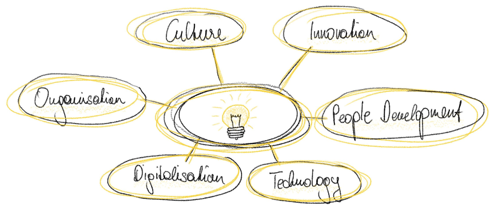

After my school and university education within technology and industrial engineering, I started my career in an international group in the steel industry. While already 10 years with the company, I had a wide variety of roles within industrial management, based at the group's Vienna headquarters and at a production site in Sweden.

At the moment, I am leading a team of highly skilled and dynamic individuals that drives strategic topics within our global company group.

Over the years I have developed an increasing interest in all things digital, both by taking on roles concerning digitalisation and by postgraduate education in Data Science.

In the course of my career I helped shaping activities and programs that significantly increase efficiency and reduce the environmental footprint of the company group. I develop teams and programs within the global company network and establish completely new capability fields for the group. 

## My strength

I see my core strength in "connecting the dots". I am good at identifying patterns in unfamiliar, opaque and messy situations. I enjoy most when I am able to successfully re-apply proven ideas and concepts from foreign fields, after understanding their similarities with the problem at hand.

Going hand in hand with the point above, I am always interested in understanding systems below the surface, the systems' actors, and their connections. Only by understanding systems and their dynamics, you are able to effectively shape them in a permanent and sustainable way.

## Professional blog

I am writing about various aspects of my work, new work and career in my [professional blog on LinkedIn](https://www.linkedin.com/pulse/welcome-jakobs-linkedin-blog-updated-lists-all-posts-jakob-h%C3%BCrner/).

It not only helps me reflect on my challenges and my professional development. I also want to share my experiences so that others can benefit from it. 

#### List of posts (external links)

*   [My professional journey from mechanical engineering to management of digitalisation and data science programs](https://www.linkedin.com/pulse/my-professional-journey-from-mechanical-engineering-data-jakob-h%C3%BCrner/)
*   [3 competences I could carry over from mechanical engineering to digitalisation and data science](https://www.linkedin.com/pulse/3-competences-i-could-carry-over-from-mechanical-data-jakob-h%C3%BCrner/)
*   [3 competences I had to acquire when changing from mechanical engineering to digitalisation and data science](https://www.linkedin.com/pulse/3-competences-i-had-acquire-when-changing-from-data-science-hürner)
*   [How to deal with remote and remote-only work settings](https://www.linkedin.com/pulse/how-deal-remote-remote-only-work-settings-jakob-h%C3%BCrner)
*   [A practical approach to Data Quality](https://www.linkedin.com/pulse/practical-approach-data-quality-jakob-h%25C3%25BCrner/)
*   [What photography taught me about technology](https://www.linkedin.com/pulse/what-photography-taught-me-technology-jakob-h%25C3%25BCrner)
*   [A year in review in 3 illustrations](https://www.linkedin.com/pulse/year-review-3-illustrations-jakob-h%C3%BCrner?lipi=urn%3Ali%3Apage%3Ad_flagship3_detail_base%3BGGdva%2Bv1QBO4DBQWKFLsjQ%3D%3D)
*   [Use the right tool for the (communication) job](https://www.linkedin.com/pulse/use-right-tool-communication-job-jakob-h%C3%BCrner/)
*   [Using modern ways to communicate novel and complex topics in a corporate environment](https://www.linkedin.com/pulse/using-modern-ways-communicate-novel-complex-topics-corporate-h%C3%BCrner)
*   [What I have learnt about career and health & fitness](https://www.linkedin.com/pulse/what-i-have-learnt-career-health-fitness-jakob-h%2525C3%2525BCrner)
*   [3 of my learnings for most relaxing holidays](https://www.linkedin.com/pulse/3-my-learnings-most-relaxing-holidays-jakob-h%25C3%25BCrner)
*   [Facilitate learning and free up your mind by consistently maintaining personal notes](https://www.linkedin.com/pulse/facilitate-learning-free-up-your-mind-consistently-personal-h%25C3%25BCrner)
*   (continuously updated, approx. 1 post per month)
