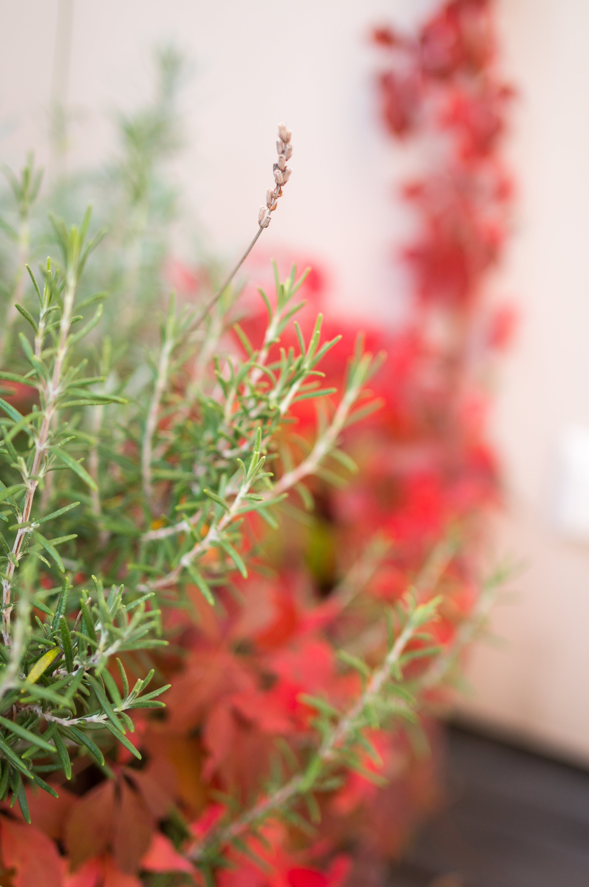

After I have spent a lot of time on photography and cameras in the past, I almost gave up on more ambitious photography in recent years. On the one hand because there is not so much spare time on hand for a young father. On the other hand due to the fact the cameras in our pockets (i.e. smartphones) got so incredibly good and thus reduce the need for a bulky DSLR.

Now some new technological developments - mainly camera hardware and editing software solutions - converged to a really promising package that convinced me to step into a dedicated camera setup again.

My requirements were that this package had to be portable, deliver really high quality photos (otherwise there is no point choosing a camera over a smartphone) and it should be „lean“ in the sense that the whole workflow is as simple and frictionless as possible. I did not look for the cheapest option, but one that really delivers on my requirements.

My type of photography can be described as rather casual. I want to take nice pictures of our family, of hiking trips and travel and from time to time spend some time to do more artistic landscape and nature photography. 

Considering all of the above, I have found the almost perfect setup for me by using
- the Sony A7C  - the smallest full-frame interchangeable lens camera on the market 
- the Sony FE 1.8/35mm - a compact and versatile lens with great optical quality
- the Sony FE 1.8/85mm - same as the 35 but at 85mm
- Adobe Lightroom (on iPad, PC and iPhone) - powerful RAW workflow tool that keeps the complexity of storing, synching and backing up your photos in the background by a robust cloud sychronisation

In the coming weeks I will describe in a bit more detail why I have chosen this setup and provide some considerations for other casual photographers that want exceptional quality in a practical and lean setup.

For the time being, let's start with some pictures from the setup above. Click to access the full-sized JPEGs (exported from Lightroom).

(../images/something_new.jpg)