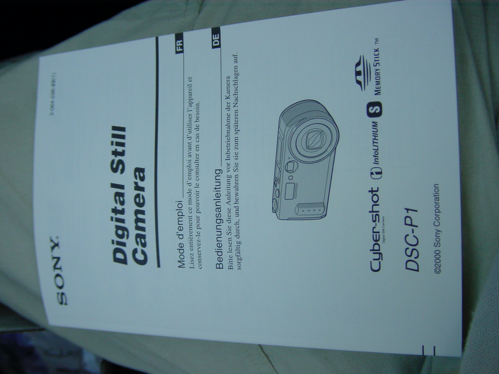
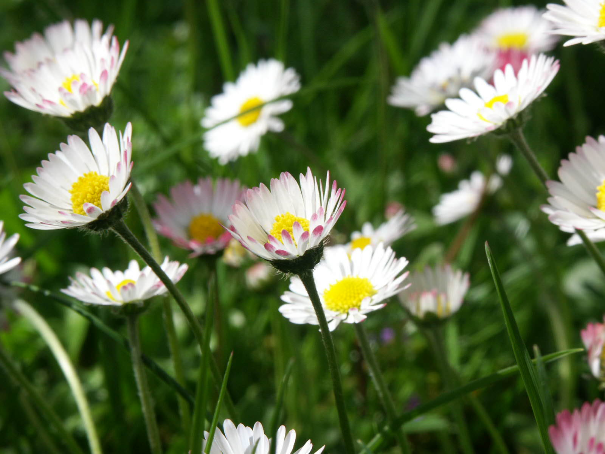
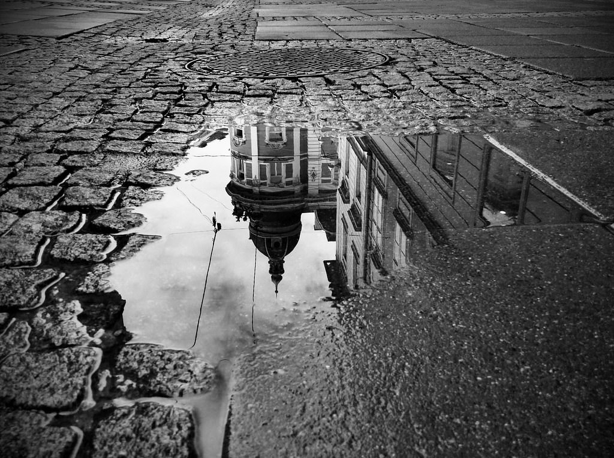
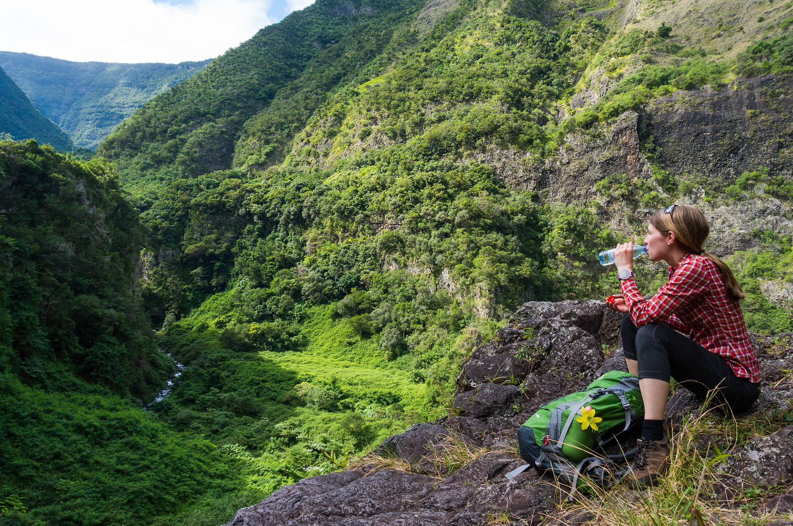

My personal history of digital photography and photo sharing started almost 20 years ago (this even suprised me when I started thinking about it). I started photography with mainly a technology interest in the beginning, and this is up to this day a motivating factor for me. I like tech and modern equipment, the "artistic" side of photography developed over time. So my look back in this post is also based on the equipment side in the beginning.

_Fun-Fact_: Maybe this tech-driven approach is also the reason why I was never interested in analogue photography. In fact, I never really used an analogue camera and film. My entry into photography was digital from day one.

### 2001

This day one was in summer 2001, when I got my first digital camera, the Sony DSC-P1. I was 13 years old back then, and I guess my marks in school must have been quite decent to justify that present. I was actually one of the first people in my hometown who had a digital camera. This was a totally novel thing back then, unbelievable today.

The [DSC-P1](https://www.dpreview.com/reviews/sonydscp1) was already a quite nice and usable camera. It featured a 3 MPx sensor and a 3x zoom lens and saved images on a 8 MB flash drive, which I later replaced with a 64 MB one.

<iframe width="720" height="405" src="https://www.youtube-nocookie.com/embed/YrdZUIsUBF0" title="YouTube video player" frameborder="0" allow="accelerometer; autoplay; clipboard-write; encrypted-media; gyroscope; picture-in-picture" allowfullscreen> </iframe>

A review of the DSC-P1 from 2022 perspective.

My first photo with the camera I deleted obviously, but here's the file called "DSC00002.JPG" 

### 2003

Within two years later my interest in photography grow that I wanted to get more serious about camera equipment. In this time the [Minolta DiMAGE 7i](https://www.dpreview.com/reviews/minoltadimage7i) was a hot and still affordable camera for enthusiast hobbyists. Better image quality, a nice 28-200 equiv. lens and a cool look made me spend my saved money on this new camera. I think, this was the actual step into more ambitious photography for me. Image results with this camera were quite decent. The big weakpoint were the batteries; a set of 4 AA NiMH batteries was good for 50 pictures or so. Meaning, you were always better off having 12, or in winter conditions preferrably 15 batteries in your bag.

In this year I also started sharing my pictures online using a personal blog - long before this term was really understood or used at least in Austria. :-)
It started with some html pages and overcompressed jpeg images, but it created some attention within my personal environment. Sharing images publicly globally within minutes was something completely new back then.
I still remember how my first website looked, unfortunately I have not archived the pages back then.

### 2004

My big wish at this time was a DSLR camera, which was not reachable for me due to the price of such an equipment back then. However, in 2003 things came together: Canon released a stripped-down amateur version of their semiprofessional DSLR model; I earned some (little) money with photography already and had found someone who wanted to purchase my Minolta. That was the perfect opportunity to step up the ladder and go for a DSLR, the [Canon EOS 300D](https://www.dpreview.com/reviews/canoneos300d).
Quite quickly it became clear that the key ingredient for a good photography setup are the lenses.

### 2005

Many surely remember: In the 2000s internet forums were a big thing. They were something like early social media before this term was coined and became a mass phenomenon. I spent a many, many hours sharing photos and discussing photography topics in photography forums, which felt like cosy photography clubs where all participants got to know each other quite well over time. They were not limited to online, I for example organised local physical meetups too. It was a great time with lots of learning concerning photography for me, that slowly came to end when other social media services entered the stage.

### 2006

Sharing photos in several online channels became more and more important to me. It helped me in my photography journey by getting feedback from different people both online and offline. To acocunt for that, I needed to upgrade my photography blog technically and chose to switched to Wordpress. The Wordpress project was 3 years old back then and not as ubiquitous as today. 

Photography equipment-wise my setup grew to a assortment of quite fine equipment that kept very stable for several years to come. Canon EOS EOS 30D, Canon EF 4/17-40mm L, Canon EF 4/70-200mm L IS, Canon EF 1.4/50mm, Sigma 2.8/90mm Makro and the EOS 300D as backup (I haven't sold it by today due to nostalgic feelings ...)

### 2008 

In 2008 hosting and managing all my pictures on my Wordpress page got more and more difficult and also expensive due to webserver costs, that's why I decided to go for Flickr to host my pictures (and also to archive them in addition to local storage). Over the years my Flickr stream filled with thousands of pictures, and several of them also generated some reach on the platform. If you are interested, [in this "Most Popular" album](https://www.flickr.com/photos/jakobhuerner/albums/72157639081126315) you can see some of my most viewed and liked pictures on Flickr.

### 2010

In 2010 I chose to update my meanwhile dated cameras with an entry-level Canon EOS 550D which was fine for my type of photography. As for everyday photography I wanted to have something high-quality and ultraportable, I chose to get a compact camera Canon PowerShot S95 as well. It featured a really good lens and sensor, as well as RAW capabilities that allowed for some very good pictures. 

### 2011

Having said that, around the same time a new era in photography arose - the era of smartphone photography. While early smartphones had decent cameras to snap quick shots, they improved so rapidly over the years that the difference between phones and camera shrank with every new model.

Actually at some point, the surplus quality of my S95 over the iPhone less and less justified taking two devices with me at all times. In the end, my camera equipment stayed home more and more.

### 2013

By 2013 I really adopted a very casual style of photography. I sold all DSLR equipment (except the 300D) and the S95 and chose to go mainly for iPhone photography and for a really compact, APS-C sensor camera Sony NEX-3N with a small but decent 16-50mm lens.

During this time I taught myself focusing more on composing the picture, finding the right angle, the right timing and ... ultimately the right light. In the end I personally enjoyed taking photos with my phone as much as I enjoyed taking photos with my cameras.

I think it was a "healthy" development in my photography journey - maybe also just a sign of growing up and becoming more patient. ;-)

### 2016

In the coming years photography was basically split in two categories: everyday photos (with the iPhone), and photos of travels and trips (with the Sony NEX-3N). In the end I would guess that I took 95% of all photos with my phone, the rest with the NEX-3N.
It was in the end the mentioned trade-off of portability vs. additional quality as well as the trade-off between maximum quality in RAW-postprocessing vs. convenience of shooting JPEG on the phone, that lead to leaving the camera at home most of the time.

### 2018

At this time convenience won over photographic ambition. I shared photos predominantely with family and friend via messaging services, and with a wider, partly photography interested audience over Twitter. 

So I chose to discontinue my website and also my Flickr stream. It still feels right, and allowed me to open my mind to new aspects of life - especially time for my family. 

<blockquote class="twitter-tweet">
Das Leben ist Veränderung, manchmal schließt man Kapitel. So mache ich es nun mit <a href="https://twitter.com/hashtag/Flickr?src=hash&amp;ref_src=twsrc%5Etfw">#Flickr</a>. Es war eine gute Zeit. <a href="https://t.co/9y4eDd661k">https://t.co/9y4eDd661k</a> <a href="https://t.co/fUKKkfDUqf">pic.twitter.com/fUKKkfDUqf</a>
&mdash; Jakob (@jakobh) <a href="https://twitter.com/jakobh/status/1074286126230323200?ref_src=twsrc%5Etfw">December 16, 2018</a></blockquote>  

### 2020

As [explained before](../leanest_highest_quality_casual_photography_setup), in 2020 finally some things came together that motivated me getting into more ambitious photography again. In short: mainly time and the availability of a lean & at the same time highest quality casual photography setup.
It is the time to make up another step on the quality ladder into full-format, and combining it with 20 years of experience in photography.

*Final thought*: It is a lot of fun and feels really good being able to spend more time and passion on photography again. 
