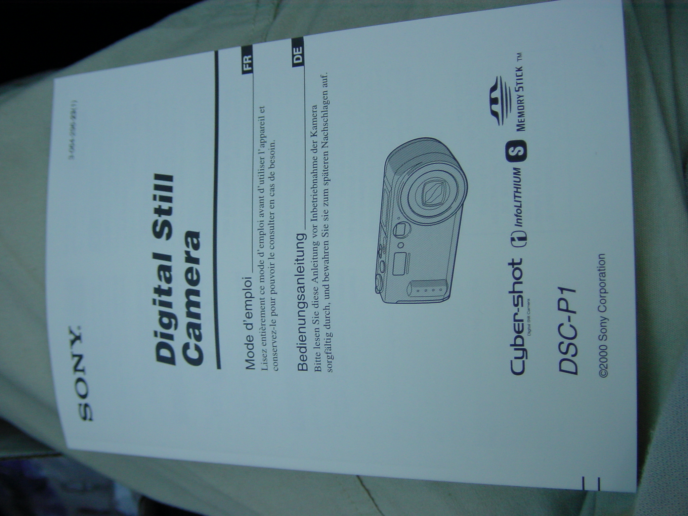

My personal history of digital photography and photo sharing started almost 20 years ago (even suprises me when thinking about it).
In fact, I never really used an analogue camera and film. My entry into photography was digital from day one.

### 2001

This day one was in summer 2001, when I got my first digital camera, the Sony DSC-P1. I was 13 years old back then, and I guess my marks in school must have been quite decent. I was actually one of the first people who had a digital camera in my hometown. This was a thing back then, unbelievable today.
The [DSC-P1](https://www.dpreview.com/reviews/sonydscp1) was already a quite nice and usable camera. It features a 3 MPx sensor and a 3x zoom lens and saved images on a 8 MB flash drive, which I later replaced with a 64 MB one.
The first photo with the camera I deleted obviously, but here's the file called "DSC00002.JPG" 

### 2003

In this year I started sharing my pictures online using a personal blog - long before this term was really understood or used at least in Austria. :-)
It started with some html pages and overcompressed jpeg images, but it created some attention within my personal environment. Sharing images publicly globally within minutes was something completely new back then.
I still remember how my first website looked, unfortunately I have not archived the pages back then.

