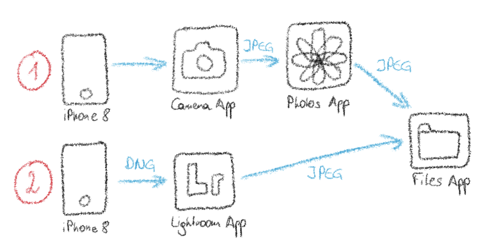

As a casual photography who strives for high image quality, I wanted to try out two possible paths to take and edit photos on the iPhone. I did a non-scientific test in which I took photos with my iPhone 8 on a cloudy December day with very flat light in two ways:

* Path 1) using the standard Camera app and editing possibility with the Photos app (JPEG workflow)
* Path 2) using Adobe Lightroom App and its editing features (DNG workflow)

In both ways I edited the picture as I would do it normally to match my taste.

The results can be found here:

Test Photo 1 - Path 1:

Test Photo 1 - Path 2:

Test Photo 2 - Path 1:

Test Photo 2 - Path 2:

Test Photo 3 - Path 1:

Test Photo 3 - Path 2:

Generally, the path 1 (integrated apps) produced much punchier pictures, I even turned down contrast in the editing step, especially for the last picture. Also as it looks like the iPhone applies much more generous sharpening with larger - „bolder“ - sharpening radius. Path 2 (Lightroom) images appear less punchy. Especially the details are rendered considerably finer and more subtle sharpening is applied, although I turned it up to 56 in Lightroom. Moreover, in the tricky lighting conditions even the iPhone-DNG files seem to provide more headroom to correct the exposure afterwards, as you would normally expect from RAW/DNG data.

Overall both approaches have their strengths. It takes slightly less time to go path 1, but also 2 does not add a lot of overhead. Image quality-wise I would considers 2 superior to 1. In both scenarios 
Main difference for me is that the integrated Camera app feels snappier than LR (at least on the older iPhone 8), which will make me choose path 1 more often than path 2.
