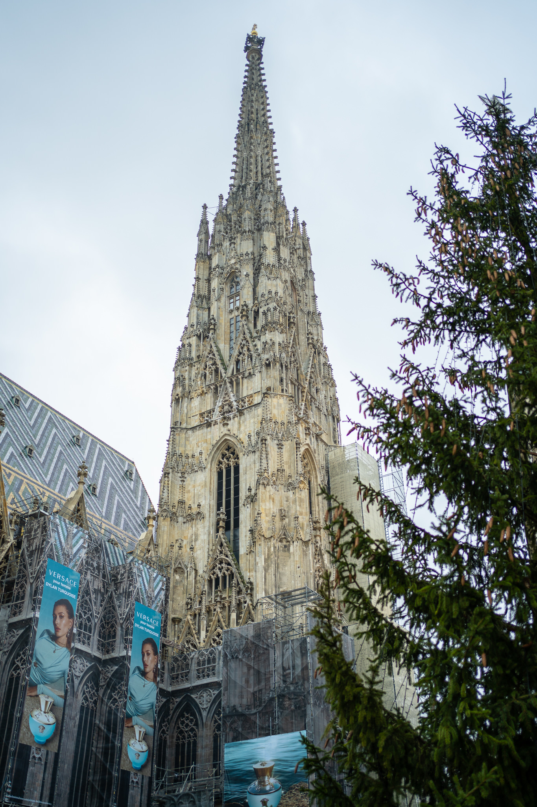
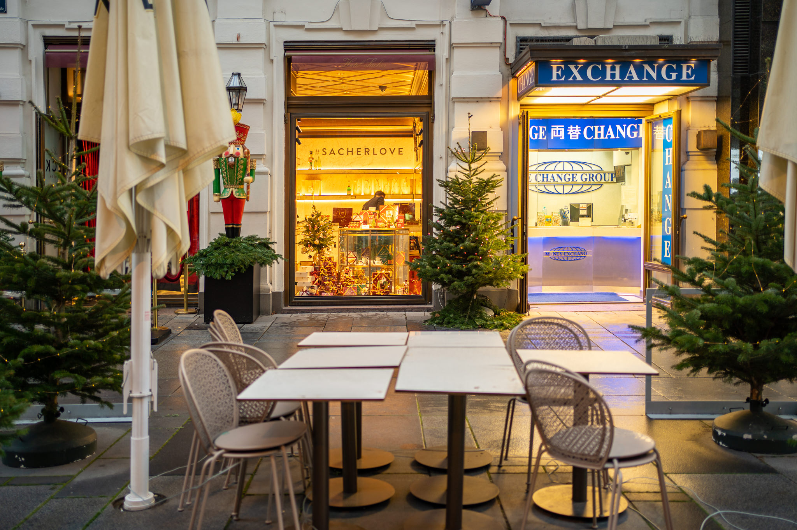
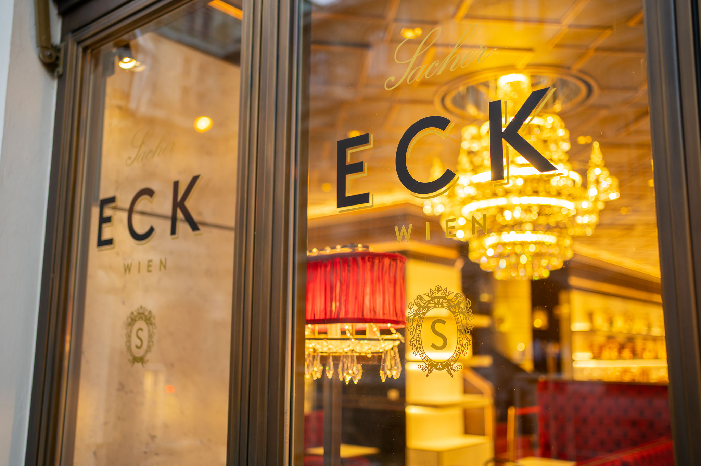
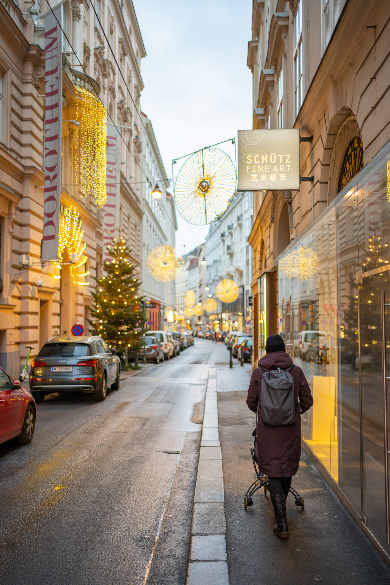
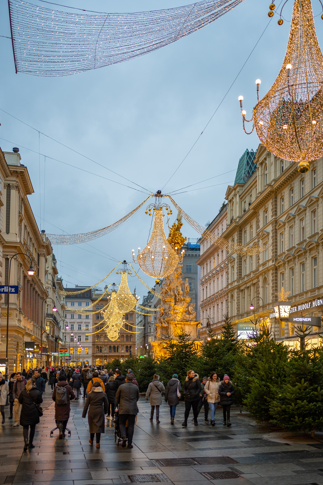
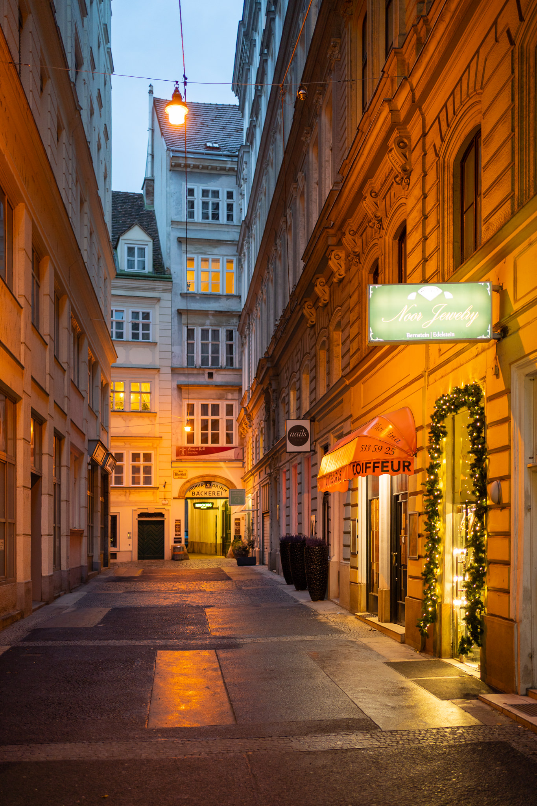
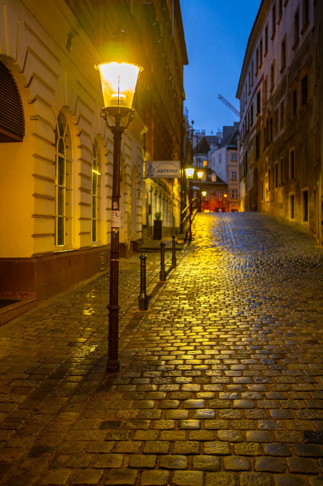

The Christmas season in Vienna is beautiful, some even say magical. Both Vienna residents and tourists enjoy the weeks before Christmas for strolling through the city, having Glühwein and do some Christmas shopping. Normally.
This year, the decorated city looks almost the same as a year ago, but feels totally different. 

In the end, I found something that was truly the same as last year. Something to hold on to. ;)

All pictures taken with the Sony A7C and the Sony FE 1.8/35mm.
