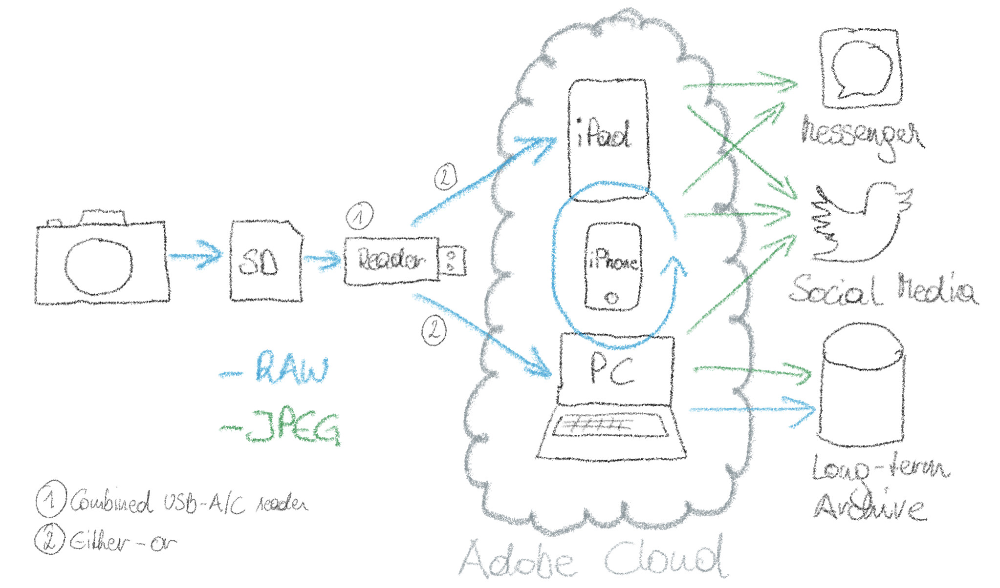

As [described before](https://jakobhuerner.github.io/leanest_highest_quality_casual_photography_setup/), I was looking for a digital photography workflow, that yields highest quality photos and at the same time does not create a huge manual workload and complexity in the process.

Major Requirements
* Highest image quality, utilising the full potential of the used camera and its RAWs - my goal of photo processing is to make the final images look like I remember the scene (I don’t do artistic/“over-photoshopped” photos)
* Convenient photo management tools for keeping a good overview
* Frictionless exchange of photos in a multi-device setup
* Robust and future-proof solution, so I do not have to adapt constantly or switch in near future again

I have found a great solution for a lean and convenient RAW workflow with Adobe Lightroom.

## History

I used the “old” Lightroom (now called Lightroom Classic) from the time it was initially released in 2007. The processing possibilities were great right from the start (and got better with every release), combined with the photo management/workflow approach it has shown huge potential from the beginning. Handling larger collections of photos was not always easy, as it was a purely local setup that relied on local files and catalogs. Additionally, you as the user had to take care of all file management, backups etc.

## Transition to the cloud

Convenience made a huge leap when Lightroom with cloud support emerged. I am sure it was a business decision (Adobe makes more and constant revenues with cloud subscriptions than with a one-time license model) and it has obvious downsides to put everything to a vendor’s cloud - but from the aspect of end user convenience it is just great. The hassles of keeping local files and catalogs, synchronising them, making frequent backups, … just disappear. 

## Current setup

The following sketch illustrates my current RAW workflow as of late-2020.

As you can see, the Adobe Lightroom apps and the cloud synchronisation is in the center of the workflow.
Pictures are transferred from the camera’s memory card via card reader either to the PC or to the iPad. There the automatic synchronisation of the original RAWs to the Adobe cloud and the distribution to all Lightroom apps on all devices is triggered. Of course only (editable, so called smart-) previews are downloaded in the first place, on demand the original RAWs are then pulled to the device. In the apps on the different devices I then export JPGs to different channels.

The only thing that is left for me as a manual job is the long-term archive, for which I prefer to keep it vendor-neutral and to take care of it on my own. So I do not use Lightroom as a long-term archive as such. Having said that, I keep the files there indefinitely, as the 1TB storage still provides space for the years to come.

## Downsides

The described setup works really well for a casual photographer like me. While it delivers on all above mentioned requirements, some downsides must be taken into account.
* The dependency on Adobe is obviously large. As with every software-as-a-service product you obviously have significant vendor lock-in. To mitigate this, I strongly recommend taking care of the long-term archive based on open/standard solutions.
* Getting your RAW files out from Lightroom works reasonably well by the standard apps (for a few photos) or an available stand-alone download tool for Windows or Mac (for all photos in your account). For the latter I would wish for more possibilities like downloading all photos of one year instead of just “all”.
* The price tag of 12 €/month for the apps and 1TB cloud storage is not exactly cheap.

## Conclusion

Overall, for me personally the pros outweigh the cons by far. In my attempt to get the [“leanest & highest quality casual photography setup”](https://jakobhuerner.github.io/leanest_highest_quality_casual_photography_setup/) the element Adobe Lightroom blends into the setup perfectly and makes all further steps lean, convenient, and frictionless once the pictures are on the camera’s memory card.
