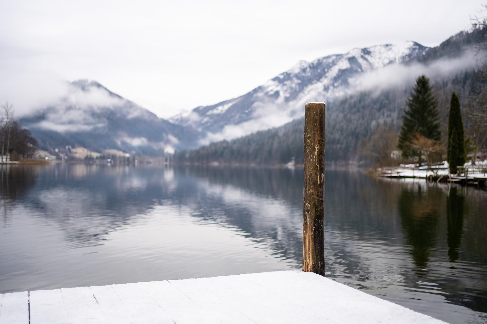
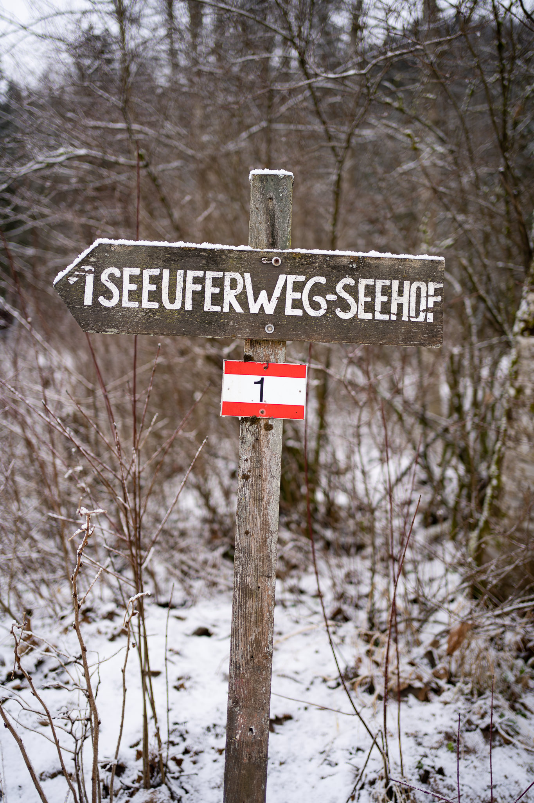
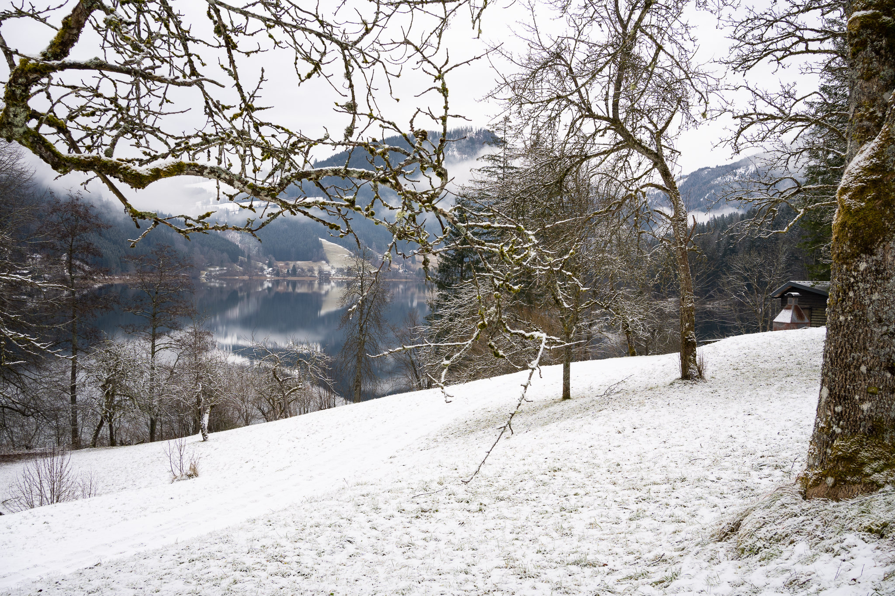
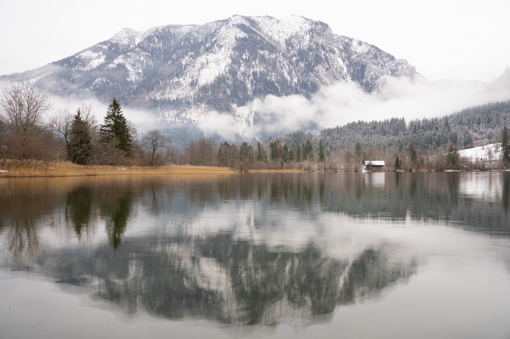

Walk around the cold Lake in Lunz am See.

But the lake is still good for water sports (if you do not mind some sub-zero degrees).

<blockquote class="twitter-tweet">
Unerschrockende Seefahrer ❄️  (am Lunzer See) <a href="https://twitter.com/hashtag/LunzAmSee?src=hash&amp;ref_src=twsrc%5Etfw">#LunzAmSee</a> <a href="https://t.co/dBg6JTbh0b">pic.twitter.com/dBg6JTbh0b</a>
&mdash; Jakob (@jakobh) <a href="https://twitter.com/jakobh/status/1344278298357080064?ref_src=twsrc%5Etfw">December 30, 2020</a></blockquote>  

All pictures taken with the Sony A7C and the Sony FE 1.8/35mm.
