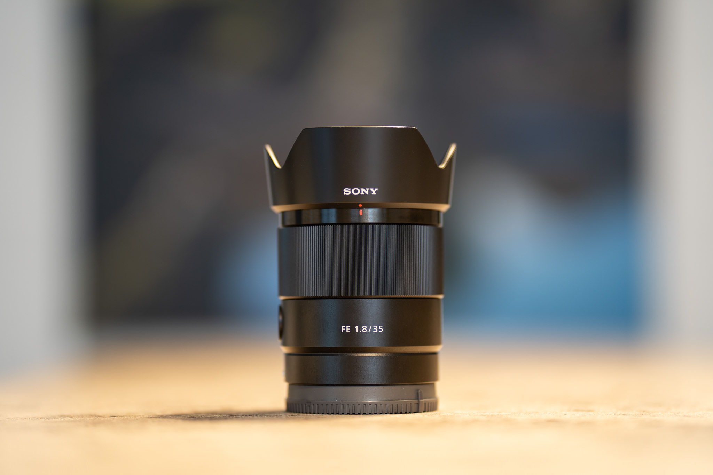
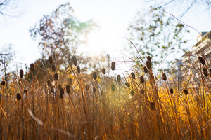
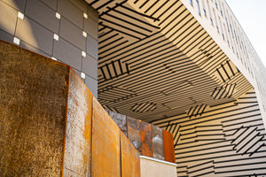
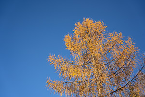
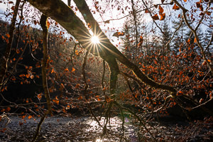
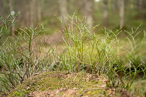
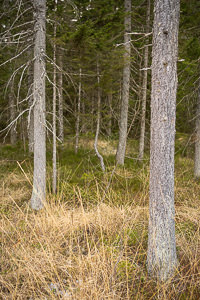
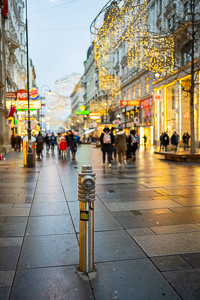
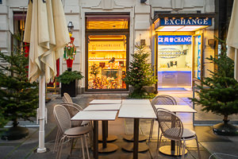

The following lines reflect my impressions on the Sony FE 1.8/35mm, which I use in combination with the Sony A7C.
As [written before](https://jakobhuerner.github.io/leanest_highest_quality_casual_photography_setup/), I would describe my kind of photography not as ultra-ambitious, but as __casual__ paired with a high expectation to image quality. 

Coming from this direction, it means for me that I need a lens for everyday use, that is both portable enough not to be a burden and optically excellent. I have found this for the Sony A7C full-frame camera with the Sony FE 1.8/35mm.

## Plus and minus

What I like:
- Portability: the Sony 1.8/35mm is relatively light and not too big; it creates a comfortable package with the rather small A7C.
- Build quality: It looks and feels solid due to metal as primary material, Sony also promises basic water-resistance.
- Autofocus: AF is extremely fast and silent.
- Minimum focus distance: The lens can focus rather close objects, which makes it an even better allrounder.
- Sharpness: Wow, this lens is sharp, even fully open at F1.8. 

What I do not like:
- Vignetting: a downside is some vignetting (darker edges) at F1.8, which is however easily controllable with automated lens corrections in Lightroom.
- CA: especially wide open there are purple fringes at high-contrast edges.

## My conclusion

I am impressed by this lens. If I compare it to similar mid-range lenses that I used for years on my Canons, this lens plays in another league. I am personally very much into sharpness as central optical quality, and I was used to stopping down fast lenses at least one full aperture stop for good sharpness. Not this one, concerning sharpness at all apertures this lens scores 10/10 for me.

Overall, the 1.8/35mm on the A7C delivers the perfect all-rounder package for me, with portability and excellent image quality at a handy focal length for everyday use.

## Samples

Below you‘ll find some samples with the Sony FE 1.8/35mm on the Sony A7C. I applied my normal processing using Adobe Lightroom and developed the RAWs according to my taste.
Click to access the full-sized image.

