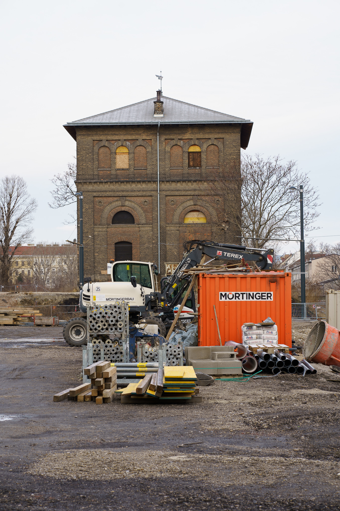
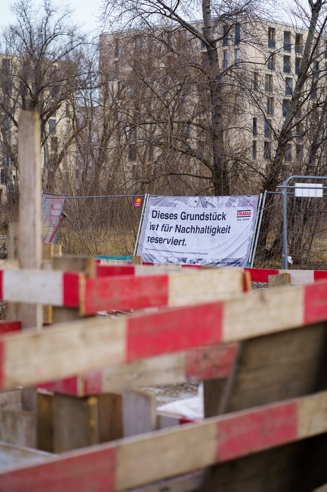
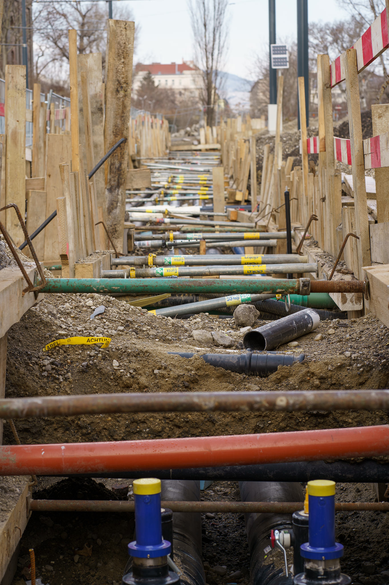
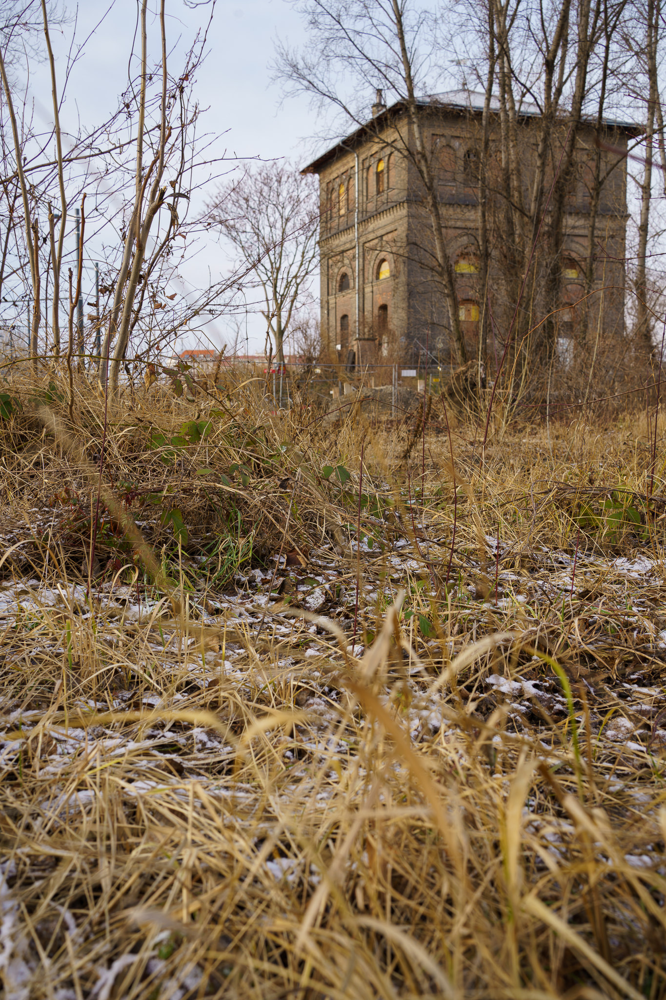
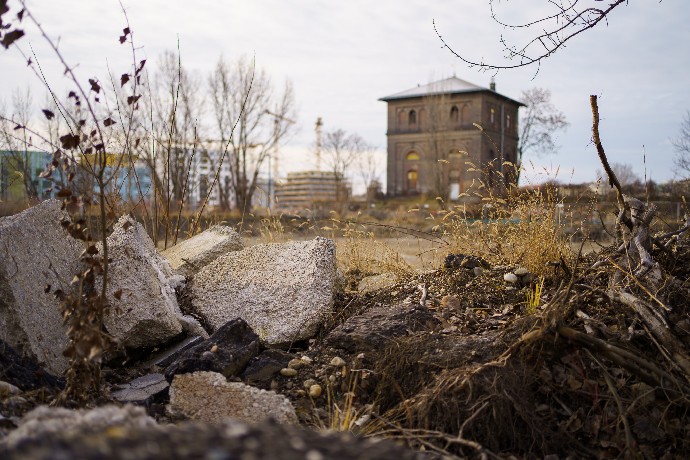
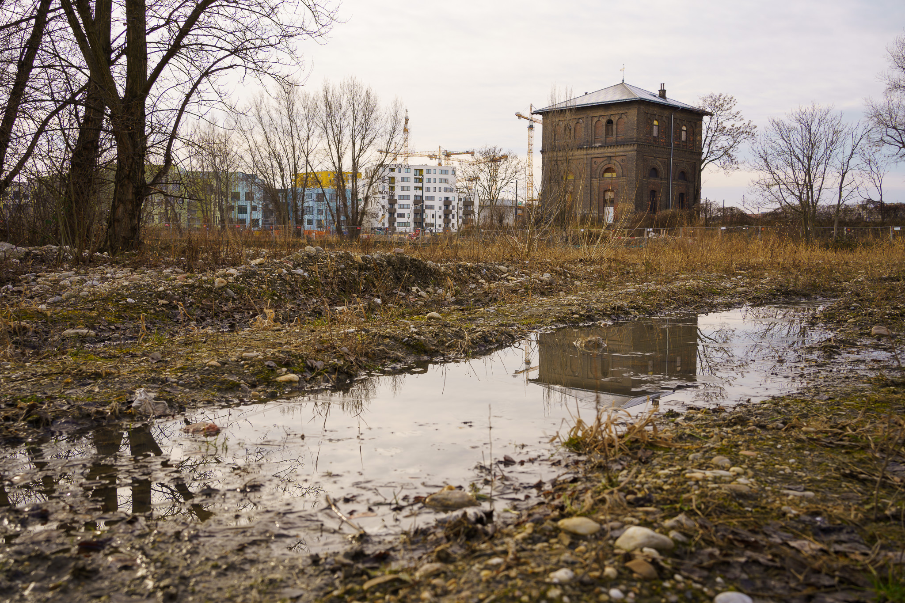

Some images of the construction around the historic water tower, the landmark which will be the center of the "Freie Mitte", a large new park of 10 hectares. 

Pictures taken with the Sony A7C and the FE 1.8/35mm and FE 1.8/85mm.
