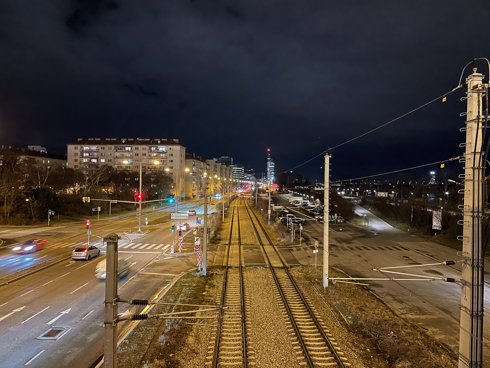
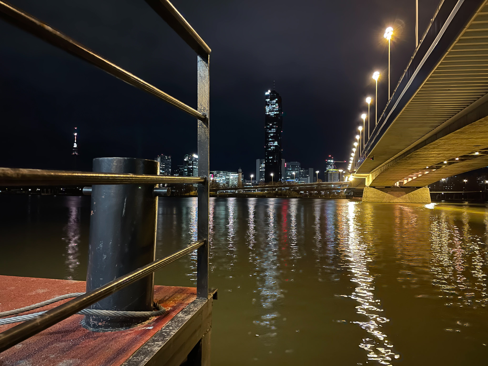
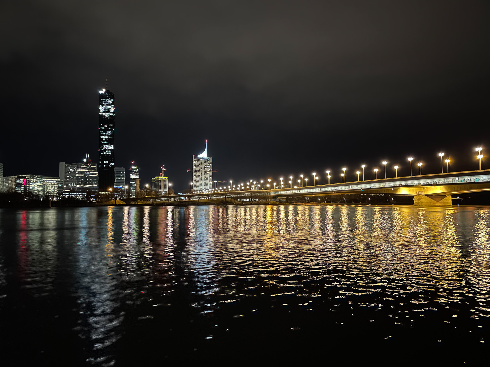
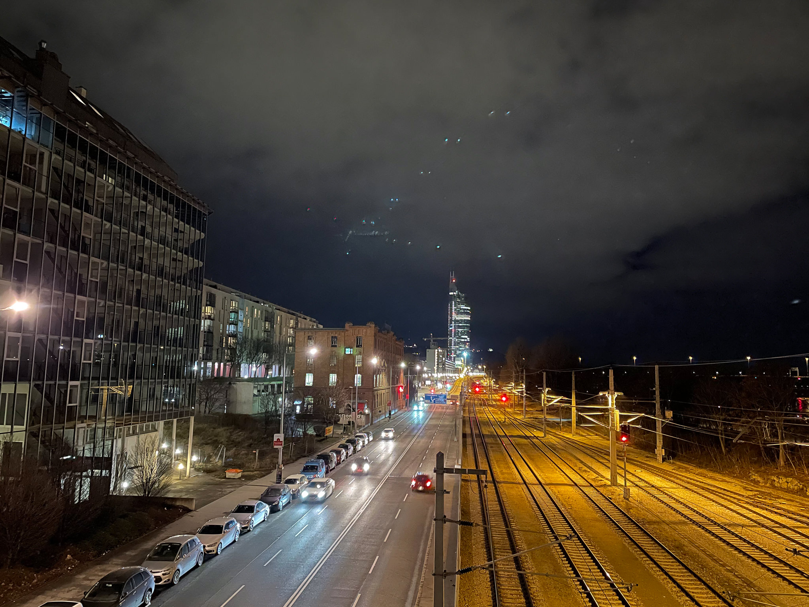

Getting some fresh air after a homeoffice day.

Noteworthy: All images are taken handheld with the iPhone. Simply sensational how far smartphone photography (computational photography) has come!

In the last picture you find some ghosting in the evening sky from the cars' headlights. In cases like this one you still see the limitations of a smartphone. However, that's not a big issue - it would take <30s to remove those flaws from the picture.

Picture taken in February 2021 with the Apple iPhone 12 mini and the standard camera app.
