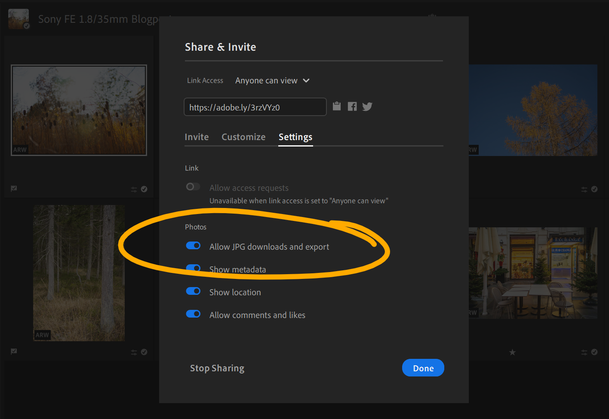
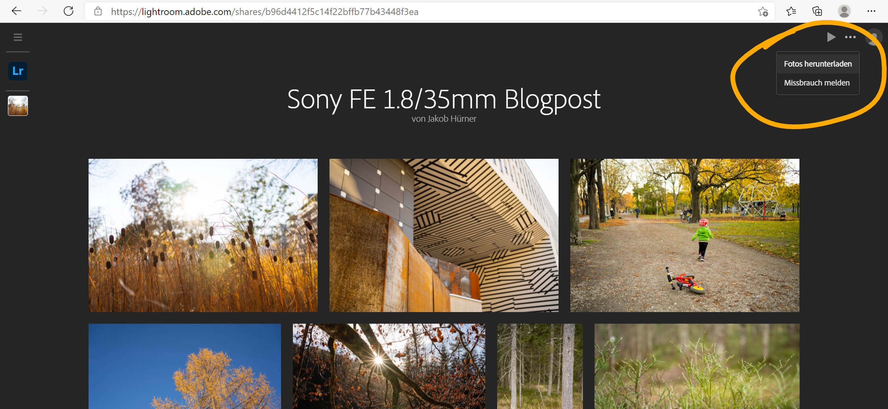

For [my kind of photography](../leanest_highest_quality_casual_photography_setup/), taking RAW files and managing & editing them with Adobe Lightroom on my computer and mobile devices is a perfect choice. 

However, a general downside of a RAW workflow is the significant processing time for exporting to JPEG, especially if the to-be-converted number of images is large.
For certain cases I have found a nice trick to handle these bulk conversion within seconds.

## Prerequisites and possible use cases 

The described functionality relies on Adobe Lightroom with Adobe cloud synchronisation, and is available once the upload is finished.

A typical use case for me is a bulk export of images of a period for a secondary backup location, which holds all images in medium JPEG quality. Another one would be a quick export of an album to share with family or friends. 

## How-to and brief performance test

Normally you are able to download JPEGs from Lightroom online just one by one. The web view of shared album, however, allows you to download the whole album at once as zip.

- Step 1: Select album for bulk JPEG conversion
- Step 2: "Share & Invite"
- Step 3: Enable sharing with link and apply "Allow JPEG downloads and export"
 

- Step 4: Open created link
- Step 5: Download via the three-dots-menu on the upper right corner

- Step 6: In Lightroom, disable sharing via "Stop Sharing" in the "Share & Invite" menu again
- Step 7: Done :)

I put this setup to a test with 10 RAWs from the Sony A7C on my Microsoft Surface Laptop (Intel Core i5 with 8GB, 150 MBit/s internet connection):

- Local conversion: 118 seconds (roughly 2 minutes)
- Cloud download: 20 seconds

## Limitations

Big benefit of this trick is the really quick export. However, a few limitations do apply:
- JPEG quality is medium, I would roughly compare it with the JPEG quality setting 70% in Lightroom
- Manually added metadata like keywords or captions is not exported (camera EXIF are properly written into JPEGs)
- There are no file naming options, the original file name will be used

All in all, this option comes in handy in use cases as described above, when you just want the quickest possible conversion of your edited RAWs from Lightroom.
