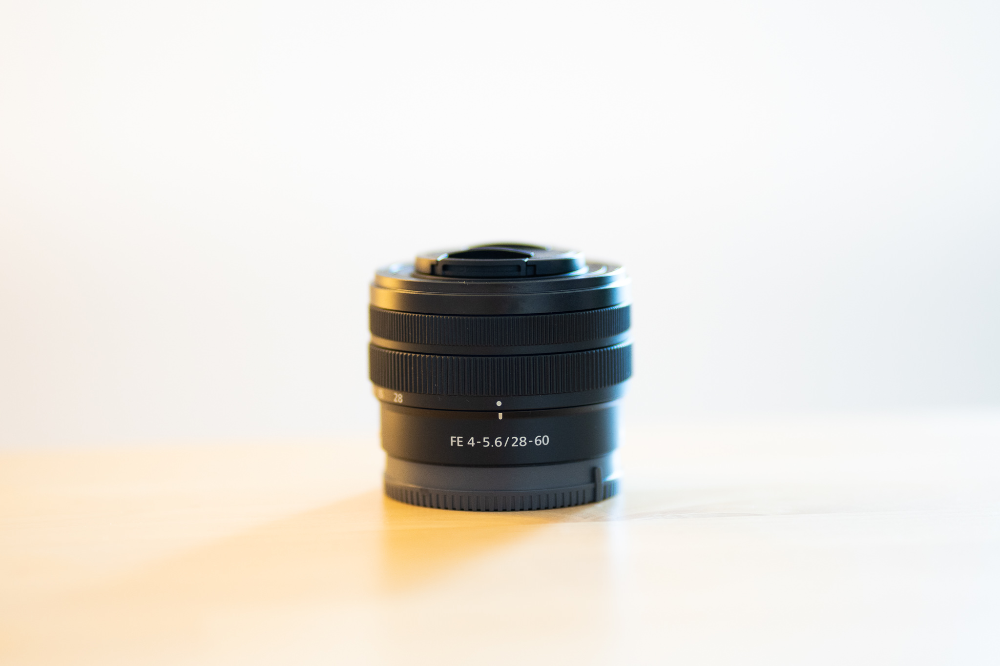
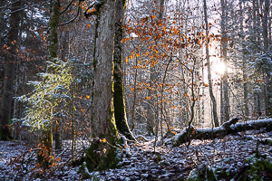
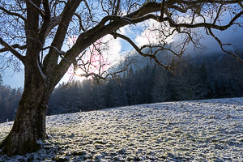
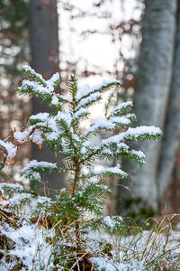
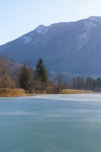
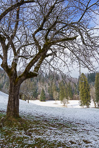
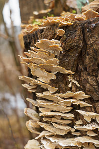
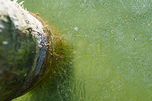
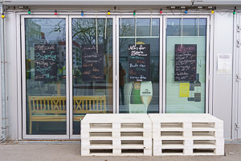
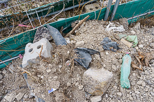

When I bought the Sony A7C, it was meant for a [lean and high-quality photography setup](../leanest_highest_quality_casual_photography_setup/).

Part of this package must be, besides a handy and capable camera, a nice and small all-round lens. For this purpose I have bought the camera with the kit lens Sony FE 4-5.6/28-60mm.

Actually, I have used the 28-60mm much less than anticipated. This is mainly due to the qualities of the other lenses in my bag, the Sony 1.8/35mm and 1.8/85mm, and does not imply that the 28-60mm is a bad lens. But let’s look closer.

## Plus and minus

What I like:

- It is really compact. I mean really really compact for a full-frame zoom lens.
- The optical quality is good, based on my workflow with post processing lens corrections in Lightroom it delivers appealing results.
- Especially its sharpness is quite good for a lens of this type, which is important to me.
- Despite being plasticy, the lens is solid.
- Autofocus is fast and accurate.

What I do not like:
- Generally a 2x zoom lens is sort of a strange thing. Sometimes it feels equally feasible to just use the fabulous 1.8/35mm and crop the image afterwards - you'll get similar results. (Still, the package is larger.)
- Distortion is hefty, but that's no big problem in my Lightroom workflow.
- I would love to have a shorter minimum focus distance, which would be great for example for detail shots at hiking trips.
- Its look is not the nicest, sometimes I think it looks almost comically small on a full-frame body and also a bit cheap.
- Did I say cheap ... that is something the lens is not, but for its qualities reasonably it is priced in my point of view.

Distortion at 28mm: original shot and corrected version in Lightroom (correction works fully automatic in my workflow)

## My conclusion

With all its downsides, this lens is still delivering on the major requirements for me - being really compact and producing high-quality results on a full-frame camera body. While in normal situations my lenses of choice will be the primes, the Sony FE 4-5.6/28-60mm will be on my camera whenever I will only bring the smallest possible full-frame camera+lens package with me, for travelling, family trips, hiking and the like.

## Samples

Below are some samples taken with the Sony A7C and the Sony FE 4-5.6/28-60mm. I applied my normal processing using Adobe Lightroom and developed the RAWs according to my taste. Click to access the full-sized image.

