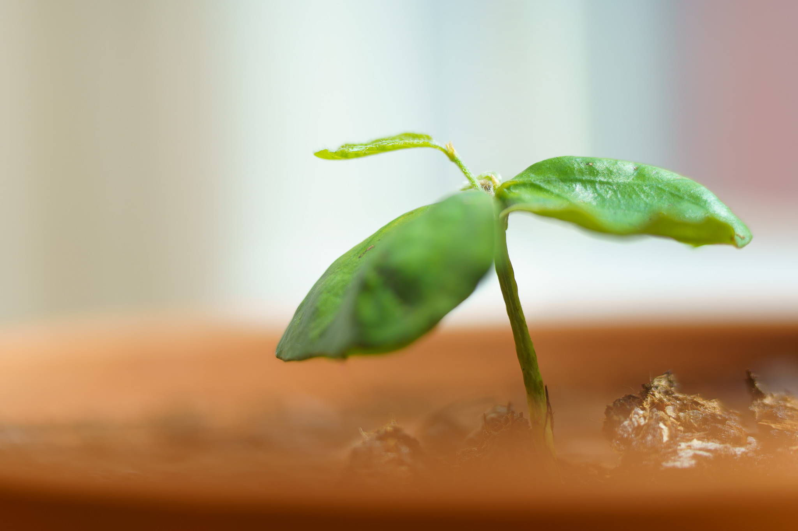
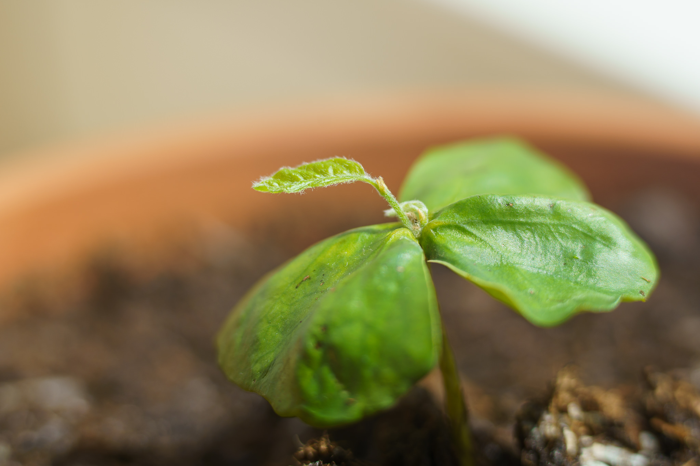
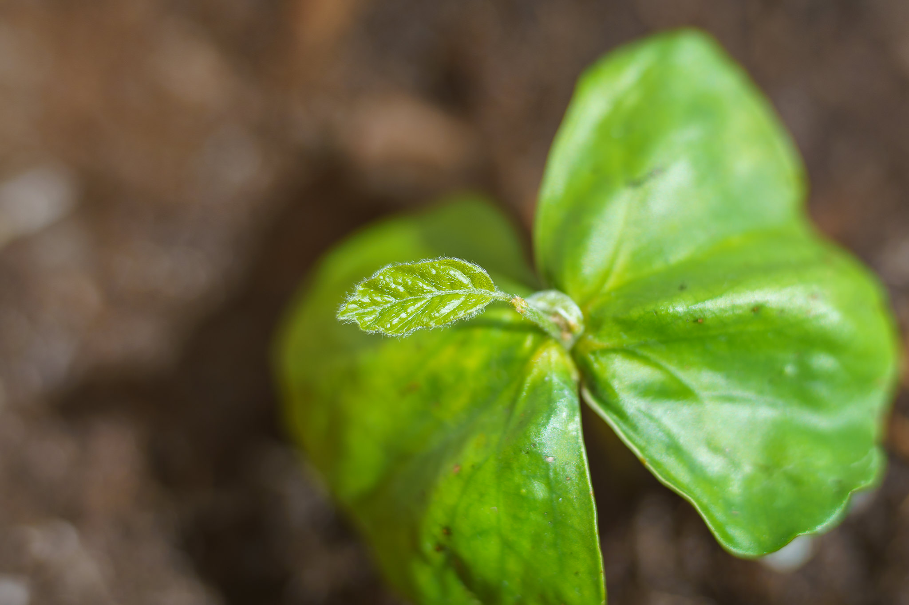

*Start small and grow* is a principle that is true for most things in life.
Even a large and strong beech*) tree, in this case "born" at Vienna's Lainzer Tiergarten, starts as a tiny and fragile sprout.

*) At least I think it is a beech, in 1-3 years from now I hopefully know definitely.

Picture taken with the Sony A7C and the FE 1.8/85mm with 10mm+16mm extension tubes.
