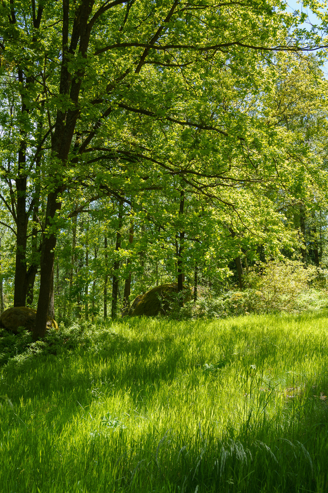
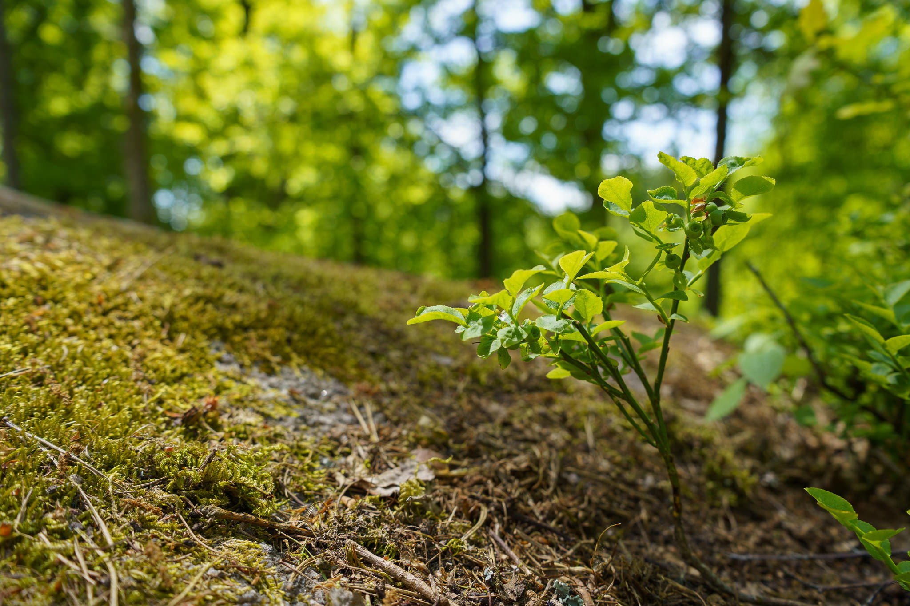
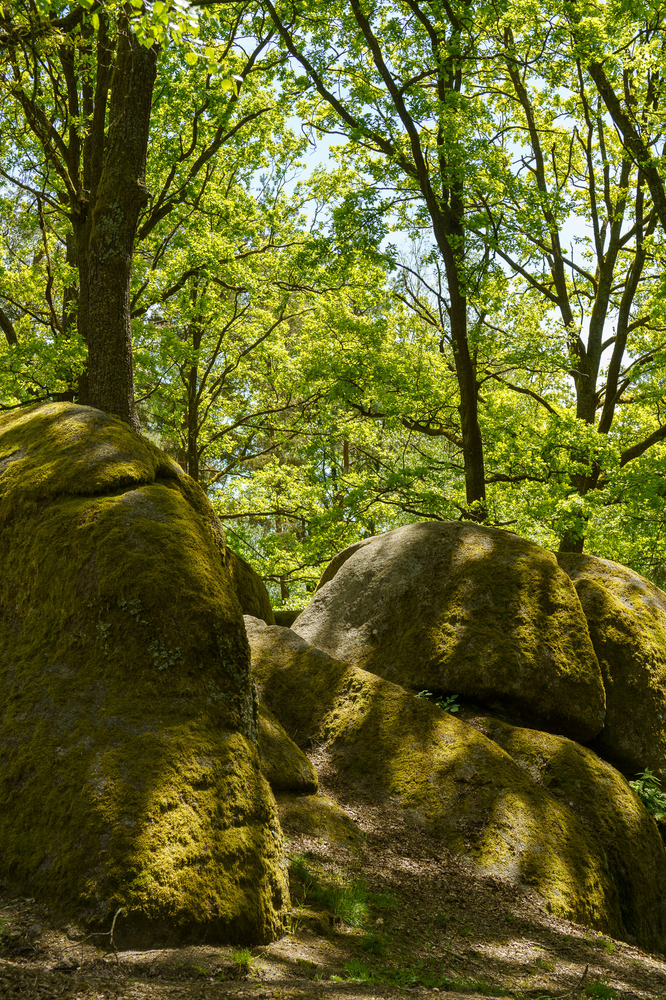
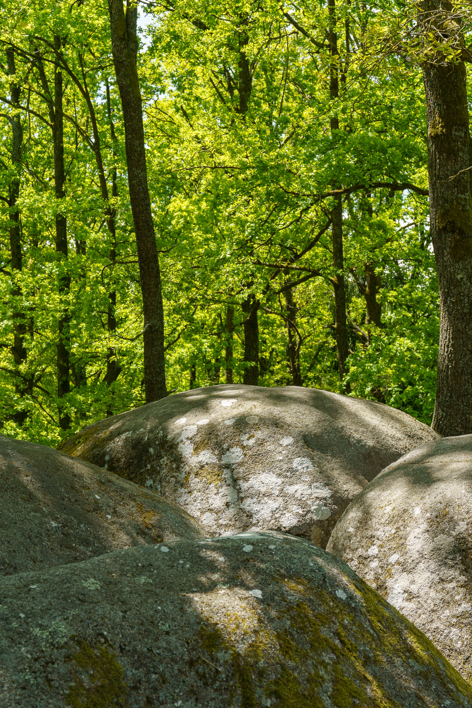
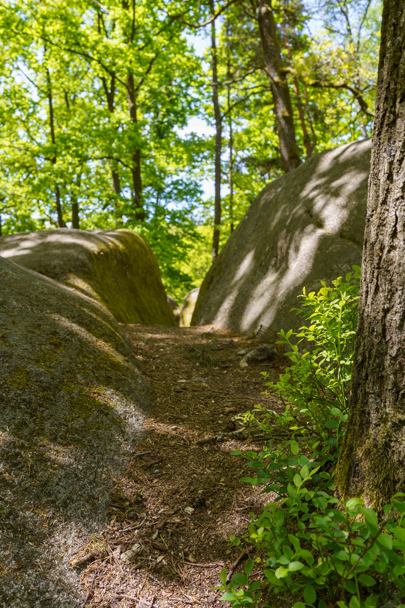
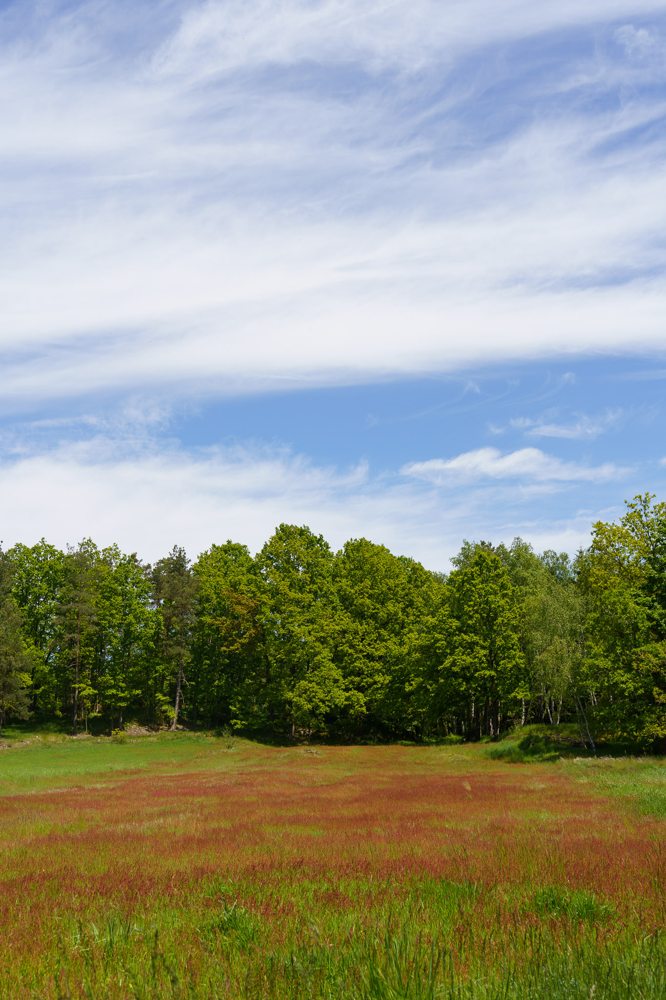

Blockheide is a very special place with rich nature and famous giant granite blocks in Lower Austria's Waldviertel region. It is especially beautiful in summer - but see for yourself!

Pictures taken with the Sony A7C and the Sony FE 4-5.6/28-60mm.
