After a rainy day, the sun is back and with it the autumn colours we all love. :)

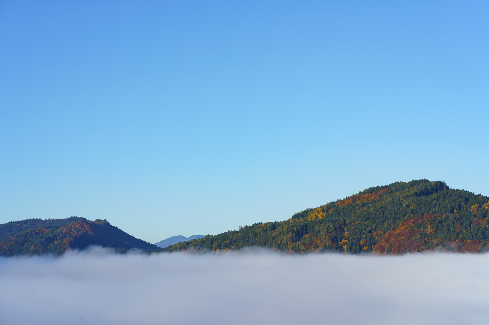

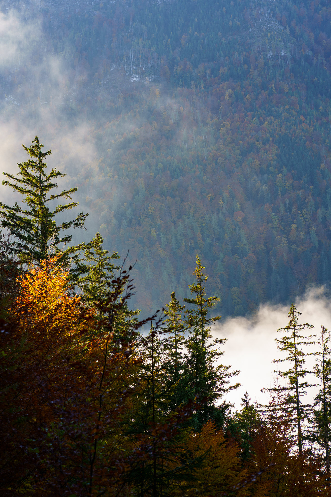

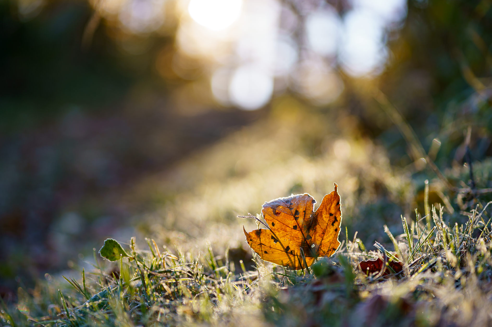

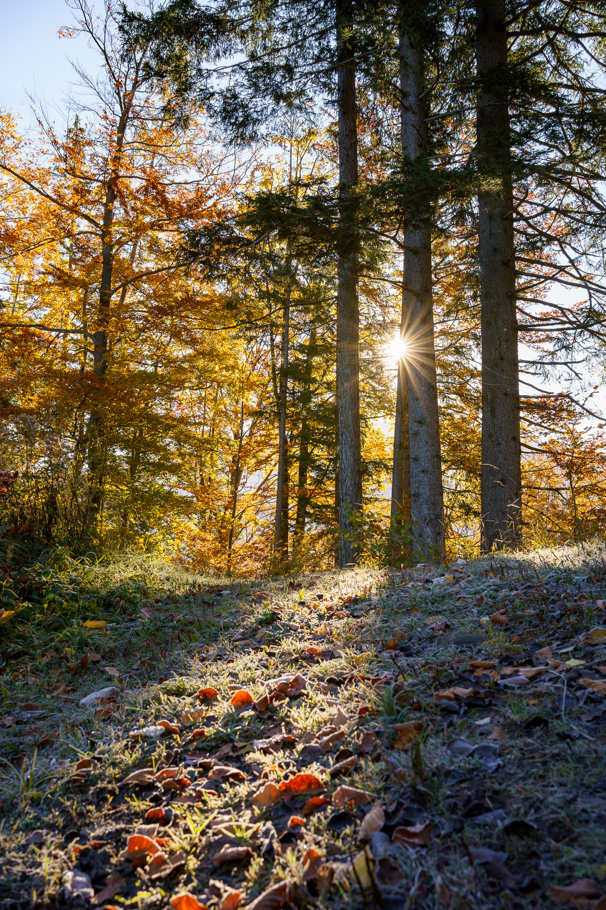

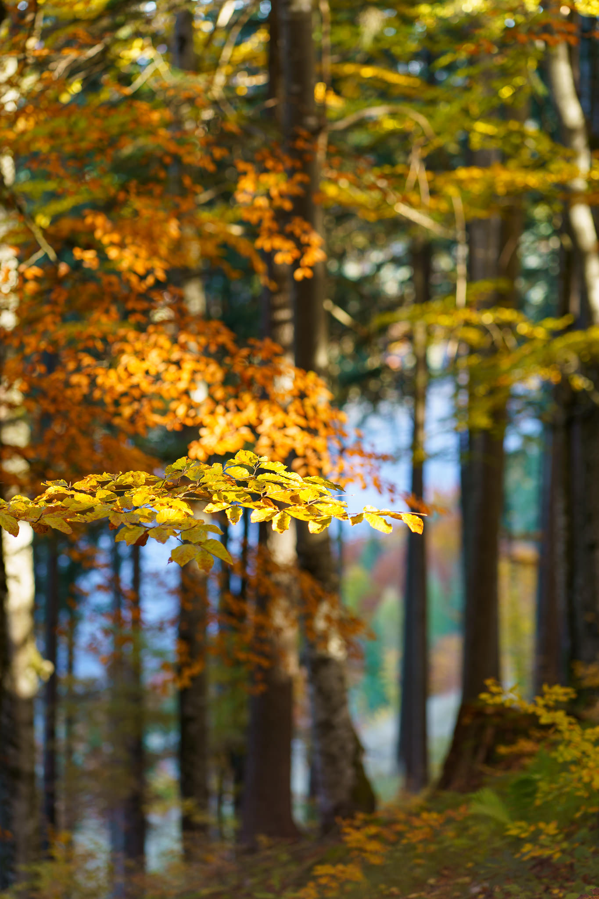

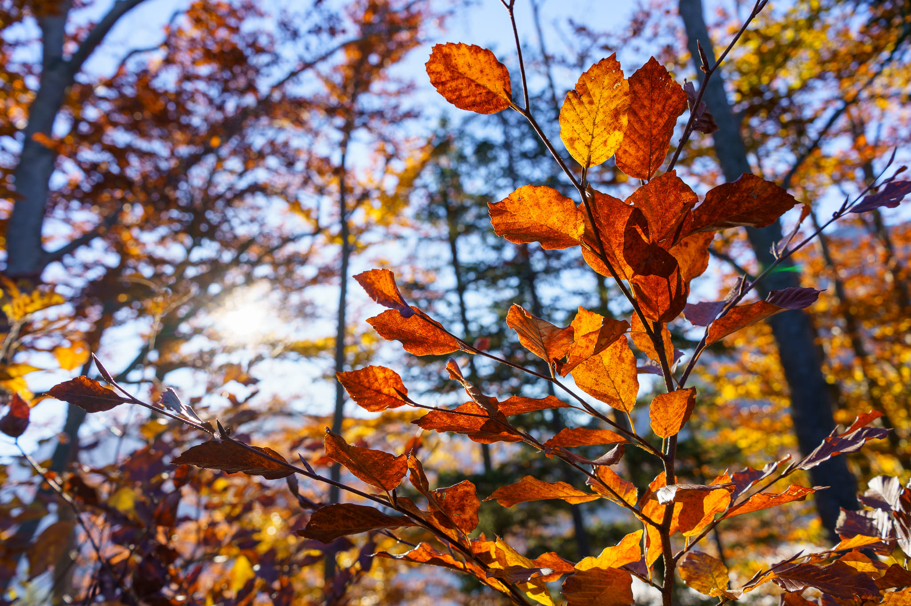

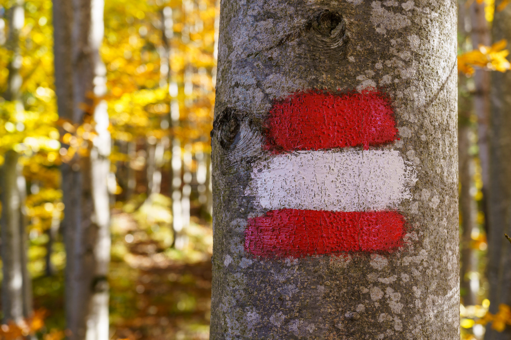

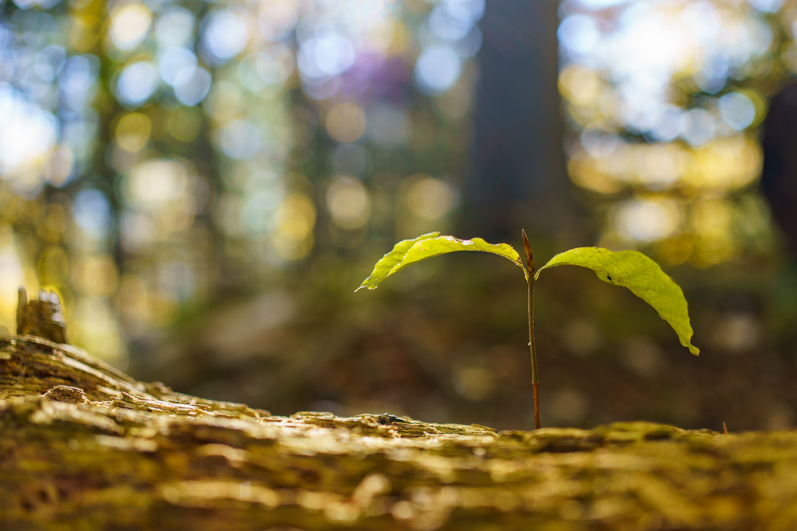

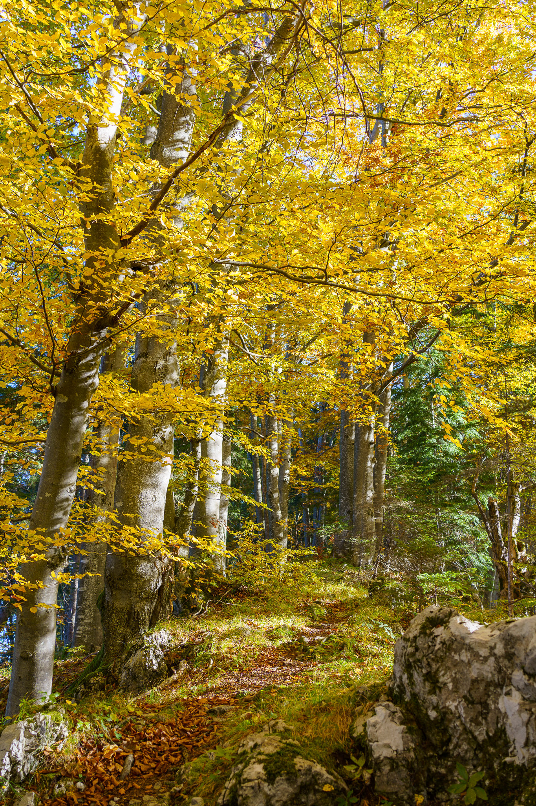

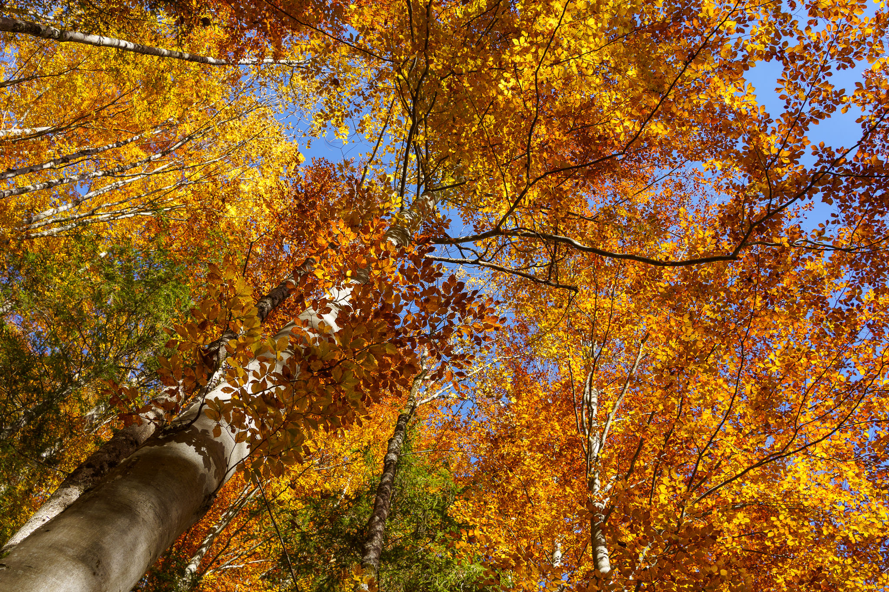

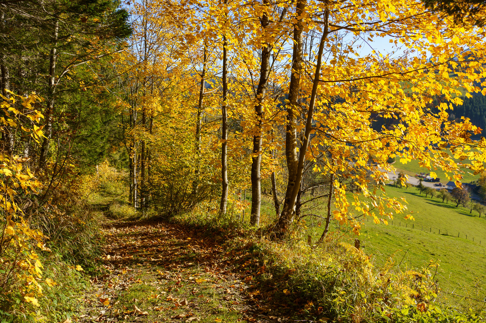

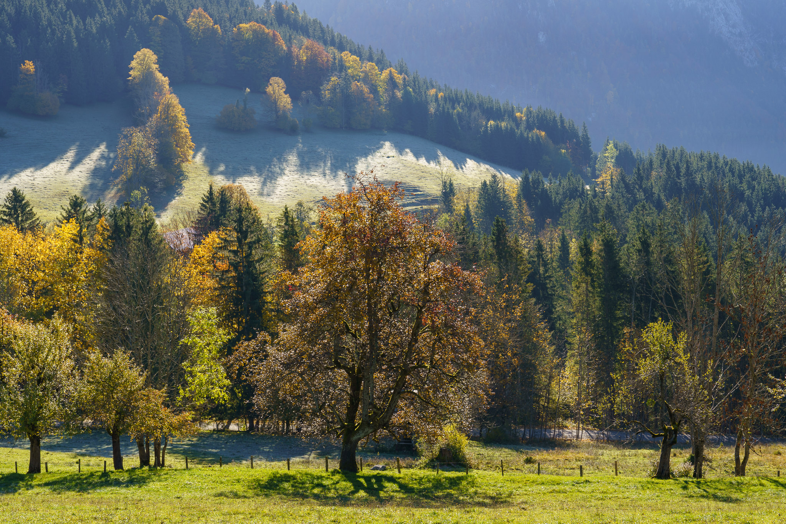

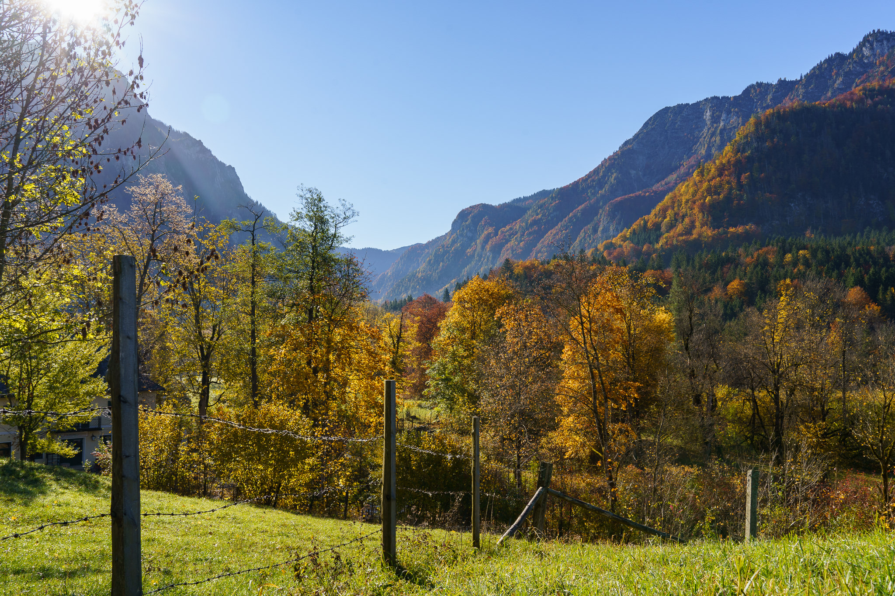

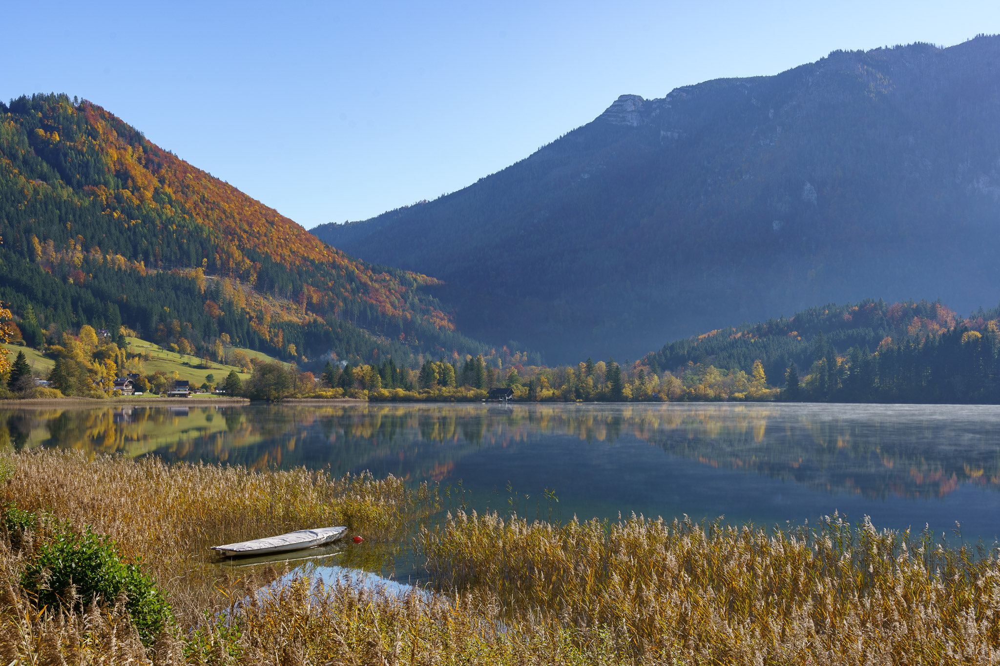

Pictures taken with the Sony A7C and the Sony FE 1.8/35mm, the Sony FE 1.8/85mm, and the Sony FE 4-5.6/28-60mm.
