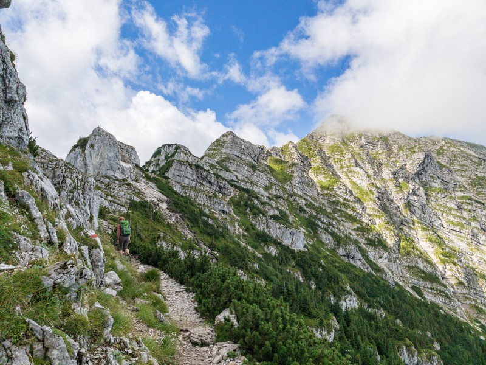

 Year end is the time to look back to the last 12 months in retrospect, to reflect where your path led you and what mountains and rocks you have climbed.

I want to look back to 2021 with three inspirational illustrations I have come across during this year. Those are pictures I have seen in social media channels this year - maybe even posted by YOU, thanks! - that made me think and that ended up in my "digital shoebox" for things I want to keep and remember.

(Credits: authors are unfortunately unknown to me.)

## Consistency

On the one hand we often think about progress and innovation as revolutions and "Heureka" moments. On the other hand we totally underestimate how far we come in a year, or three or ten. The worst thing to do is never starting, even not taking the smallest steps.

In reality, what makes most of us successful most of the time is consistency and stamina in what we do. It's the many small steps into the chosen direction that bring us to our goal.

## A question of perspective

You only really understand things if you look at them from different perspectives. What looks impossible at first, might work out fine if you did not stop after the first glance or an early frustration.

## Opportunities in front of you

Too often we only look backwards when thinking about our life path and opportunities we used or did not use. In reality every day offers a new set of possibilities and opportunities that we should look for, evaluate and use. The future is bright. 

If you would like to read more of my blog, check out the list of posts [here](../work#professional-blog)!