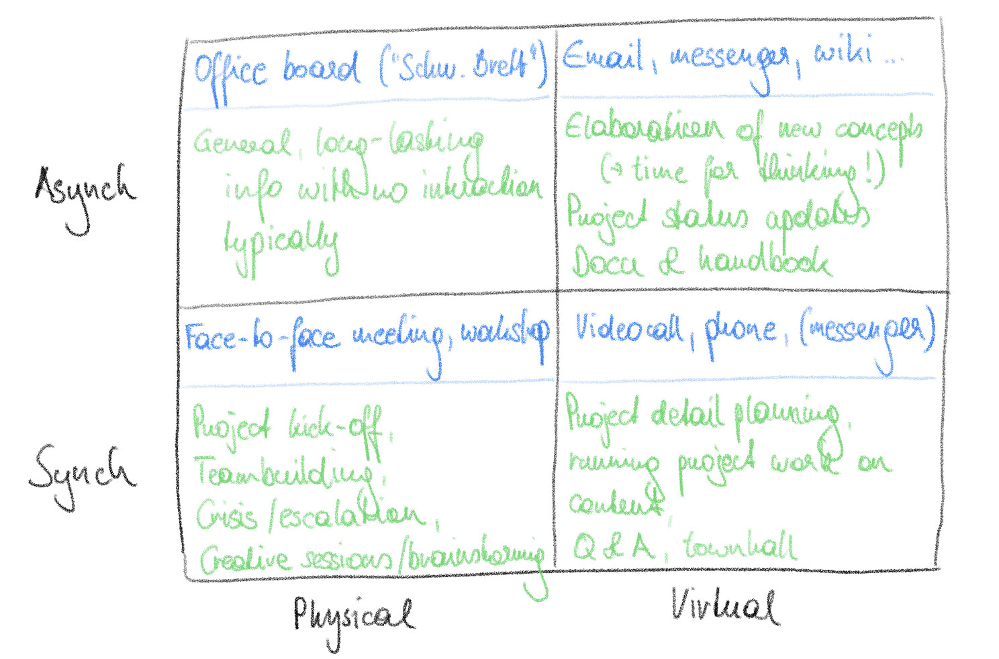

This post elaborates on my statement about choosing the right means of communication in [this article](../how_to_deal_with_remote_and_remote-only_work_settings).

Over the last year I had a lot of discussions with colleagues about how we are working and communicating. It got clearer and clearer for me that all of us can improve the way we communicate and that we should recognise this as an ongoing personal improvement path.

## From fax to ubiquitous videoconferencing

When I had my first jobs in industry, the means of communication were rather limited and therefore clear. If you wanted to send something to someone, you wrote an email (or even still a fax). If you wanted to actively discuss anything, you made a phone call or a meeting.

Over time the means of communication expanded a lot, partly with a clear intention, partly it just happened. Online drives, team folders, messengers, video conferencing, online whiteboards, wikis, etc. entered the PC in the office and your mobile phone. For some of them clear use cases were defined, others came as side-cars with other services.

## The challenge of expanding communication channels

Having more means of communication has various effects:

- Offering more possibilities to interact and potentially lower barriers to communicate, which leads to faster and better results
- Introducing whole new ways to share content and collaborate (e.g. real-time online whiteboard)
- Increasing the complexity of communication
- Potentially increasing the mental load for people to stay on top of all channels
- In the end, there is a clear need for a discussion and definition on how a team or the greater organisation should use those channels to communicate in the best way.

Some people, I feel, see an ever increasing burden from new communication channels coming up. I understand that. For me personally the gains will certainly outweigh the burden. Given that we actively manage the way we communicate!

## How I think about the "right" means of communication

For me the key principle is to find and define the right tool for the task. It sounds obvious, but in reality it is not.

All of us know the meetings we are sitting in, that could have been handled in a short email. Or the email asking something that could have been answered with a quick look-up at the existing documentation.

I have thought about a categorisation on how to structure my communication. For me it is a helpful way to harvest the maximum from virtual and physical communication, paired with synchronous or asynchronous nature of different communication means.

Please note that the figures above is not complete, it should illustrate the basic idea.

How do you think about the way you communicate? 

If you would like to read more of my blog, check out the list of posts [here](../welcome_to_jakobs_professional_blog)!