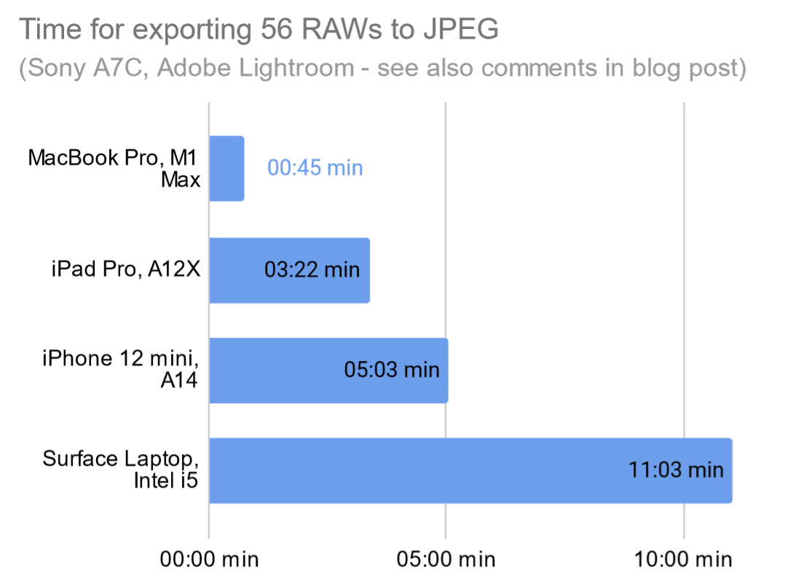

Many tests and benchmarks have been done and published when the new M1 Pro and M1 Max MacBook Pros were released (like here on general tests and also here on more photo/video creators’ tasks). Recently I had the chance to try out my photo workflow on one.My focus was on how Adobe Lightroom works on one of those well-received (hyped?) MacBook Pros. 

The computer I used is a MacBook Pro with M1 Max, 64GB of RAM, and 1 TB of SSD storage.
I reflect on it in the context of my normal hobby photographer setup using an older Microsoft Surface Laptop with an Intel i5-7200U and 8GB, and an Apple iPad Pro with A12X chip.

# General

My first impression: “Oh, it’s heavy and bulky for a MacBook!”

Given the performance and general positioning as a professional tool, the size and weight is reasonable. The overall build quality is simply great, as you would expect.

It’s great that you can power it via USB-C if you like, this makes an extra charger obsolete if you want to travel as  light as possible.

One nice feature for photographers is the built-in SD card slot. It does not support the speed of the highest-end cards, but I guess for 95% of the photographers using this laptop it’s a great feature.

Moreover, an outstanding feature is the computer’s efficiency and battery life. The promised 11 hours of web browsing, translated to probably a bit less for photo editing, is an asset when working with photos off the grid.

As expected, the screen of the MacBook Pro is wonderful. Its resolution, its brightness and also the colour representation are superb in my point of view (literally).

# Performance (+ a hobby photographer’s test)

A big promise of the M1 Pro/Max is its outstanding performance. I tried it using Adobe Lightroom in the latest versions as of February 2022. It is a great test setting, as Lightroom is a cross-platform solution that really shines in the integration of different device categories and operating systems. It already runs as native application on the M1 chip in the tested version.

## The test samples

For comparison I chose a set of 56 Sony A7C RAWs with 24 MPx each that I exported to JPEGs of 100% quality. All RAW files are synced across Lightroom and locally stored on all devices. To all of them corrections of exposure, colour etc. are applied (but no Enhance/Super-Resolution).
All devices were restarted before running the test.

Disclaimer: It is a hobby photographers test, results from tests  in a fully controlled environment might differ.

## The test results

Please note: A clearly limiting factor for the older Windows PC was the lack of RAM, seen from permanently high activity of the SSD in the Windows Task Manager at Lightroom exports and Lightroom use in general.

## Practical view on the performance

As a more practical view on performance of Adobe Lightroom on the MacBook Pro with M1 Max: On all devices I used so far I was used to a certain delay (up to maybe 4 seconds) when zooming into RAWs to 1:1 view. Of course, in this case the computer has to render the full RAW including all corrections and cannot show any proxies.
On the MacBook Pro all operations were instant, there is simply no delay when working with Lightroom, when changing edit settings, or zooming.

# Conclusion

Is the MacBook Pro with M1 Max a great tool for photographers: __Yes!__ (Most probably the best portable computer ever built for a photographer.)
Its screen, performance, and overall robustness makes it a perfect photographer’s companion. 

Would I buy this MacBook Pro with M1 Max: __No!__ 
The price of this computer is simply too high, looking at the requirements of a hobby photographer who is not dependent on the shortest export times, the quickest editing capabilities and most accurate colour representation on the laptop screen.

For me personally the 13” MacBook Pro with M1 is perhaps the sweet spot between capability and price.
