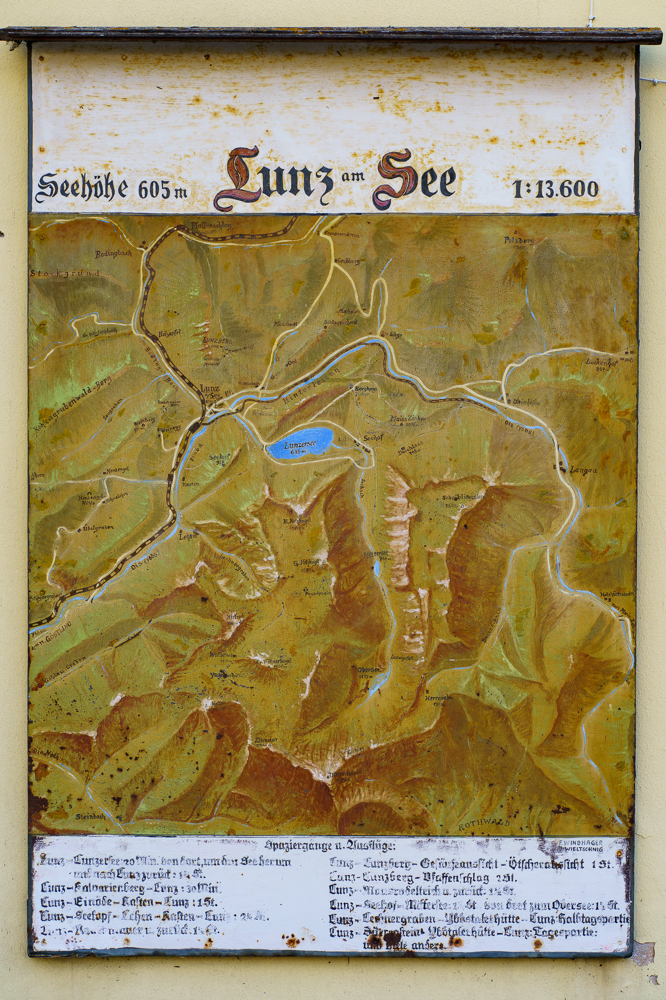
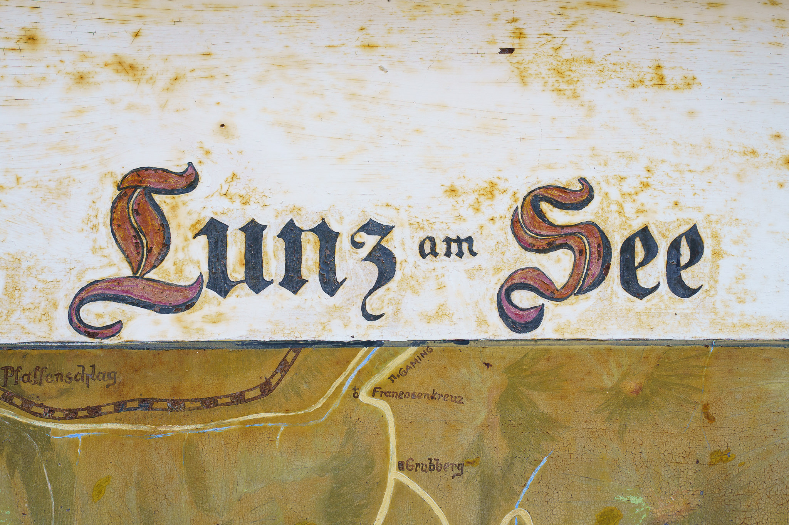
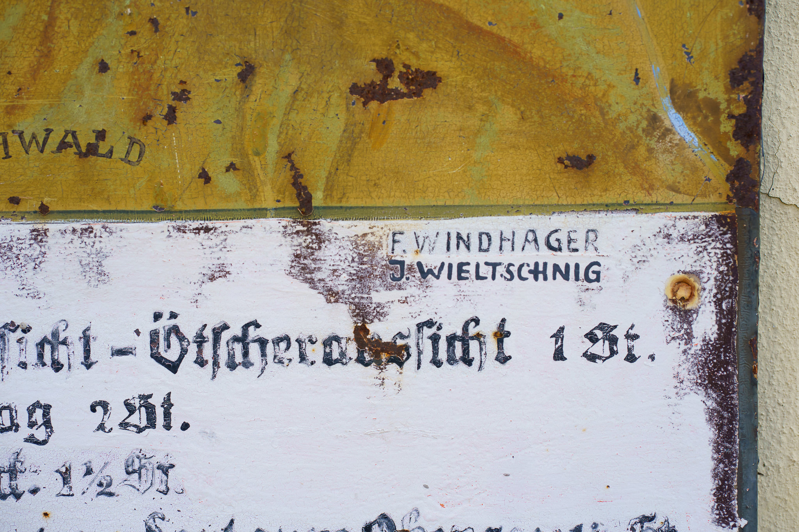
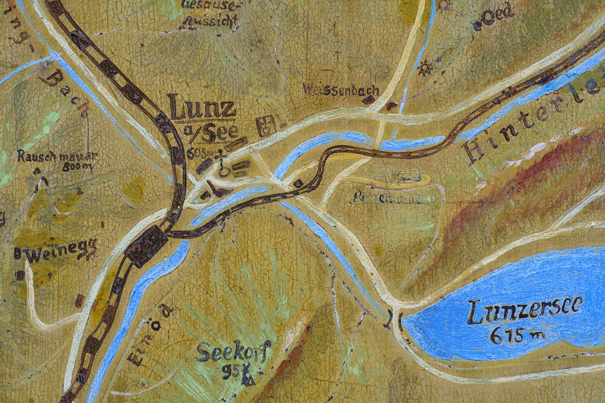
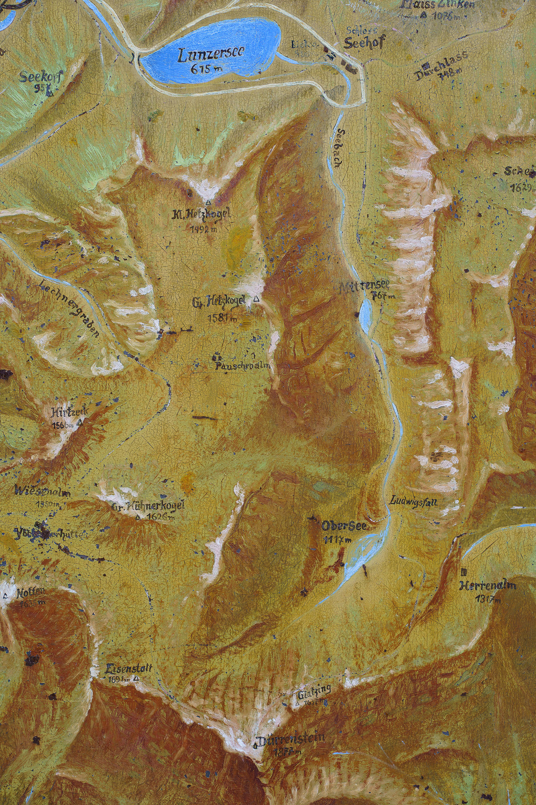
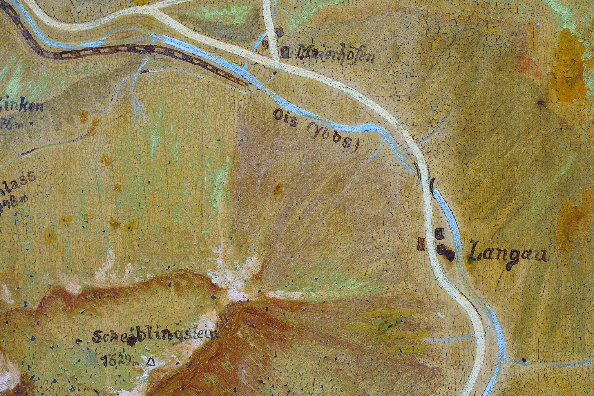

Here is a picture of a historic map of my hometown Lunz am See in Lower Austria.

What's special about that? It was painted by my great-grandfather a long time ago! 

Since I can remember, it is placed on a house wall in my hometown, and I always wanted to digitalise it and with that "preserve" it from further degradation.

Done! Here you can find the original in high resolution: [Lunz am See Map](../images/20220305/lunzamsee_map_fullsize.zip) (20 MB)

Pictures taken with the Sony A7C and the FE 1.8/85mm.
