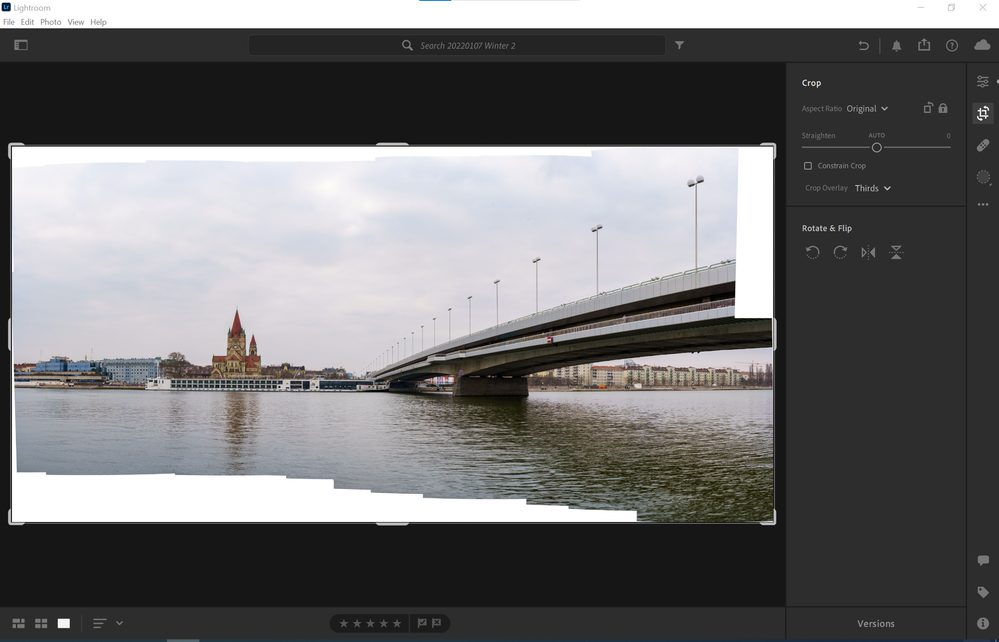
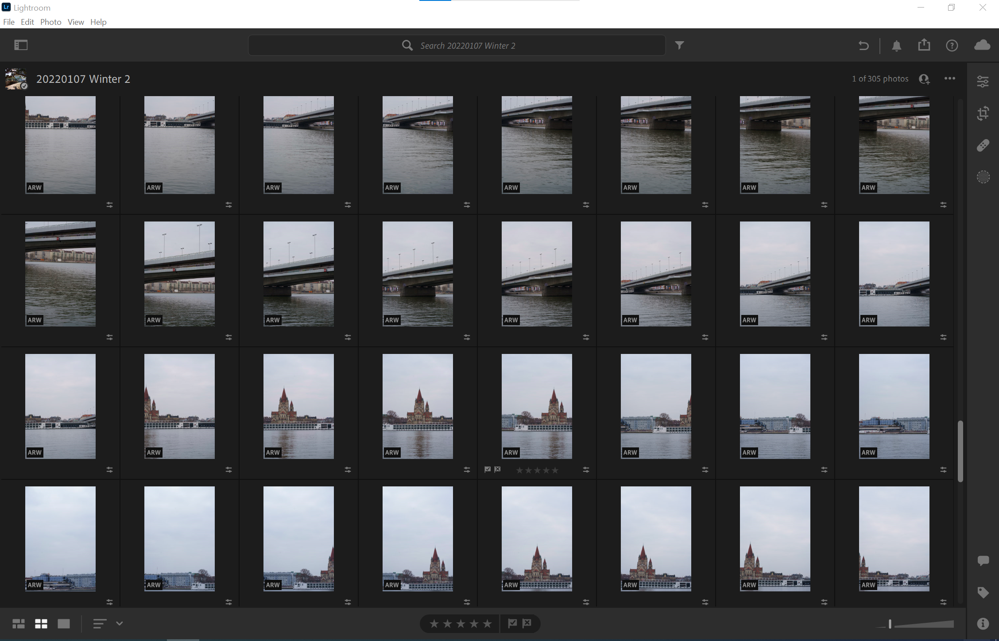
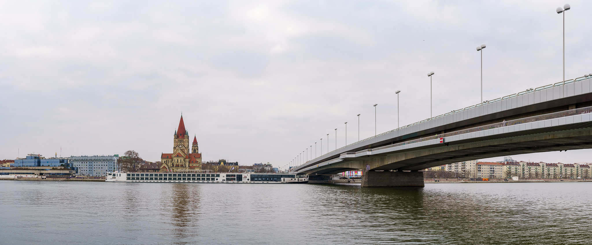

I have written [before](../raw_workflow_with_adobe_lightroom/) about how Adobe Lightroom serves as a great RAW workflow solution for the - in my opinion - [“leanest & highest quality casual photography setup”](../leanest_highest_quality_casual_photography_setup/).

Today I want to elaborate on one of its sophisticated and at the same time simple feature: the built-in panorama functionality. 

## How it works

With the panorama feature in Adobe Lightroom you can merge multiple pictures into one high-res panoramic image.

You start with a series of photos in one or multiple rows that "scan" the final frame. By using some overlap between the images, Lightroom is able to detect how to merge them into one final image.

The whole process is almost fully automatic and therefore very convenient. The resulting file is a .dng that you can further process using the RAW information of the source images.

## Example

I did a simple test of the feature, taking a panoramic photo of the Reichsbrücke and Franz-von-Assisi church in Vienna's second district.

I took 46 picture with the Sony A7C and the FE 1.8/85mm that were then merged in Lightroom. The pictures were taken hand-held without special consideration of how to pan over the frame. Due to the distance to the subjects this should not be a big issue.

The resulting .dng image merged by Adobe Lightroom has approx. 175 megapixels and a file size of 650 MB. Here shown is a version with reduced file size.

## Recommendations

Defining factor for the quality of the final panorama is of course the quality of the source images.

Here some tips and tricks:

- Try to take the source images with sufficient overlap between the photos, so Lightroom can figure out where and how the images shall be merged.
- Put your camera into manual exposure and manual focus, so you ensure exposure and focus consistency across the entire image series. I typically measure and manually set the exposure at a light area, as lightening up shadows in postprocessing works better than darkening highlights.
- If you create a handheld panorama, consider some safety margin for exposure time, so you do not get motion blur when panning across the frame. In my example I used 1/320s for my shots with the 1.8/85mm lens.
- Handheld panoramas work fine if there is sufficient distance between the subject and the camera. If you want to take panoramas of closer subjects, the geometry and how to move the camera using a tripod and special adjustment plates is not trivial. 

In general I found that the Adobe Lightroom panorama functionality works very well for me. I really appreciate having this feature built into Lightroom directly, keeping everything neatly in the workflow and synced across devices etc.
