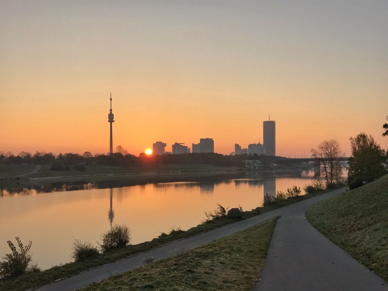
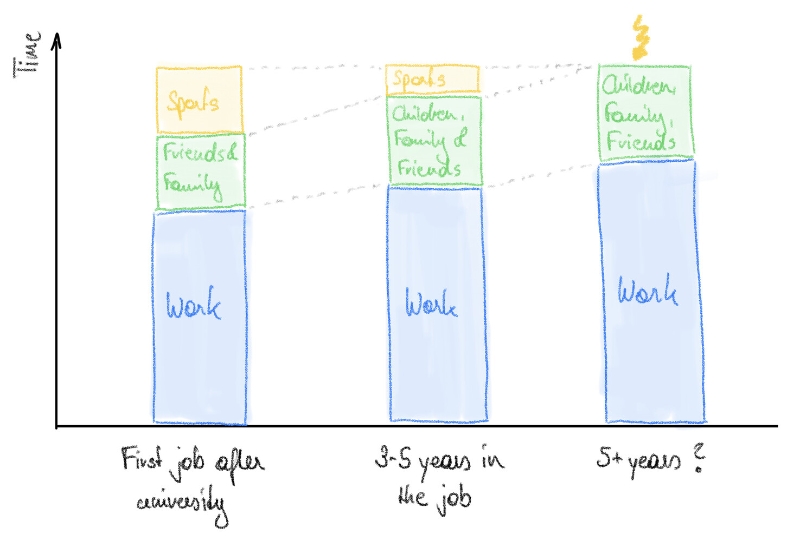

What’s the most important thing for building a long-term successful career? Your degree? Your skills? Your network?

I realised, the most important thing (or better: prerequisite) is your health. There is no professional success in the long run if you do not take care about your fitness and your physical and mental health.

## Know your limits

You can go above the performance limits temporarily and work at 130% for a certain time. However, it is crucial to recognise the situations where you are above 100% and develop a clear path to come to a healthy level again.

I have seen examples of people in my private and professional life who went over their limits for too long and said to myself: That‘s not worth it, neither for the individuals, nor for the company!

Also organisations have realised this. I had the chance to participate in a development program for managers in my company a few years ago. The one thing I remember most prominently is about keeping an eye on your energy levels and your health. You always need to balance your work, time for family & friends and also time for sports, fitness and regeneration.

A typical path for a professional might look like this:

After university you are used to having enough time for sports and exercise. With your first promotions on the job, your work hours tend to increase. Then you want to spend more time on family and children. Step by step you need to reshuffle your limited time budget. It is in these cases always the easiest way to cut back on time dedicated to sports and fitness, because it does not hurt immediately.

This works for the short- and medium-term, but not in the long-term! __So, watch out for this trend!__

Only if you find the right balance and make your energy and health a top priority, you will succeed in the long run, privately and professionally.

## Good practices for an active (work-)life

Tips to get more active in your daily work and private life routines:

- Do not set too high targets - a 30 min run or fast walk is better than staying at home on the sofa!
- Block time slots for sports in your work calendar, for example start your Thursdays with a morning run (works for me - see header picture :) )
- Integrate activity into your daily commute, for example by not using the escalator but the stairs, or by commuting by bike instead of using public transport or the car, if possible.
- Use a fitness tracker and follow up your daily steps or calories, set yourself realistic targets that you try to achieve every day.
- Find sports buddies and schedule regular sessions with them.

If you would like to read more of my blog, check out the list of posts [here](../welcome_to_jakobs_professional_blog)!