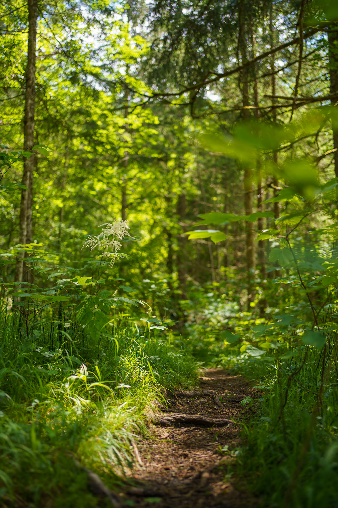
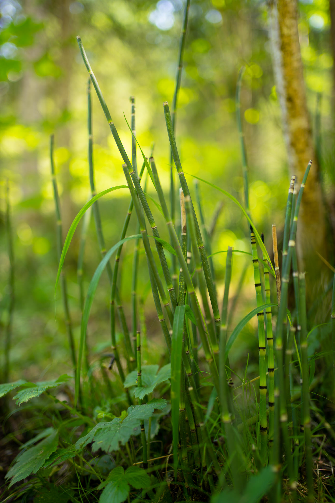
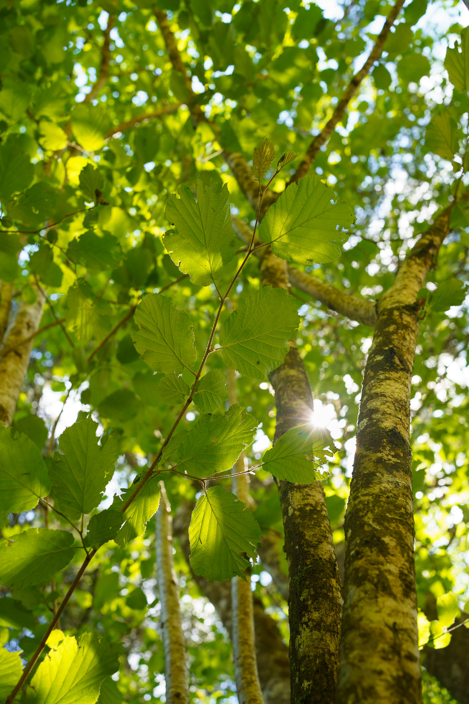
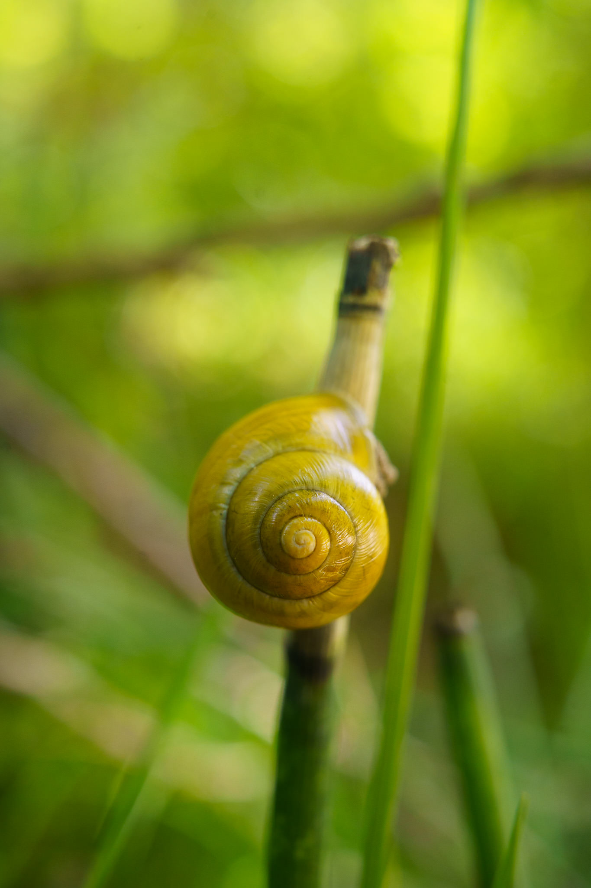

The best way to spend an extended weekend: In nature. To use the time to recharge for the daily city business life.
 

<blockquote class="twitter-tweet">
<a href="https://twitter.com/hashtag/enjoythesilence?src=hash&amp;ref_src=twsrc%5Etfw">#enjoythesilence</a> <a href="https://twitter.com/hashtag/LunzAmSee?src=hash&amp;ref_src=twsrc%5Etfw">#LunzAmSee</a> <a href="https://t.co/IKiZiI27Y7">pic.twitter.com/IKiZiI27Y7</a>
&mdash; Jakob (@jakobh) <a href="https://twitter.com/jakobh/status/1537887113932222465?ref_src=twsrc%5Etfw">June 17, 2022</a></blockquote>  

Pictures taken with the Sony A7C and the Sony FE 1.8/35mm, partly with extension tube.