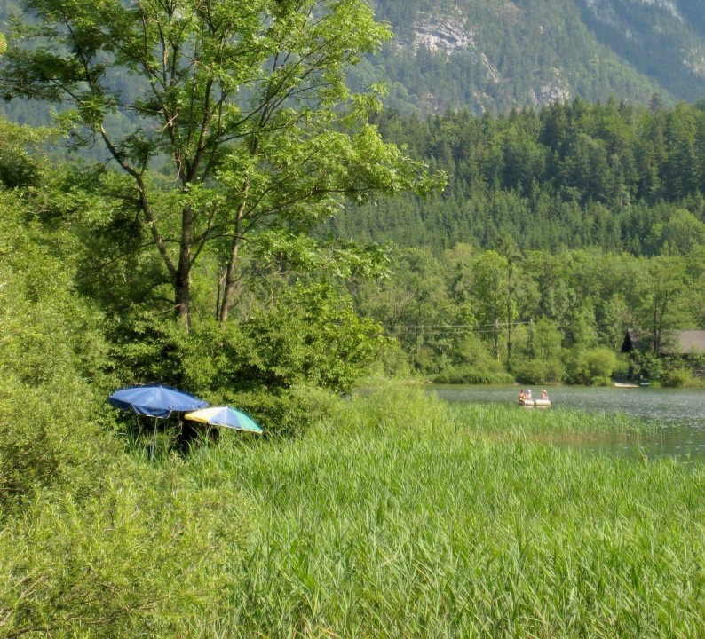

Summer holiday season is here! I had to learn during my career that for holidays the same is true as for all other business: to get most out of it, you need a winning strategy and execute it accordingly.

In the first years at work I underestimated how important holidays and relaxation are for recharging your physical and especially mental capacities. Moreover, it is essential to get some real distance from work and to come back with fresh motivation and new ideas. I underestimated it, and I did some things wrong.

Here are some tips for doing holidays the „right“ way:

## Plan your holiday long enough

Longer weekends are nice, but to get into a real holiday mood (and to get your head free from daily business routines) you need more time. In my experience, you should plan 10+ days, to really get the necessary distance and start getting the above mentioned benefits.

## Plan to close your open tasks on day -2

Don’t plan your work schedule until the last day prior to your holiday - you will certainly experience quite some stress then. What has worked for me is to plan to close your open tasks latest a day earlier. You will not be bored on the last day anyways, but have time to sort out open topics with ease and start your holidays with a clear mind.

## Decide upfront on how you deal with work emails

Two distinct ways of handling work emails can work well: Either keeping track regularly and classifying them by follow-up priority - you get back to work with a good feeling that no surprises will await you. Or, you just leave emails untouched at all until your return and mentally disconnect completely.

Risky is starting with a no-touch strategy and then looking up emails - you will most probably be overwhelmed by the number of emails at this point. Nothing you would like to have during your holidays.

All the best for your summer holidays! Make best use of it!   

If you would like to read more of my blog, check out the list of posts [here](../welcome_to_jakobs_professional_blog)!