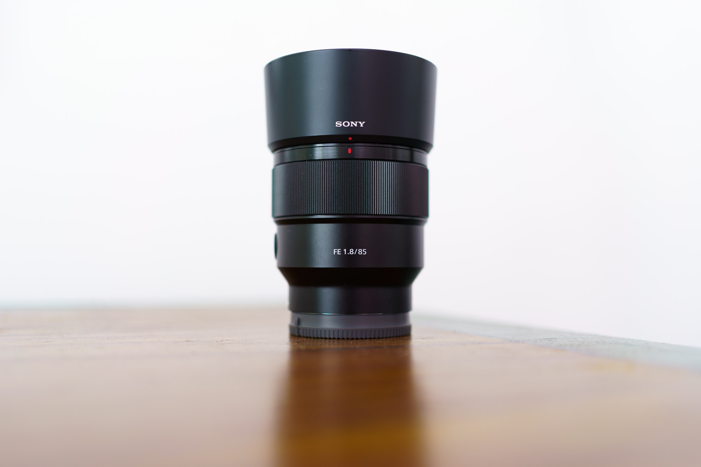

After writing about the [Sony FE 1.8/35mm](../sony_sel35f18f_review) and the [Sony FE 4-5.6/28-60mm ](../sony_sel2860_review), I want to conclude the review series of the lenses I use (as of 2022) with the Sony A7C: The final one is the Sony FE 1.8/85mm.
How to read it: [As written before](../leanest_highest_quality_casual_photography_setup/), I am valueing a lean and high-quality setup that supports a __casual__ photography style. 

The Sony FE 1.8/85mm is a great choice for this requirement, as part of the mentioned lens setup with the Sony A7C full-frame camera.

## Plus and minus

What I like:
- Autofocus: The AF is very fast, silent and accurate, it can even keep up with tracking the moves of a toddler with ease.
- Handling: For a fast 85mm lens the Sony FE 1.8/85mm, the lens is rather small and light.
- Build quality: The look and feel is very solid for its class, Sony also promises basic water-resistance.
- Sharpness: The lens is very sharp, starting at F1.8 and even improving with stopping down to f2.8. 

What I do not like:
- Minimum focus distance: With a minimum focus distance of 0,8m you often reach the proximity limit. (For [close ups](../spring_blossoms/) I use simple third-party extension tubes - these make the lens a nice and cost-effective macro option.)
- Vignetting: The edges of the frame are notably darker at F1.8, which is however easily controllable with automated lens corrections in Lightroom.
- CA: You'll find some  purple fringes at high-contrast edges when using this lens at fast apertures. Again, this is rather easily controllable.

## My conclusion

I use and like this lens more than I thought before the purchase.
To utilise the benefits of a full-frame camera body for family and people photography, you need a fast ~85mm lens. The Sony FE 1.8/85mm is a perfect choice as the optical and build qualities are almost without flaws, while being reasonably small and light.
When using it for family, but also for nature & macro purposes, it is really versatile and therefor the perfect match in my [lean and high-quality photography setup](../leanest_highest_quality_casual_photography_setup/).

## Samples

How the Sony FE 1.8/85mm performs on the Sony A7C you will see on the images below. As always, I applied my normal processing using Adobe Lightroom and developed the RAWs according to my taste.
Click to access the full-sized image.

