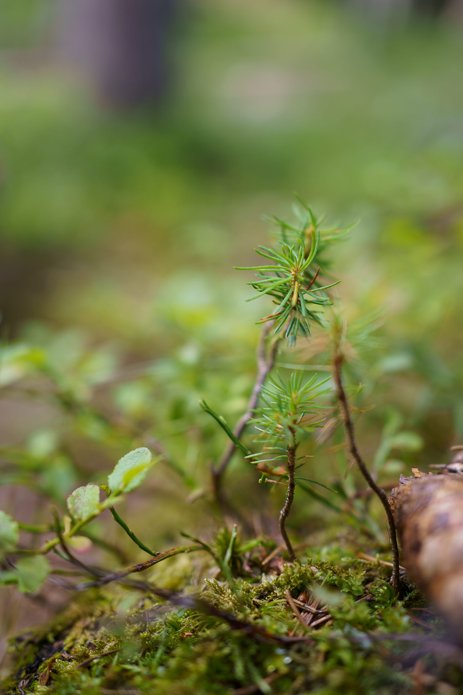
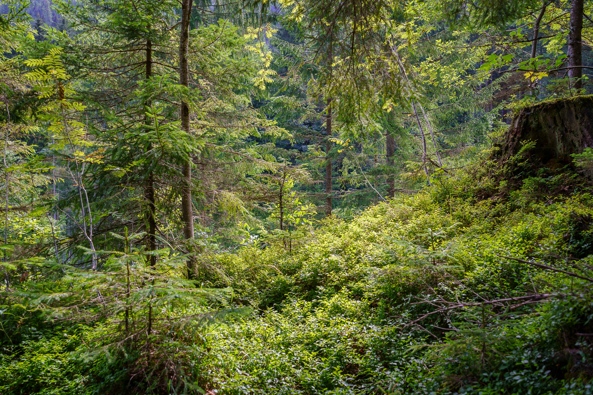
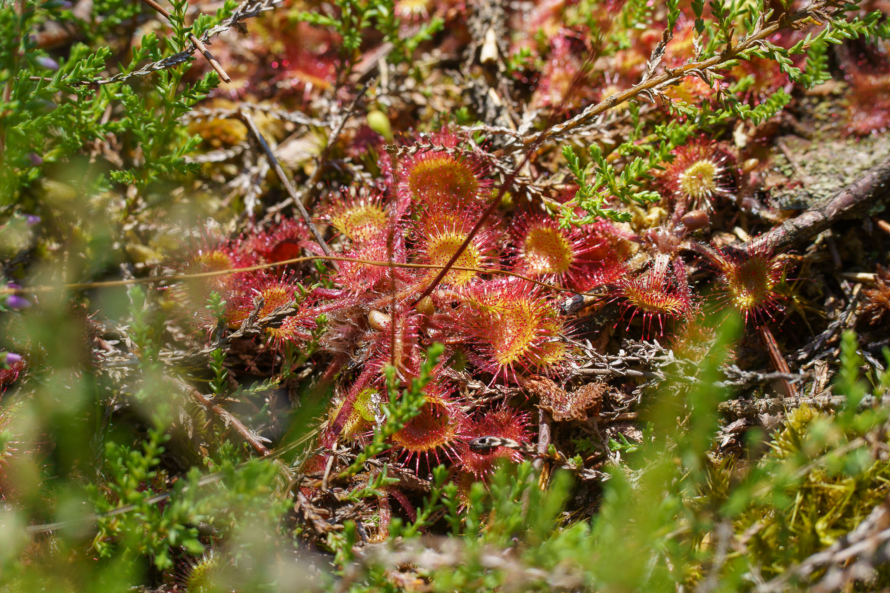
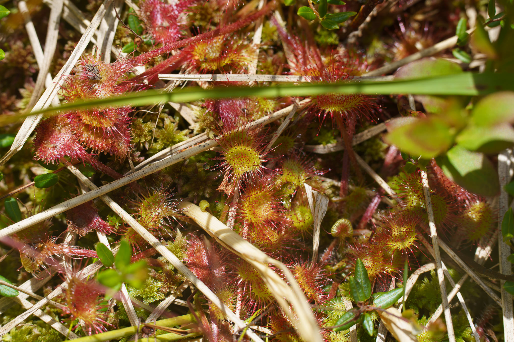

We have been at the Leckermoor [in winter](../last_day_2021_leckermoor), now we visited this jewel of Austrian nature in summer for a guided tour for children.
Pay attention to the last two photos of the roundleaf sundew (Drosera rotundifolia) that finds a perfect habitat there.
 

Pictures taken with the Sony A7C and the Sony FE 1.8/35mm or the Sony FE 1.8/85mm with extension tube.
