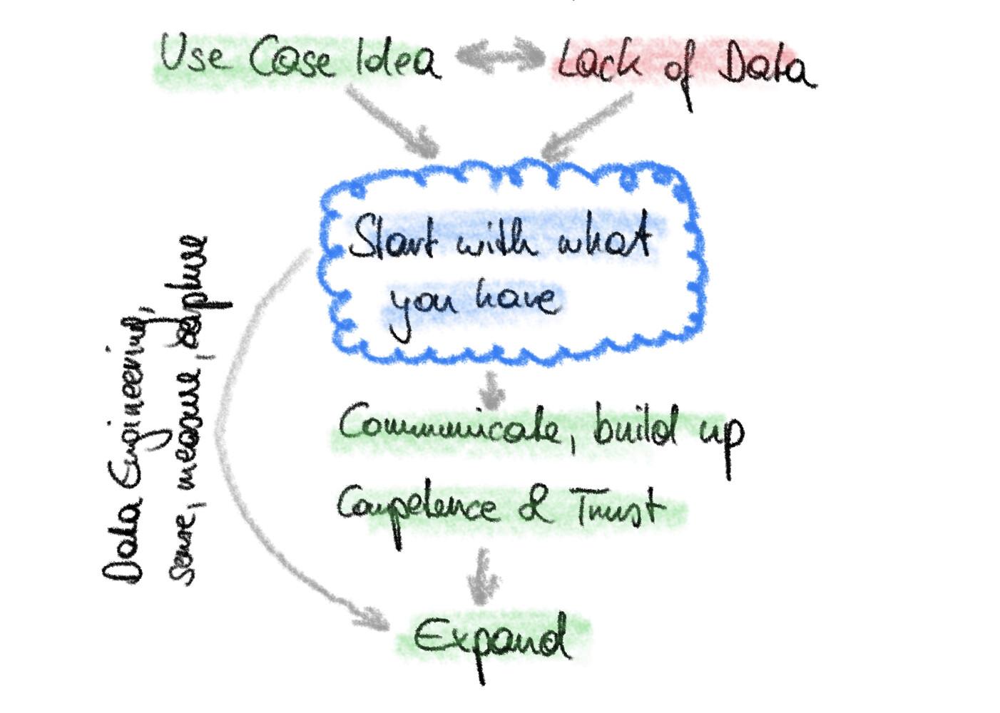

If you have dealt with data (science) projects in the real world, you know the following situation: You have a good use case idea, but you lack data in the right quality or quantity.

__Three possible decisions:__

1. Kill the idea
2. Initiate a (tedious) data collection process
3. Start right away with what you have and improve gradually

My definite recommendation is 3 - simply do it, start small and grow.

## Just do it

My and others’ experience has shown that an iterative hands-on approach to data use cases is the way to go. The well-known CRISP-DM process from the 90s lays the universal foundation. Follow it and cycle through it quickly and repeatedly. 

### Reason 1: Understand the use case

Every good use case starts with an idea - the best ones start with an idea by a team of end users and data experts. For bringing together the different functions it is not enough to talk about the intangible thing “data product” and to create PowerPoint slides. That is an important start (and you should do it based on a template/checklist), real understanding for the business and data requirements, however, comes from working on the actual implementation.

### Reason 2: Understand your data

In most cases you do not have the right data, data quality and/or data quantity at hand when you start. That is perfectly normal. Moreover, you simply do not have the exact criteria to judge it in the beginning, as especially data quality is [highly use case dependent](../a_practical_approach_to_data_quality/).

Often you start with a set of “small data”, like a spreadsheet or some measurement data. You should run through your first CRISP-DM cycle quickly to learn about your starting point. With some experience you also get a feeling of the feasibility of your idea’s hypothesis quite quickly.

Continue by gathering more data, adding additional data sets, contextualising, … based on the requirements of your use case.

### Reason 3: Communicate your use case and build competence and trust

Maybe the most important reason for just doing it is communication. Success of a data project always builds on a good alignment of interest and understanding between end users, business experts and data experts. Bringing them together takes time, and is best done based on practical work carried out together.

“What precision/recall do you need from our prediction?”, “Column B shows you the temperature. It must be between 300 and 700°C. Oh wait, why is it empty here, and why are values above 1000°C there?” … you cannot solve those and other questions by abstract talking only. Maybe you technically could, but without getting your hands on it and actually doing, people will lose motivation rather quickly.

Along the way, you will build experience, competence in dealing with your data, and also trust among the involved players. 

Pitfall: Be careful to communicate clearly that you apply such an interactive “start small and grow” approach, to set the expectations right. Without an appropriate explanation of what you do here and why you do it, end users and business experts might expect wonders from your “AI” solution and get frustrated about the pace in practical work. Involve them closely in the journey and you will succeed.

## When facing your next data-availability dilemma ...

So, next time you hear:

> “Good idea, but we don’t have the data.”, 

then answer:

> __“Great, then let’s start!”.__

If you would like to read more of my blog, check out the list of posts [here](../welcome_to_jakobs_professional_blog)!
