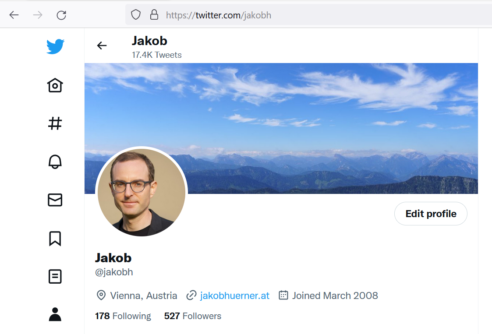

Ich werde nach fast 15 Jahren meine Twitter-Aktivitäten einschränken bzw. langsam einstellen.

_Twitter-Screenshot vom 16. November 2022. Anmeldedatum: März 2008 ... wie die Zeit vergeht!_

## Meine Bewegründe

**Grund 1:** Ich möchte meine Aktivitäten in hochfrequenten Nachrichtenquellen mit schlechtem Signal-Rausch-Verhältnis - wie eben Twitter - zukünftig reduzieren. Damit möchte ich den Kopf freier bekommen zum Im-Moment-sein und auch mehr Themen und Situationen aktiv reflektieren anstatt hauptsächlich zu konsumieren.

Oft hat man das Gefühl, etwas zu verpassen, wenn man nicht am Puls des Nachrichtengeschehens ist ("FOMO"). In Wirklichkeit stellt sich diese Angst aber als unbegründet heraus. Auch durch Nutzung von traditionelleren Medien, und insbesondere Qualitäts- und themenspezifischen Fachmedien, kann man sicherstellen, keine wesentlichen Entwicklungen zu versäumen. 

Außerdem gilt der Ausspruch "Es ist schon alles gesagt, nur noch nicht von allen" in besonderem Maße für Twitter; egal ob es um politisches Tagesgeschehen, Kommentierung des TV-Programms, Sport oder sonst etwas geht. All das trägt zum angesprochenen Signal-Rausch-Verhältnis bei.

**Grund 2:** Langfristig möchte ich verstärkt Alternativen zu Plattformen mit "Surveillance Business Model" nutzen (siehe hierzu auch Meredith Whittaker, die die Problematik unter anderem [hier](https://www.derstandard.at/story/2000138824340/neue-signal-chefin-wir-werden-uns-nicht-am-geschaeftsmodell-der) und [hier](https://www.theverge.com/23409716/signal-encryption-messaging-sms-meredith-whittaker-imessage-whatsapp-china) gut erklärt). Ich habe etwa Whatsapp gänzlich gegen Signal getauscht und bin froh darüber. Twitter ist der nächste Schritt - nun habe ich einen Anstoß für den Umstieg.

**Grund 3:** Die bei mir nur Kopfschütteln hervorrufenden Entscheidungen und das Vorgehen des neuen Twitter-Eigentümers. Dachte ich lange, "So schlimm wirds nicht werden. Hunde die bellen ...", würde es mich jetzt erstaunen, wenn Twitter in der mir bekannten und von vielen geschätzten Form überlebt.

Ganz konkreter Auslöser für meine Beschlussfassung war dann [diese Reaktion](https://aut.social/@jakobhuerner/109341873166222554) (alle seine folgenden Aktionen machten es eher noch schlimmer). Ich denke nicht, dass der neue Eigentümer (a) sich seiner Verantwortung für die globale Kommunikationsplattform Twitter bewusst ist, bzw. (b) überhaupt verstanden hat, was er da eigentlich gekauft hat.

## Die Alternativen

* Ich werde mich in der aktiven Kommunikation stärker auf mein persönliches Umfeld konzentrieren, das auf Signal versammelt ist.
* Als neue Heimat für Twitter-ähnliches Microblogging, um "mit der Welt da draußen" in Kontakt zu bleiben, gebe ich Mastodon eine Chance: [aut.social/@jakobhuerner](https://aut.social/@jakobhuerner)
* Alles was mit berufs- und karrierebezogenem Austausch zu tun hat, werde ich weiterhin über LinkedIn machen: [linkedin.com/in/jakobhuerner](https://www.linkedin.com/in/jakobhuerner)
* Für Nachrichtenkonsum habe ich RSS-Feeds nie aufgegeben, für mich nach wie vor eine praktikable und vor allem effiziente Lösung.
* Als Angelpunkt für meine Online-Aktivitäten werde ich zukünftig stärker meine Website nutzen: [www.jakobhuerner.at](https://www.jakobhuerner.at/)

## Zeit für Veränderung ist jetzt

Von Zeit zu Zeit ist es empfehlenswert, seine Gewohnheiten zu überdenken und zum Besseren zu ändern. Was meine Nutzung von Online- und Sozialen Medien anbelangt war für mich nun dieser Punkt gekommen.

<iframe src="https://aut.social/@jakobhuerner/109375420897832720/embed" class="mastodon-embed" style="max-width: 100%; border: 0" width="600" allowfullscreen="allowfullscreen"></iframe>

Tipp: Probiere es auch - es fühlt sich gut an. :-) 

_Referenz: [Toot](https://aut.social/@jakobhuerner/109369152031135970), [Tweet](https://twitter.com/jakobh/status/1593828776961609728?s=61&t=5uf4VS8NWhsqcKPY-iFEOg)_
