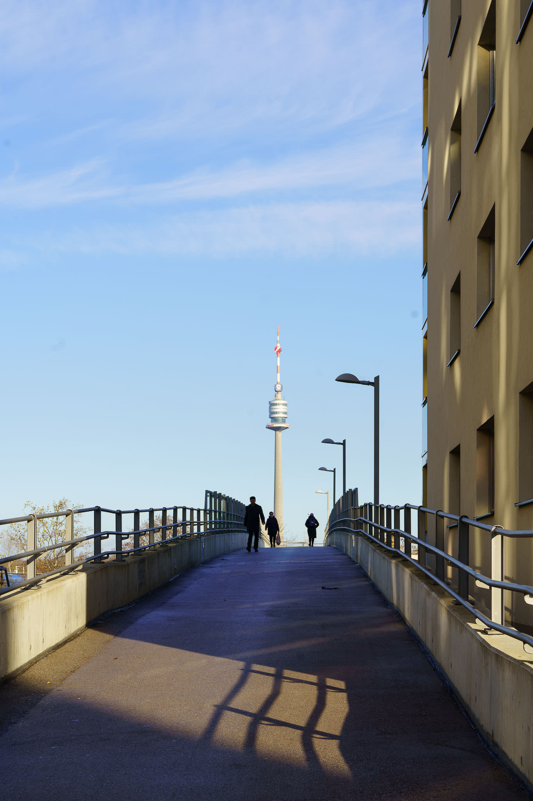
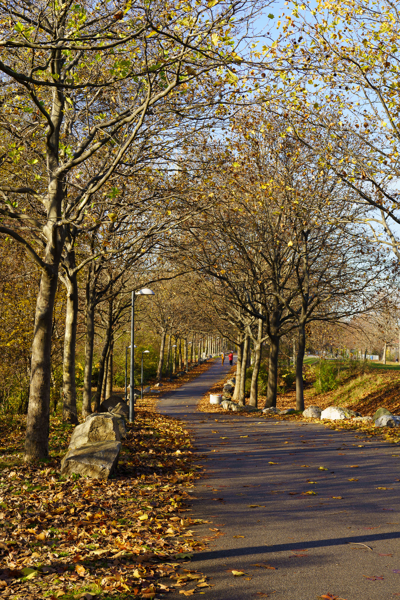
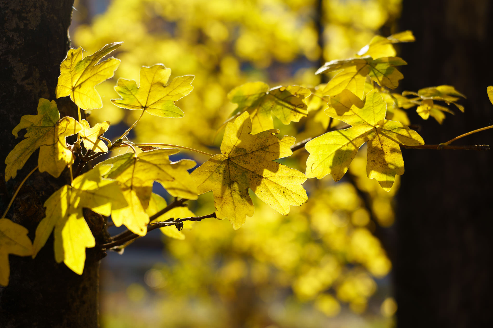
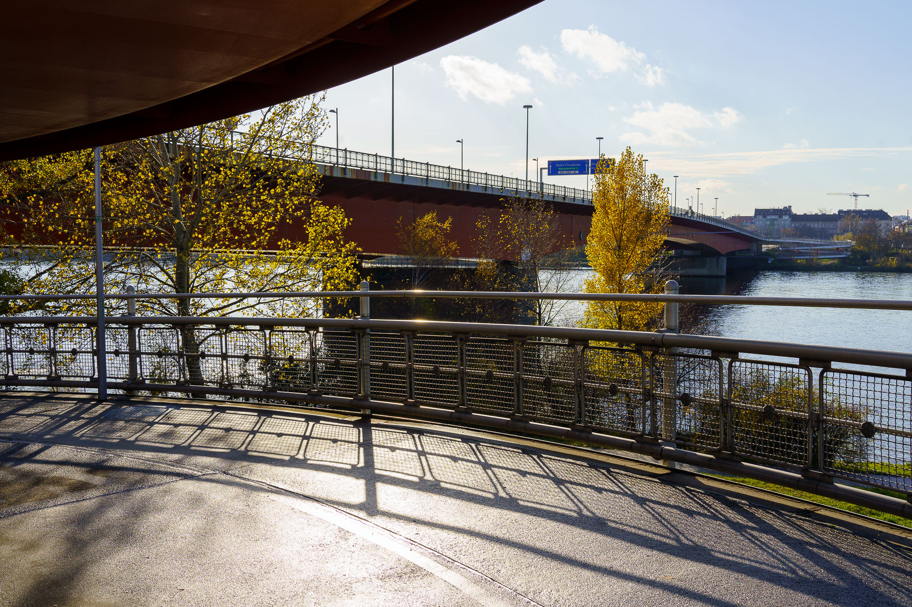
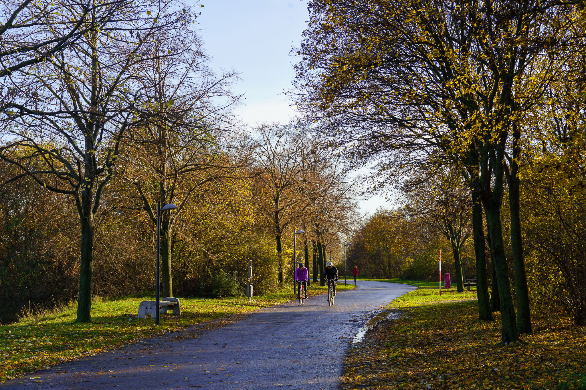
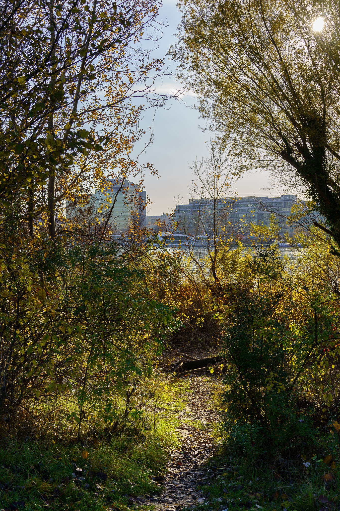
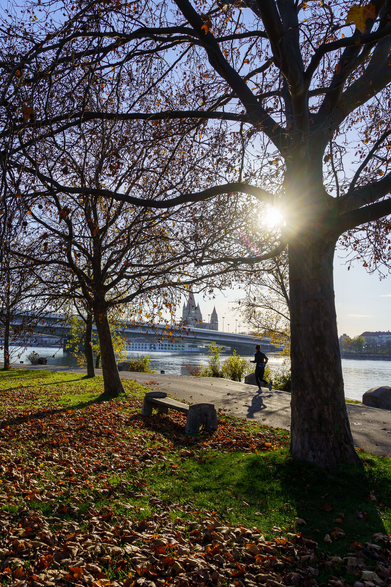

Vienna has the negative reputation of being a foggy and uncomfortable spot during autumn.

That's sometimes true, but not always, as those pictures of a sunny November afternoon show.

Picture taken with the Sony A7C and the Sony FE 4-5.6/28-60mm.
