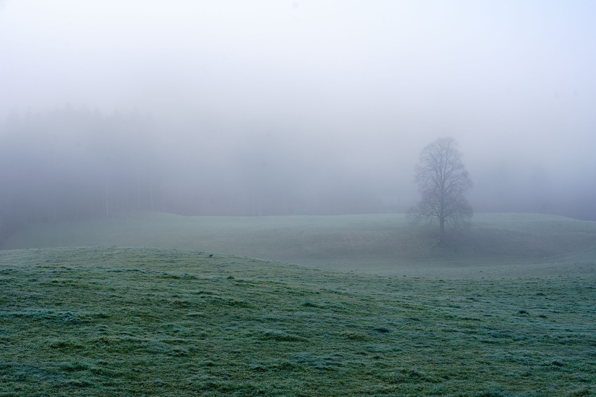
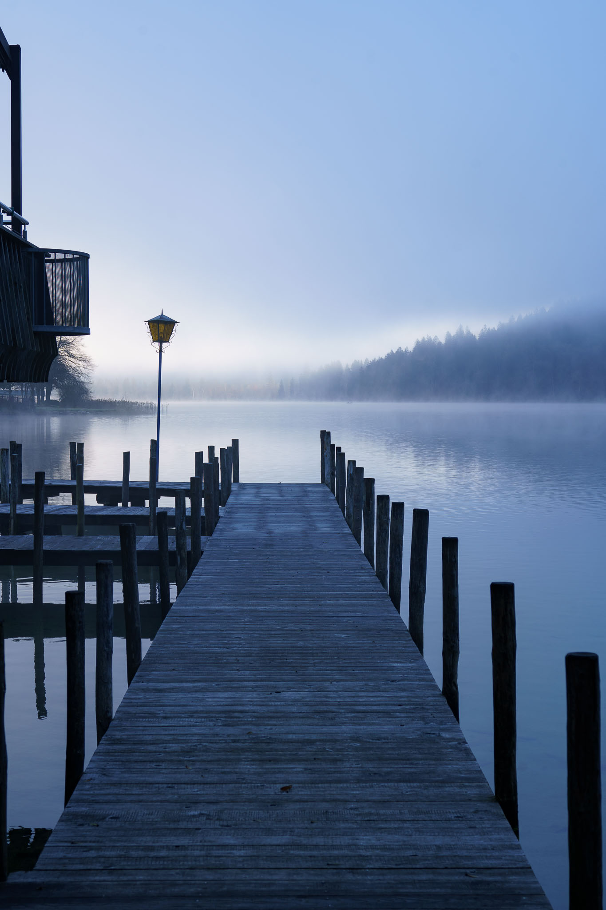
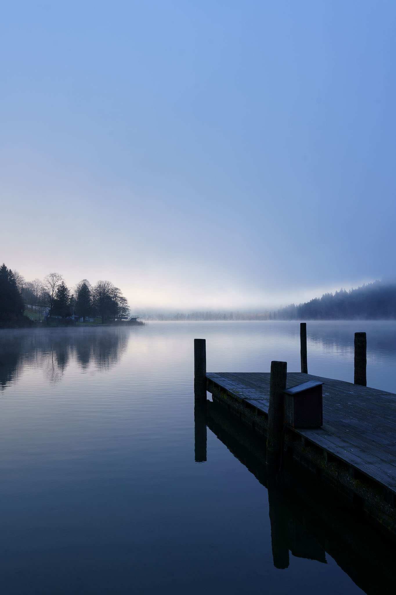
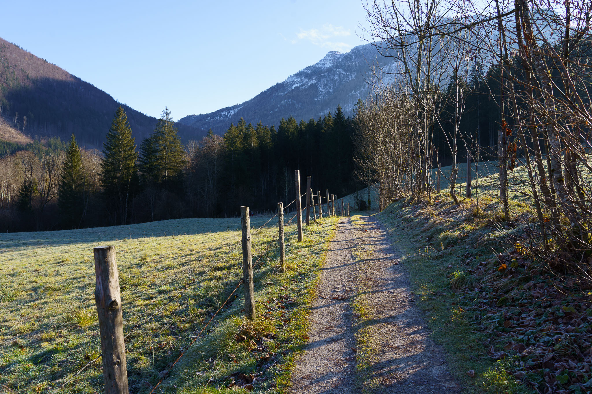
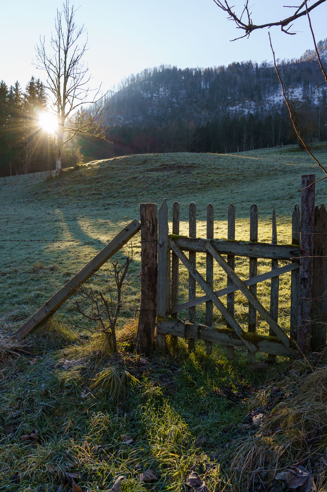
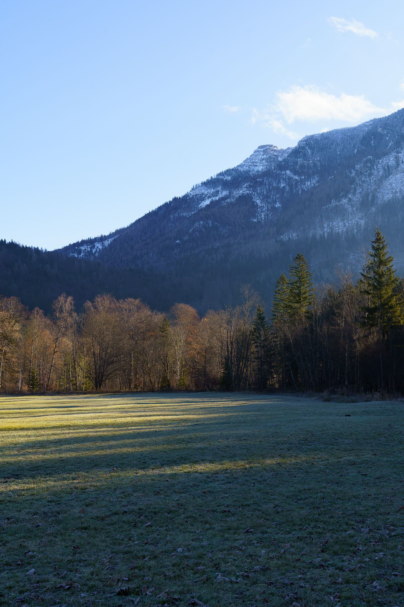
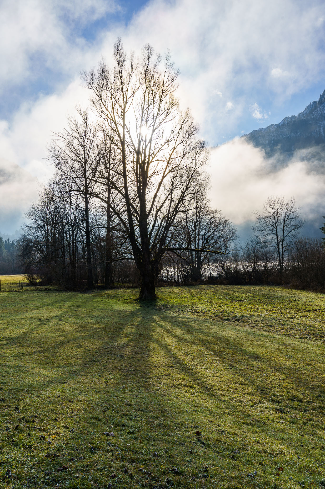
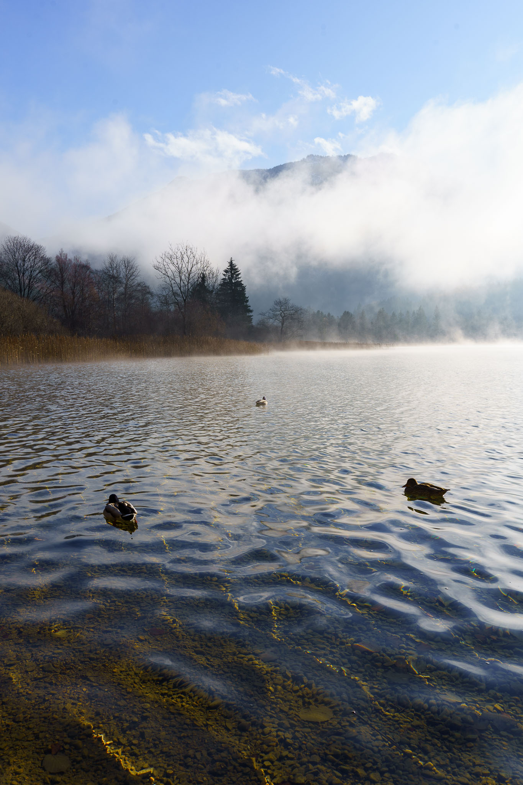
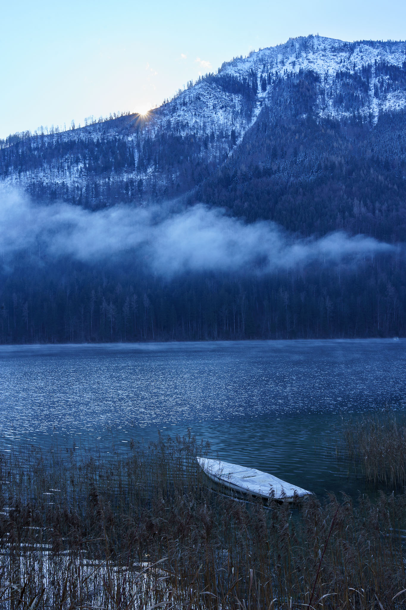

We started our walk around the Lunzer See in Lunz am See in dense fog. Half an hour later we strolled through a wonderful sunny (early) winter day.

Pictures taken with the Sony A7C and the Sony FE 4-5.6/28-60mm.
