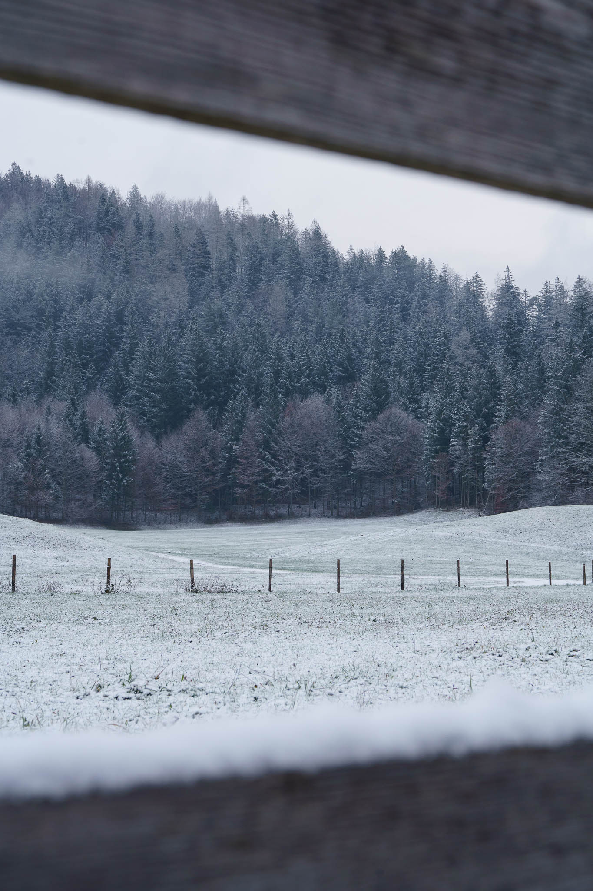
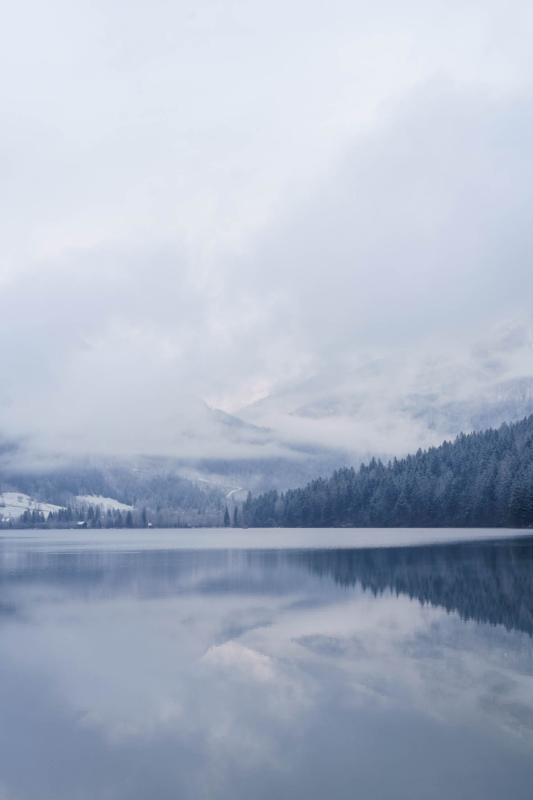
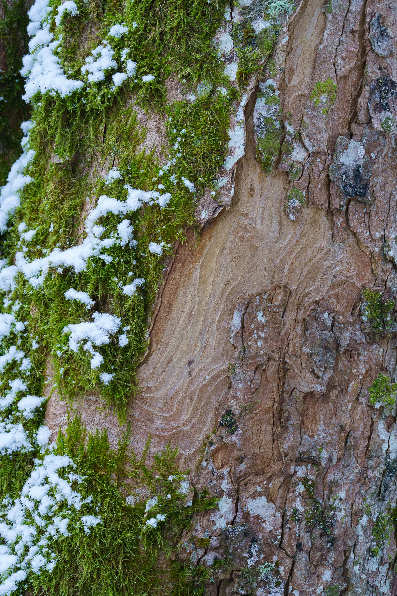
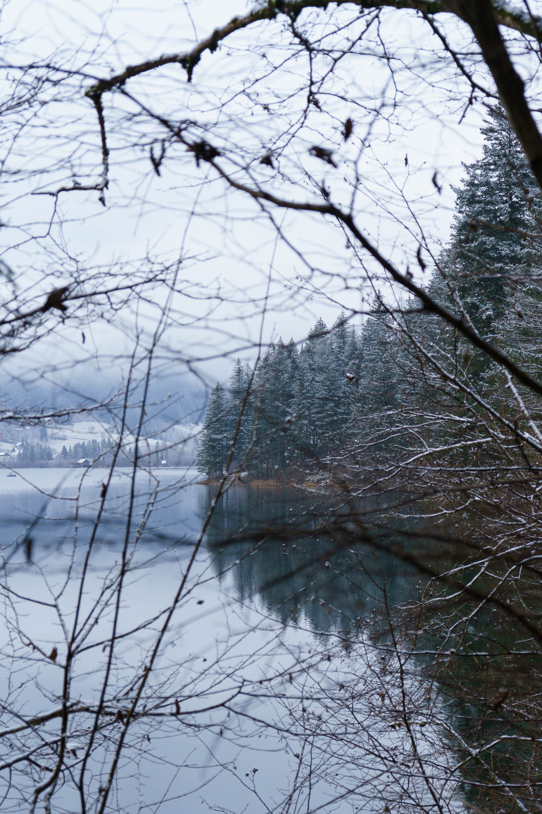
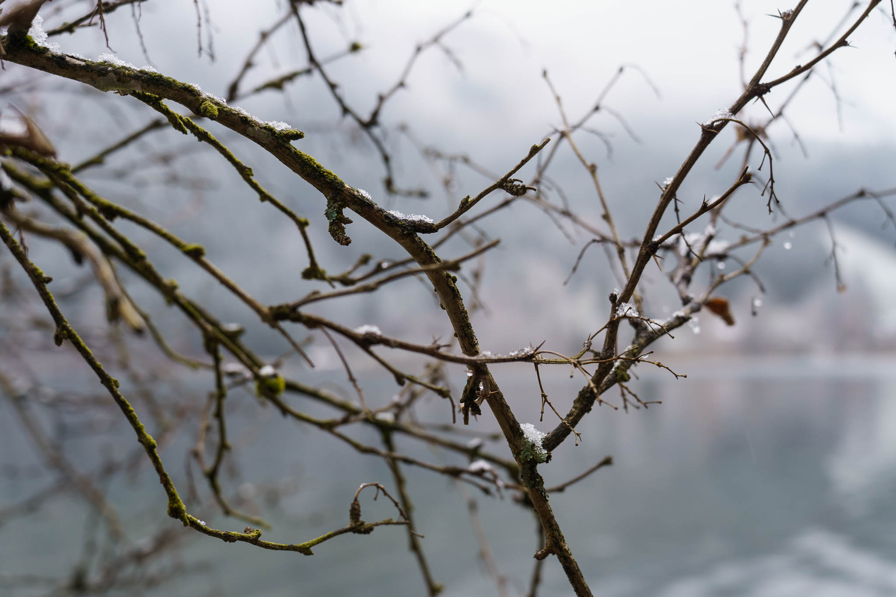
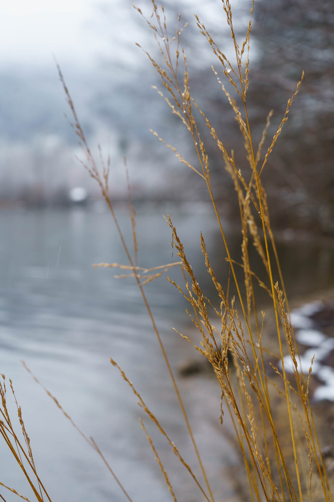
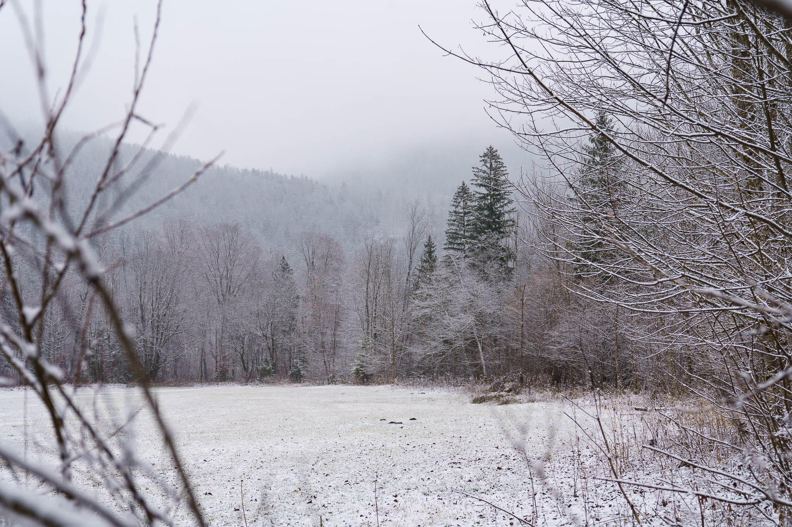
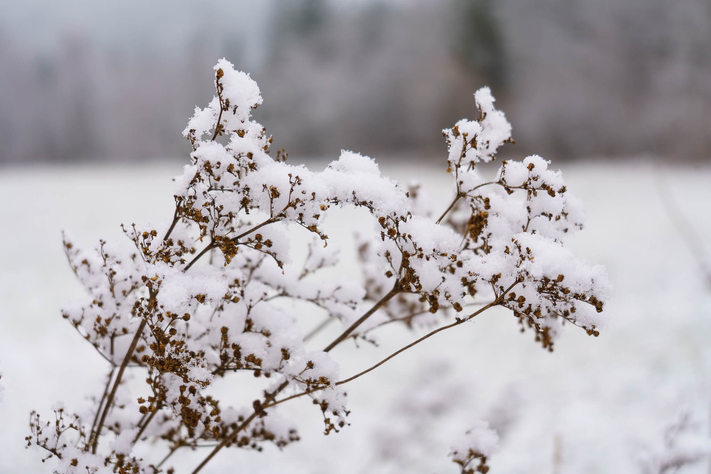
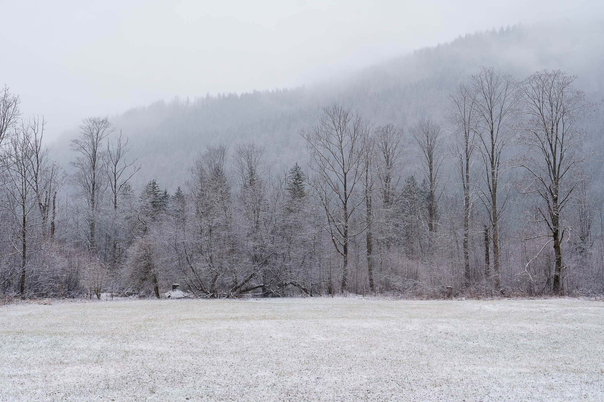

[Two days ago](..7lunzer_see_winter_walk) we had a sunny stroll around the Lunzer See.

Two days and a few snowflakes later, snow was here and Christmas felt a bit closer.

Pictures taken with the Sony A7C and the Sony FE 4-5.6/28-60mm.
