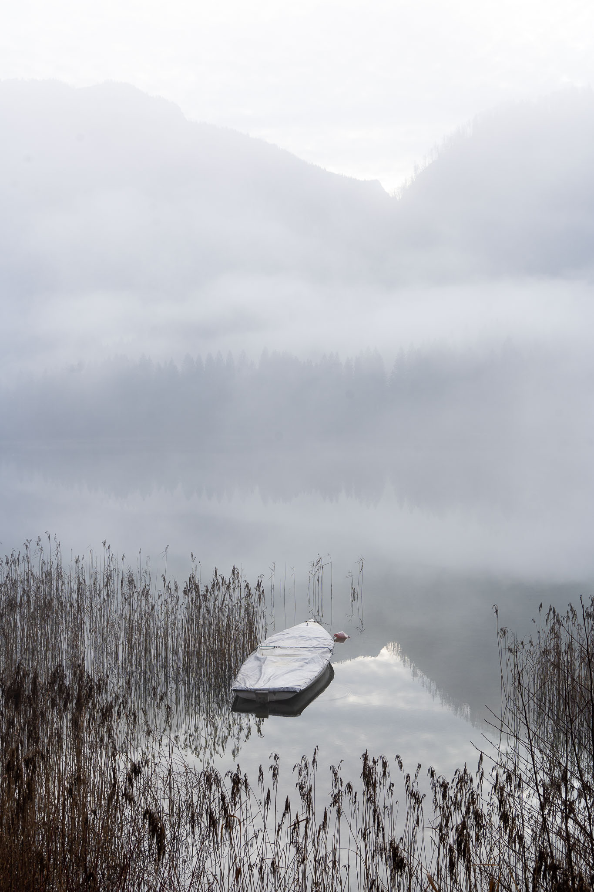
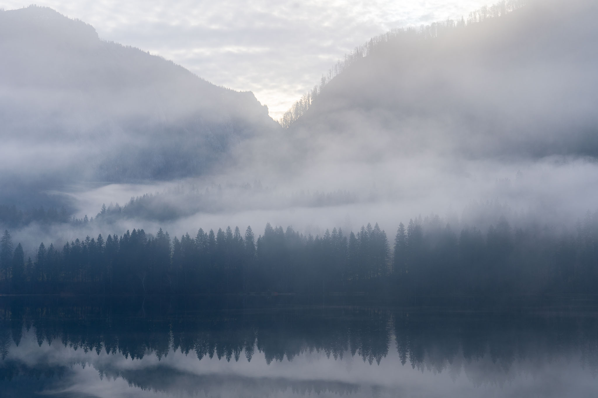
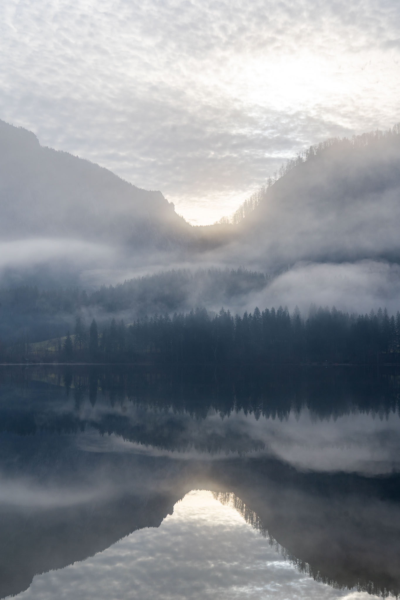
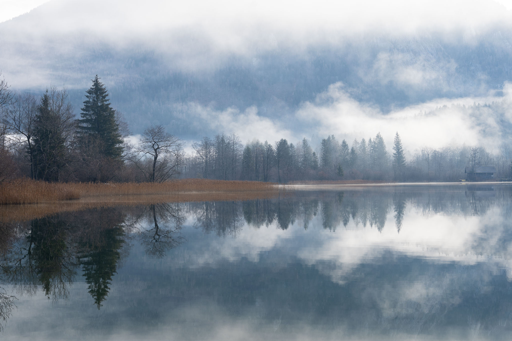
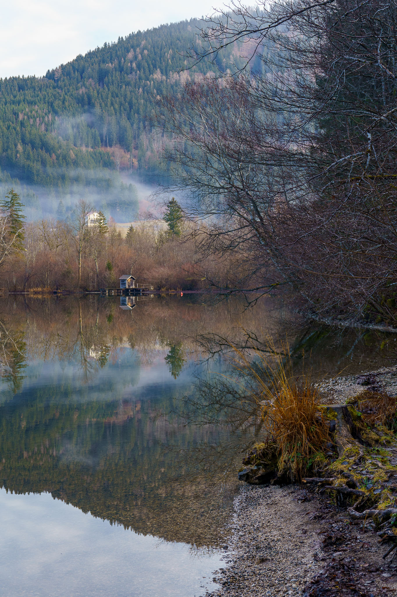
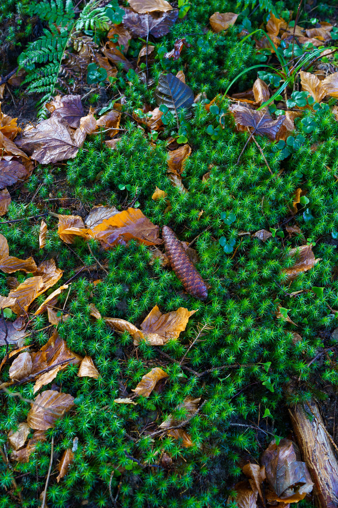
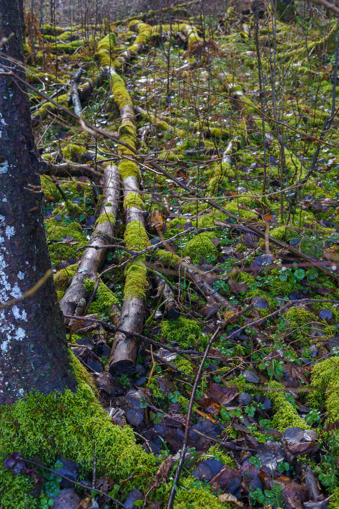
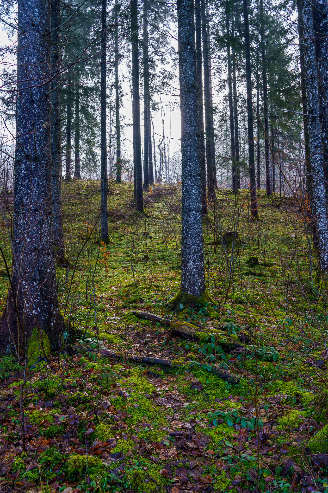

We started our year 2023 with a walk around the Lunzer See, which offered us an impressive mix of fog and sun - simply beautiful.

Pictures taken with the Sony A7C and the Sony FE 4-5.6/28-60mm.
