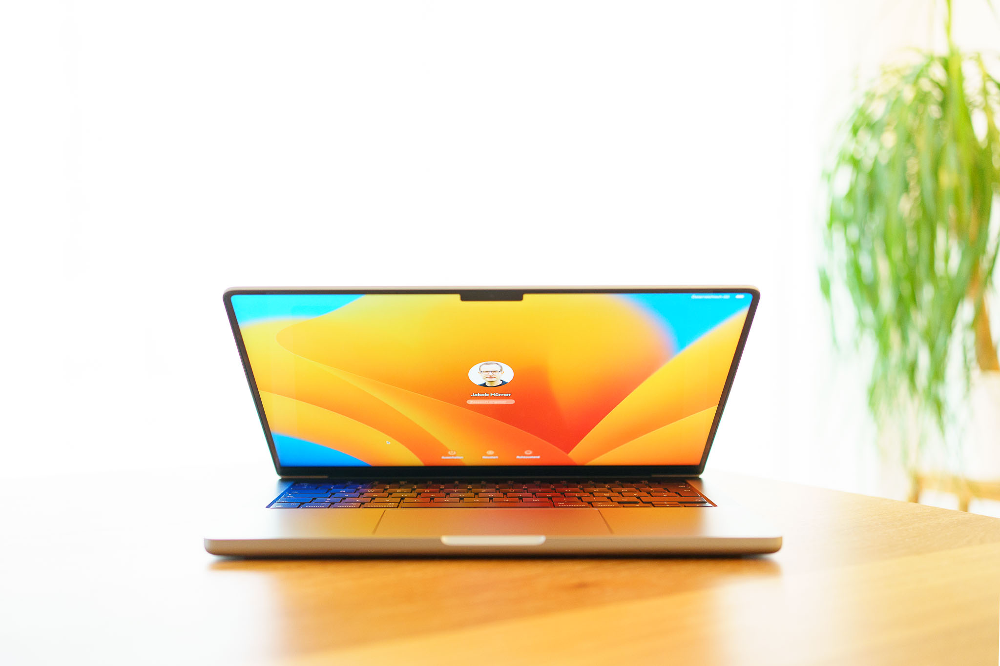
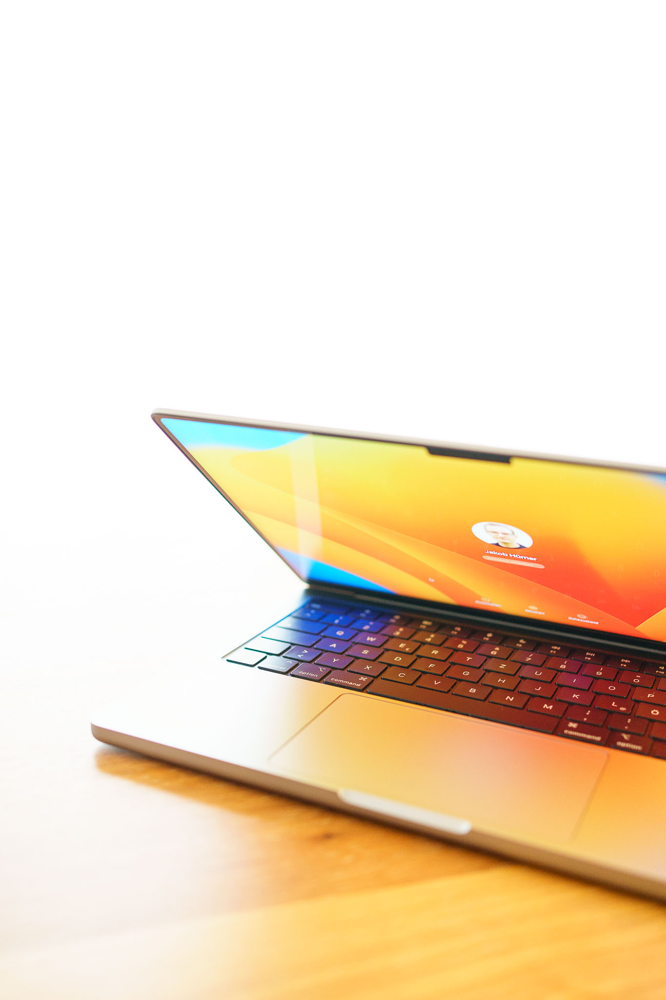

As my almost 6 year old Windows laptop needed to be replaced, I had to decide: Windows PC or Mac? I used a Mac until 10 years ago, followed by 2 Windows devices. Due to the great current Apply laptop lineup, I decided to switch back to Mac.

I [tried the 14“ MacBook Pro](../apple_macbook_pro_m1max_a_casual_photographers_view) already in early 2022 and was impressed. In contrast to my conclusion back then I now chose the 14“ model over the 13“ model as my new laptop, mainly due to my [casual photography](../leanest_highest_quality_casual_photography_setup) use.

# My choice

The major 14“ model benefits over the 13“ model for me:

- The screen of the 14“ model is exceptional. Color representation and sharpness is simply great, as a bonus you can enjoy HDR video content as well (my laptop doubles as our household‘s TV).
- A simple but welcome thing is the integrated SD card slot, which is convenient for transferring photos from the camera.
- The price difference between 13“ and 14“ was only about 15% in the configurations interesting for me - given the 14“ model is simply the higher quality device.

I went for an Apple MacBook Pro with base M1 Pro and extended the RAM to 32GB. It‘s my learning from almost every computer I bought in my life: Purchase double the RAM you think you need in the beginning, you‘ll need it in a few year‘s time. This is especially crucial if the RAM is not extendable as in many current devices by Apple and others.

# My experience

My overall impression of the MacBook Pro after one and a half months is very good.

The build quality is great, I like that they chose a more robust and solid build over the thinnest possible design.

I also enjoy the battery life of several days in my personal use. While I mainly used laptops plugged-in before, I almost exclusively use the MacBook Pro on battery power. It does not compromise performance and lasts long, so it's  absolutely practical to run it like a tablet or a phone.

The performance does not need to be discussed especially, it is simply great (in my use for photo editing and normal web use). Last time I ran a [Lightroom export test with the M1 Max model](../apple_macbook_pro_m1max_a_casual_photographers_view) against other devices. I repeated the test with my M1 Pro model, the exact same export is now even consistently faster - there must have been additional software improvements in the meantime.
I never experienced any performance-related hiccups in any tasks I did on my device. So, measured and perceived performance is exceptionally good with a lot of headroom for more challenging tasks and applications.

My overall conclusion is simple, the 14“ MacBook Pro is the best laptop I have ever used. I am confident that it will accompany well as part of my [lean & high quality casual photography setup](../leanest_highest_quality_casual_photography_setup/) in the years to come.
