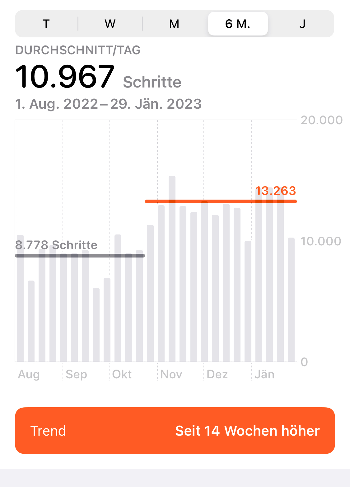

Über die positiven Effekte von viel Zeit des Papas mit dem Nachwuchs - sei es für die stärkere Bindung zum Kind, der positive Beitrag zur Gleichstellung von Männern und Frauen am Arbeitsmarkt etc. - wird viel gesprochen.

Was mir in der Diskussion unterrepräsentiert scheint: Väterkarenz hat einen positiven Einfluss auf die Fitness. 😉

Zumindest würde ich darauf schließen, wenn ich mir die Anzahl meiner täglichen Schritte ansehe. Seitdem ich [im November](../start-in-die-50-50-karenz/) in die Väterkarenz gestartet bin, haben sich Wege zur Kinderärztin, beim Spazieren mit dem Kleinen, zum Bringen und Abholen in den Kindergarten usw. messbar in der täglichen Schrittanzahl niedergeschlagen. 
 

Nächstes Ziel muss sein, diesen Trend nach Ende der Karenz, wenn sich erneut der Arbeitsalltag einstellt, nicht wieder ganz rückgängig zu machen ...
