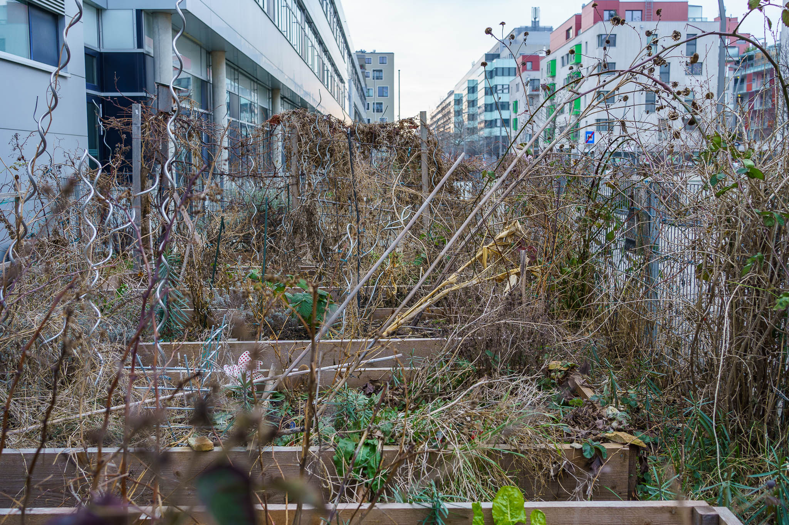

I really like to have the urban gardening of [Mintzgarten](https://mintzgarten.wordpress.com) on my daily morning walk, as it allows me to live with it through all seasons.

Now in February we are all longing for spring to flourish again. ☺️

Pictures taken with the Sony A7C and the Sony FE 1.8/35mm.
