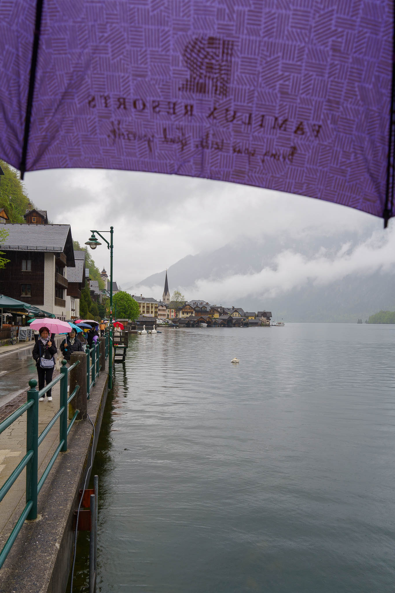

I guess: According to 8 billion people on earth (except Austrians), Austria is known for

- The Sound of Music,
- Schloss Schönbrunn, and
- Hallstatt.

Finally, I could tick the box for the third one as well after a visit a few days ago.

Even though on a rainy day, there were a lot of fellow-tourists with me the in the beautiful small (tourist) town. Nevertheless, I could take some scenic shots.

Pictures taken with the Sony A7C and the Sony FE 4-5.6/28-60mm.
