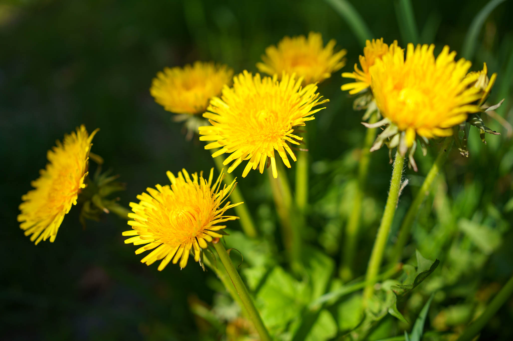
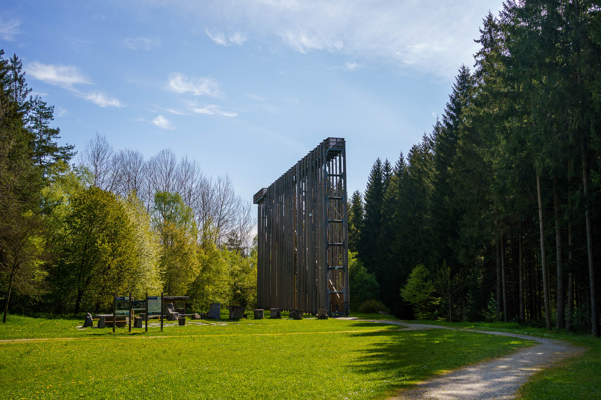
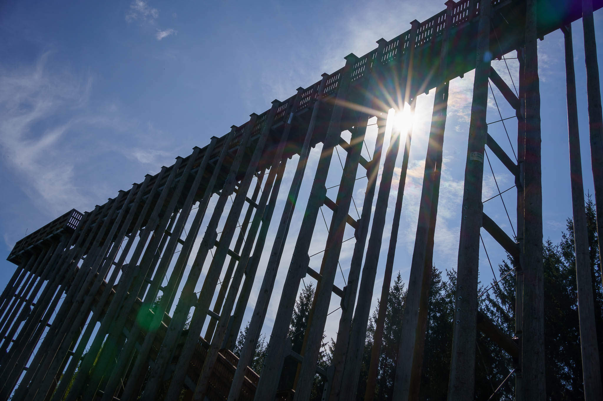
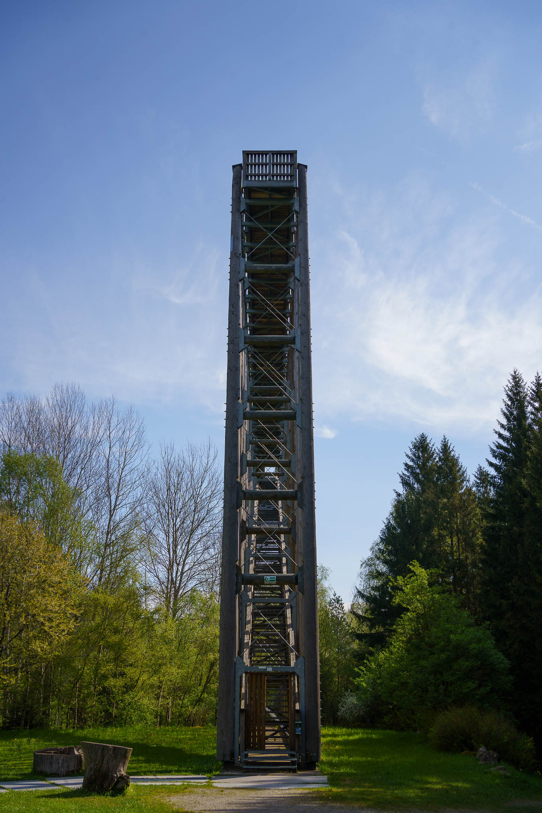
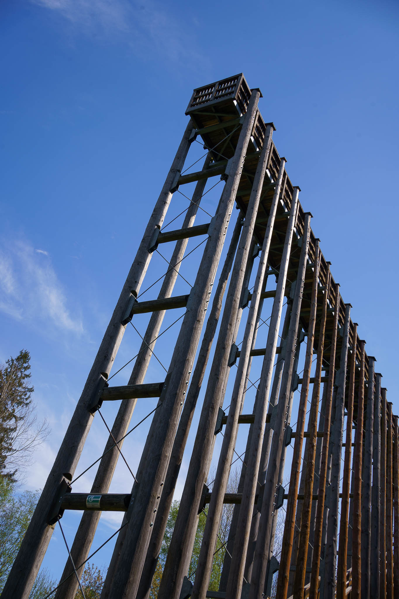
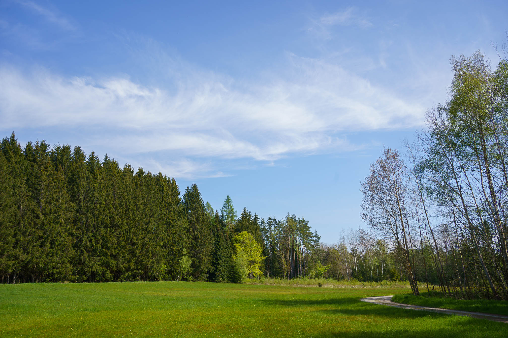

A stroll in the beautiful region of Waldviertel (Lower Austria) on a beautiful day in spring. 

Destination: The so-called "Himmelsleiter" in Schrems.

Pictures taken with the Sony A7C and the Sony FE 1.8/35mm.
