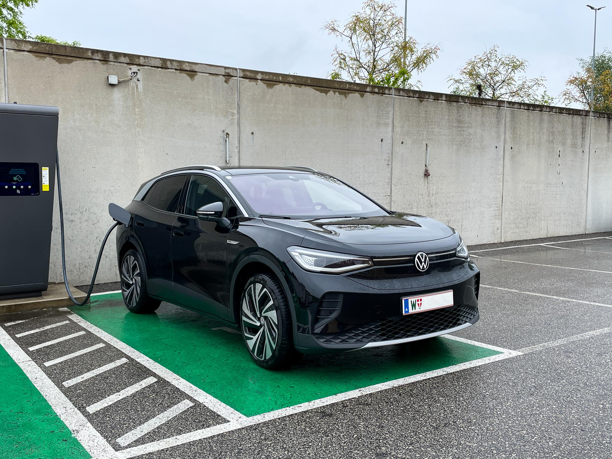

_Foto: Elektroauto an 50kW-Ladestation (Symbolbild - diese Ladesäule funktionierte perfekt)_

Wien hat meiner Meinung nach eine erfreulich hohe Dichte an attraktiven Ladestationen im Leistungsbereich 11-22kW (“Normalladen” mit Wechselstrom, dauert mehrere Stunden). Beim Schnellladen mit 50kW+ (“Schnellladen” mit Gleichstrom in <1 Stunde) schaut es am Papier nicht besonders gut aus. Wie die hier geschilderte Erfahrung zeigt, kann man in der Praxis aber leider noch schlechter dran sein.

## Praxiserfahrung aus dem Mai 2023

Ich wollte unser Fahrzeug in der Nähe unserer Wiener Wohnadresse schnellladen und musste dazu letztendlich vier Ladestationen verschiedener Betreiber anfahren, um Strom ins Auto zu bekommen.

❌ __Ladestation 1 - 50kW - Smatrics__

Der erste Versuch war an einer Smatrics-Station. Mit Ladekarte erfolgreich authentifiziert, angesteckt, kurz gewartet, Fehlermeldung. Zweimal neu versucht, ging nicht.
Also weiter fahren zur nächsten.

❌ __Ladestation 2 - 50kW - Wien Energie__

Der zweite Versuch war dann an einer Wien-Energie-Station, glücklicherweise nicht weit von der ersten entfernt. Erfahrung ähnlich wie beim ersten Versuch, nur dass die Station schon bei der Authentifizierung hing.
Also weiter zur nächsten, diesmal ein paar Kilometer. 

❌ __Ladestation 3 - 150kW - Smatrics__

Der dritte Versuch war wieder an einer Smatrics-Station mit 4 Anschlüssen. Da drei andere Autos bereits angesteckt dort standen, war ich optimistisch.
Also wieder versucht, den Ladevorgang zu starten. Die Anzeige meldete dann aber umgehend, dass kein Ladepunkt verfügbar sei, obwohl ich den freien Stecker in der Hand hatte. Trotz mehrmaliger Versuche kein Erfolg.
Also weiter fahren zur nächsten.

✅ __Ladestation 4 - 150kW - da.emobil__

Der vierte Versuch fand dann an einer da.emobil-Station statt.
Dort lief es dann endlich wie es sein sollte: Ladekarte hinhalten, anstecken, laden mit hoher Leistung.

Also alles ein ziemlich durchwachsen und zeitaufwendig.
Für den fehlgeschlagenen ersten Versuch wurde uns auf der Ladekarte sogar noch Geld abgebucht.

## Wenn es so läuft, wird’s mühsam

Mein Vorhaben, “noch schnell” zu laden, war leider an diesem Tag in Wien nicht umsetzbar. Schnell ging es nur ab dem Einstecken in die vierte angefahrene Station.

An der Qualität der schnelleren Ladeinfrastruktur in Wien muss also, zumindest dort wo ich wohne, noch stark gearbeitet werden. Eine Infrastruktur, auf die man sich verlassen kann, ist eine Grundvoraussetzung für eine breitere Akzeptanz der Elektromobilität.

Richtig ärgerlich wäre eine Situation, wie die von mir erlebte, auf der Langstrecke bzw. Autobahn. Hier sind meine Erfahrungen bisher aber umgekehrt sehr gut, was mich auch für Wien positiv stimmt - technisch ist es offenbar keine Hexerei.

_Teil 2 von 2 ([hier entlang zu 1](../wie_elektromobilitaet_sein_sollte_positive_erfahrung_volkswagen_id4/))_
