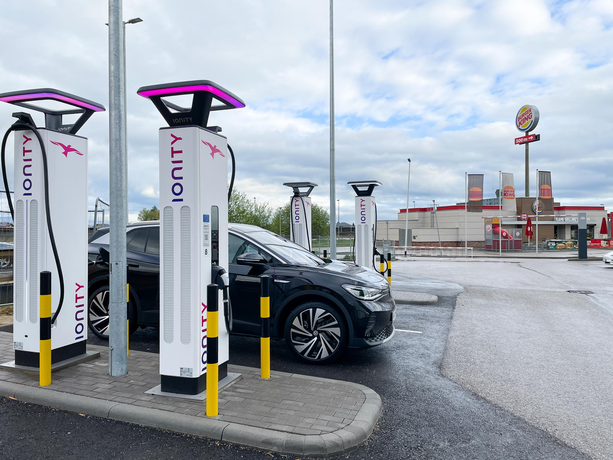

_Foto: Schnellladen eines Elektroautos an der Autobahn funktioniert und dauert ca. 30min_

Als wir unser Elektroauto recht neu hatten, ging es gleich einmal in einen Urlaub in Österreich. Während wir mit dem Auto normalerweise kaum Strecken wesentlich über 250km am Tag zurücklegen, stand bei dieser Urlaubsfahrt die Langstreckentauglichkeit des neuen Fahrzeugs am Prüfstand.
Etwas Neugierde und leichte Anspannung waren dabei, aber rückblickend waren sämtliche vorgelagerten Sorgen gänzlich unbegründet.

## Urlaubsfahrt ins Salzkammergut

Vor uns lag eine Fahrt von gut dreieinhalb Stunden, also zumindest mit der Familie eine Distanz, die man in jedem Fall mit einer Pause fährt. Früh morgens ging es mit einer gut gefüllten Fahrzeugbatterie los. Nach etwa 2,5 Stunden machten wir dann eine Pause, in der ein Toilettengang notwendig war und die Kinder ein kleines Frühstück bekamen. Nebenbei lud das Elektroauto am Ionity Schnelllader und war praktisch zur gleichen Zeit mit dem Laden fertig, wie die vierköpfige Familie mit der notwendigen Pause. Das ist perfekt.

Entspannt kamen wir in der Unterkunft an.

Dort gab es eine Ladestation für Gäste, bei der wir das Auto vor Abfahrt über Nacht nochmals aufladen konnten, ehe wir die Rückreise wieder inklusive einer weiteren kurzen Pause für Mensch und Fahrzeug antraten.

## Eine rundum sehr positive Erfahrung

Erstens: Der Fahrkomfort ist meiner Meinung nach überragend. Ein Elektroauto ist um Welten angenehmer, souveräner und vor allem leiser zu fahren als ein Verbrenner.
Zweitens: Die Fahrt mit dem Elektroauto bedarf vielleicht ein klein bisschen mehr Überlegung und Planung - der Komfort und die Nerven leiden auf längeren Strecken aber keineswegs mehr als bei einem Benziner oder Diesel.

Gleicher Komfort mit weniger Umweltbelastung - so solls sein. Ziel erfüllt.

_Teil 1 von 2 ([hier entlang zu 2](../wie_elektromobilitaet_nicht_sein_sollte_negative_erfahrung_schellladen_wien/))_
