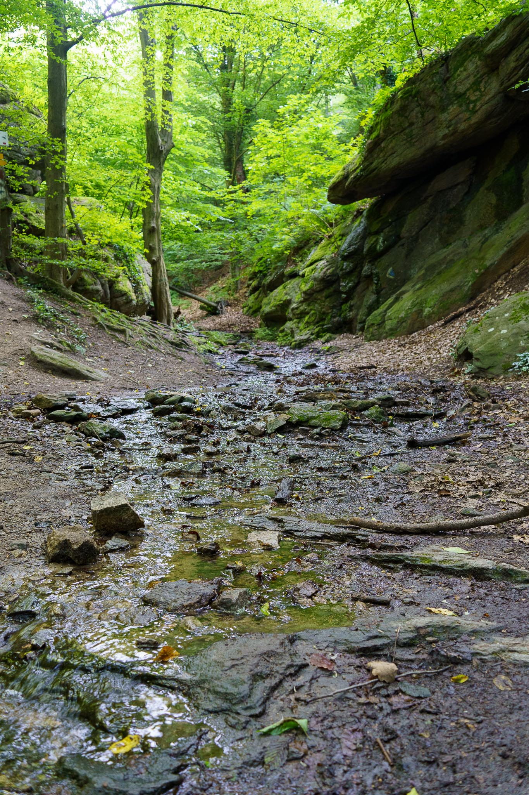
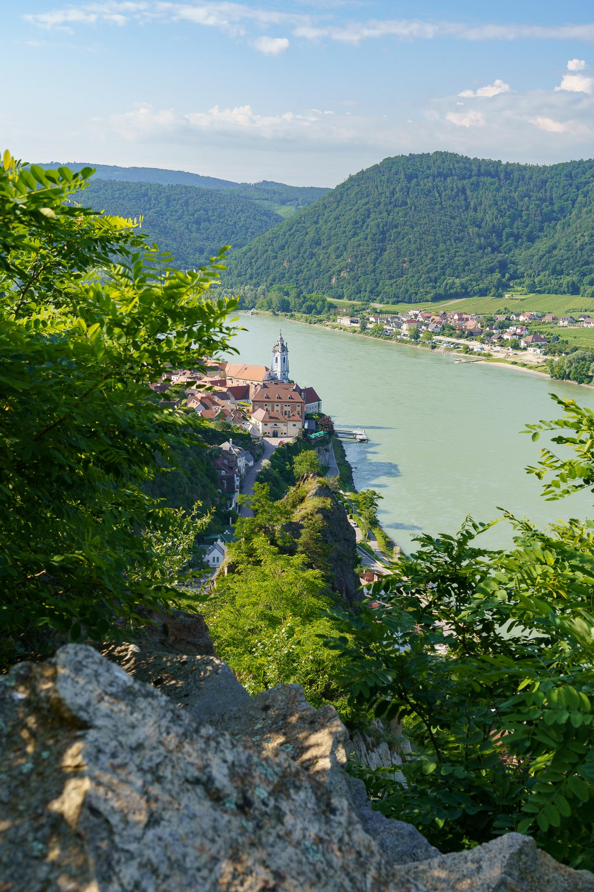
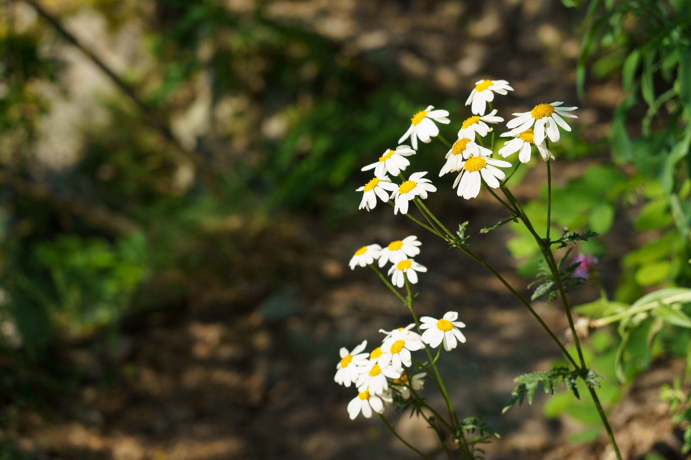
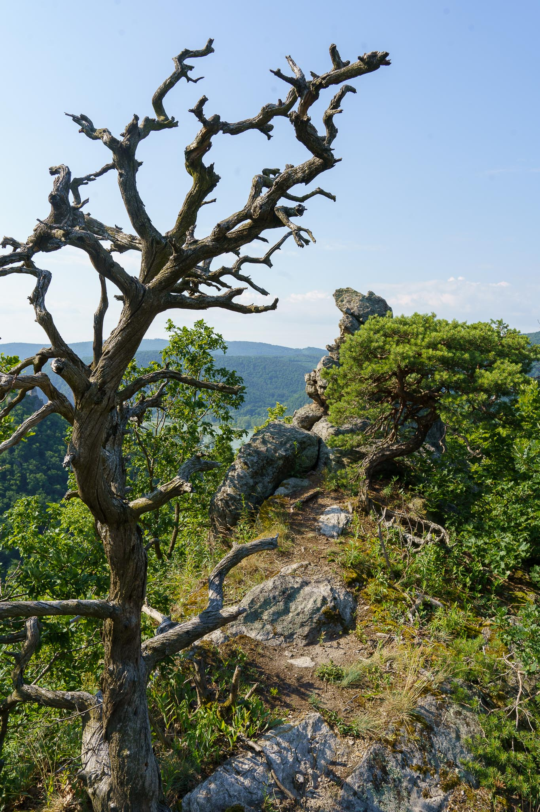
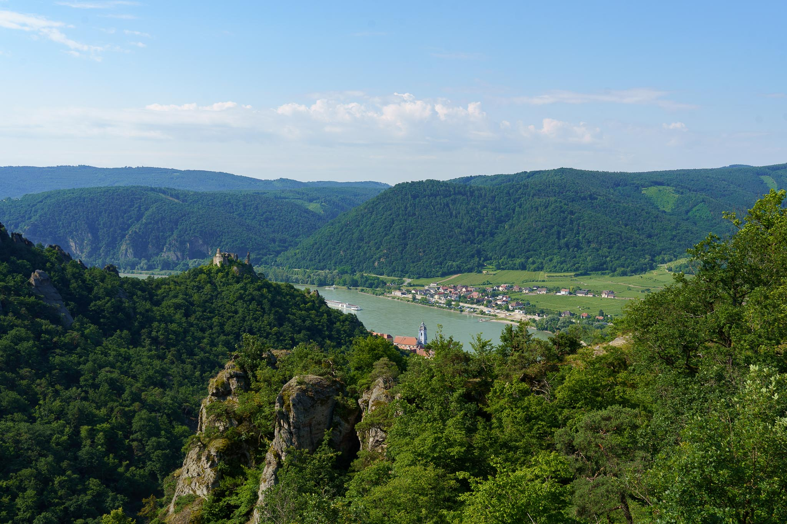
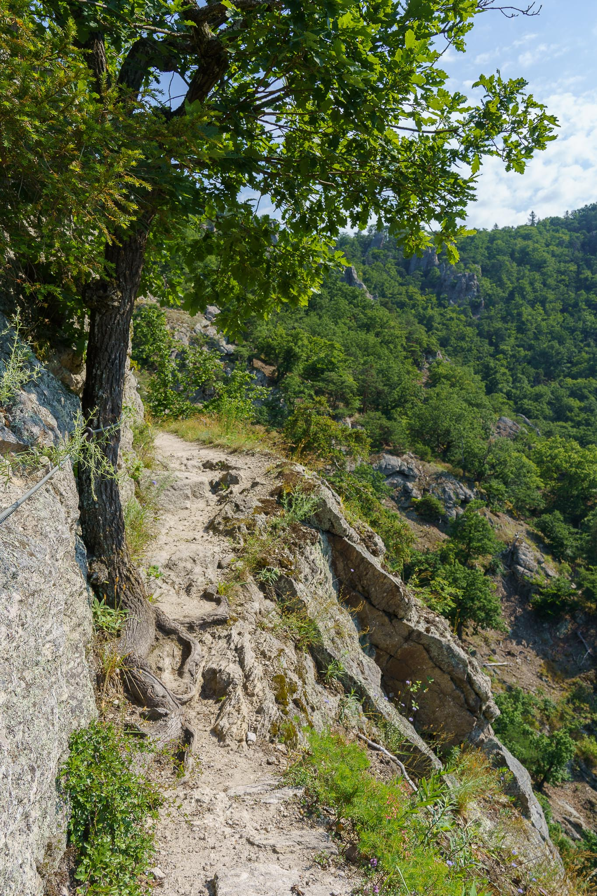
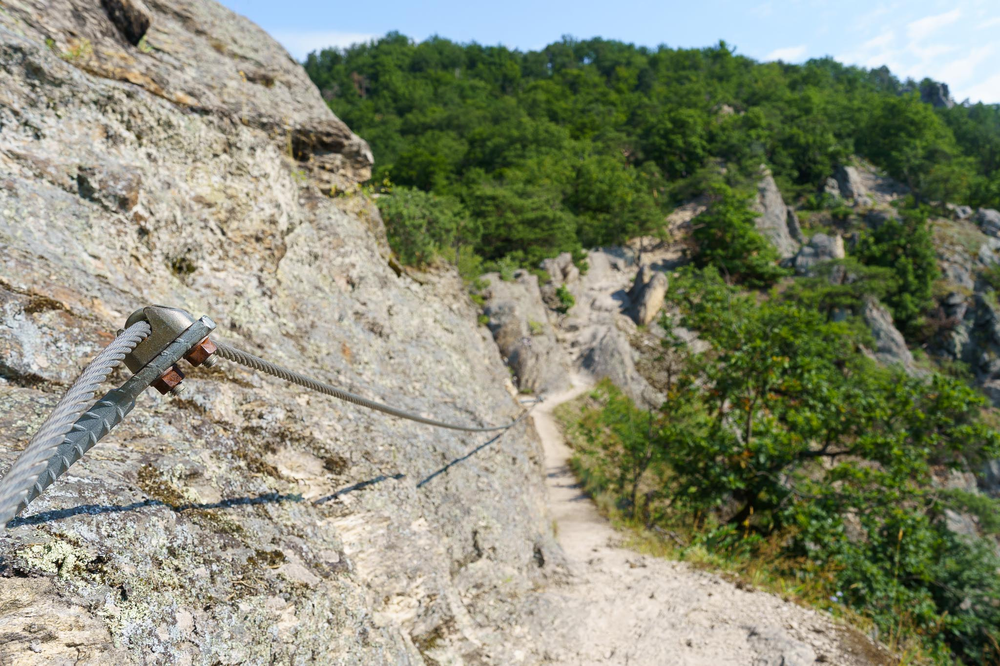
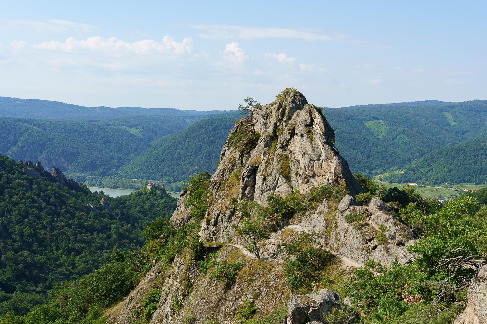
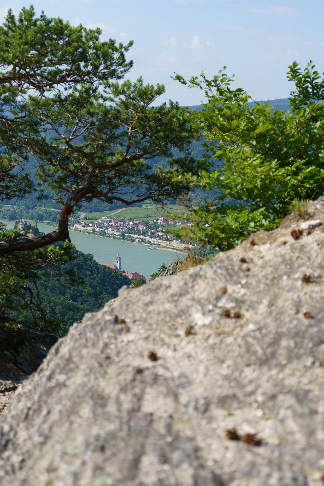
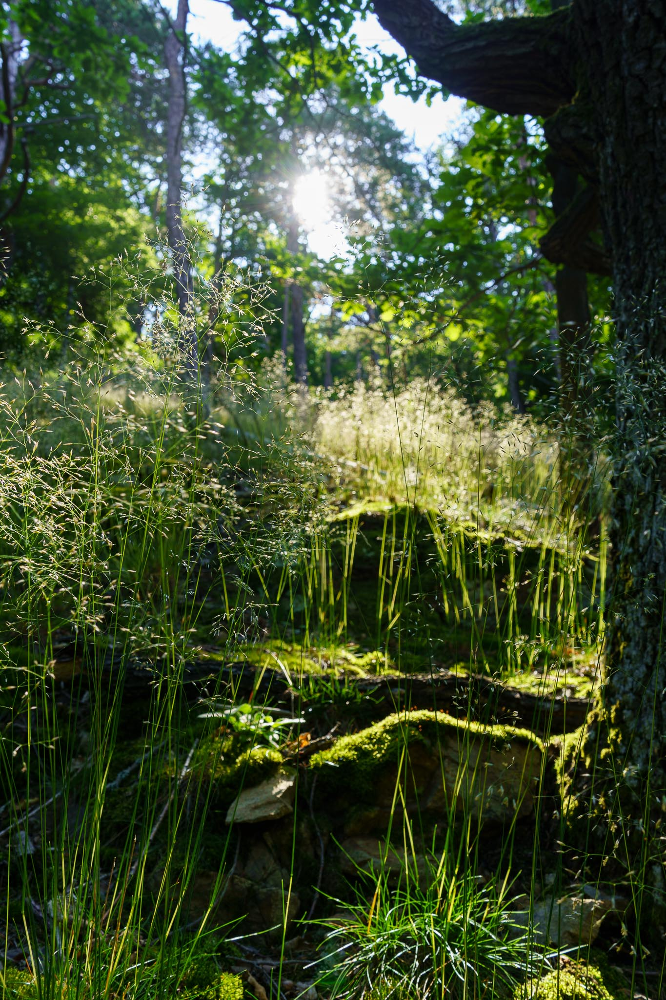

It is a real insider tip among people who like the beautiful Wachau valley in Lower Austria.

The trail at the Vogelberg is a little difficult, but offers unmatched views over Dürnstein castle and into the valley.

<iframe src="https://aut.social/@jakobhuerner/110606106856502086/embed" class="mastodon-embed" style="max-width: 100%; border: 0" width="400" allowfullscreen="allowfullscreen"></iframe>

Pictures taken with the Sony A7C and the Sony FE 4-5.6/28-60mm.
