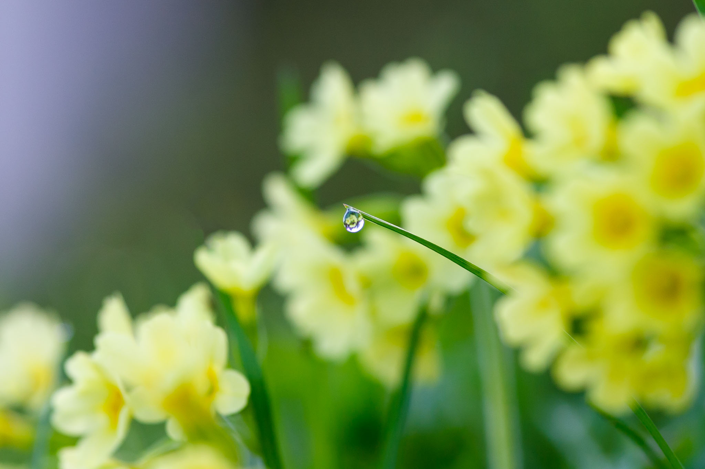

During the months of my parental leave I was more out in the „real world” in public transport, on city streets and in parks and playgrounds than usual. There, a bit detached from my daily work routine, I was thinking a lot about how we live and work, and especially how we use our time.

I made many observations. I want to dedicate this post to the one that definitely creates concerns for me. 

## Collectively addicted to our devices
Let’s be honest: As a society we got completely addicted to our mobile devices and social media apps. If you look around you at the underground train, or if you watch parents on the playground - everywhere you will see people staring at their phones, checking out the newest TikTok videos and Instagram stories. Even more intrusive, smartphone notifications seem to come in all the time.

Many people argue that people have always looked for distraction during idle times like commutes by reading newspapers or books. My impression, however, is that this distraction-seeking got more intense even in the last few years. People seem to be drawn in by all those blings, bells, and unread counters much more than a paper or book could ever do.

I do not want to blame the individual consumer. It’s the apps that are designed to make you addicted. We as consumers must be more conscious and clear about this fact. 

## Acceleration and overflow

We gave our devices and apps permission to constantly accelerate the information flow into our lives and turn it into a mere overflow. 

I feel this is not only true for our private communication, but also for our professional communication at work. As written in posts on this blog before, the number of communication channels increased strongly, and it is easy to lose oversight and a healthy usage level.

You can try it out yourself: Check out your phone’s screen time ([Apple](https://support.apple.com/guide/iphone/view-your-screen-time-summary-iph24dcd4fb8/ios), [Android](https://www.android.com/digital-wellbeing/)). Surprised by the number of notifications and device unlocks per day?

In times of regular overflow of information, I think we run into two major problems:

- As the amount of information exceeds our mental capacity, we get lost in information and followingly make bad decisions.
- If we run in information overflow mode constantly, our minds will react with exhaustion. This lowers our performance and well-being. 

## Focus is needed more than ever

Handling the information overflow age is no rocket science.

One element is to consciously choose how you communicate what. I have written a blog post [before](../use_the_right_tool_for_the_communication_job), in which I describe how I try to select communication channels in my professional life. 

I am fully convinced that in times of too much information in too many channels in too many situations of our everyday (work-)life, __focus is the new superpower__.

Focus in the age of information overflow means to me:

1. Identifying available information and channels.
1. Consciously selecting the most relevant ones.
1. Consciously selecting the adequate frequency of information coming in (e.g. do not use notifications on your phone whenever possible). 
1. Maintaining attention only to the chosen information and channels.
1.  Deliberately leaving out all other channels. If information is really urgent and important, it will reach you anyways.

## Examples and best practices

I found out that the following practices are helpful for me to maintain focus on the important things, and to run my communication in a healthy and productive way.

### Best practices in private life

- Mute notifications for group chats with more than 5 people on your messaging app, check them maybe once a day. Normally no time-critical information is discussed in such chats.
- Do not give away your private phone number unless absolutely needed. Try to run as much communication with businesses via email - so you can set the pace yourself.
- Avoid Instagram, Twitter, TikTok, … altogether. News is best consumed in a curated way on a daily or weekly basis. As a normal human being, you do not need to be informed about every small political/economic/societal development in real-time.
- Avoid the smartphone apps of online services whenever possible. Apps are typically intrusive and nudge you to open them much more frequently than needed. It is easier to stay disciplined when using the browser version, also because it is slightly less convenient. I for example stopped using the LinkedIn app, and check its webpage only every other day on average - which is certainly frequent enough. 

### Best practices in professional life 

- Be conscious about your [communication channels](../use_the_right_tool_for_the_communication_job). Also communicate your preferences to your co-workers.
- Disable notifications for emails. Email is not a means of real-time communication and therefore a time to read/reply of about a day shall be allowed.
- Avoid notifications via email as much as possible. Various business applications and workflow solutions like to send out masses of emails - the value is often very limited.
- Take some time to create clever email filters. Emails are easier to handle if you have a meaningful automatic pre-sorting in place.
- To have uninterrupted times in your working day, make use of the “busy” mode in the messaging application and on your phone, which silences notifications and displays you are not currently available.
- Book focus times for yourself in your work calendar and stick to them.

## Spread your superpower

In the end everyone of us is responsible for his or her own productivity and well-being, especially in our times of information overflow. I strongly believe that nowadays everyone needs to work on one's personal strategies for focus.

By acting in a conscious and sensible way and being open about it, you might influence others  and therefore have a positive impact beyond your own area of influence.

If you would like to read more of my blog, check out the list of posts [here](../welcome_to_jakobs_professional_blog)!
