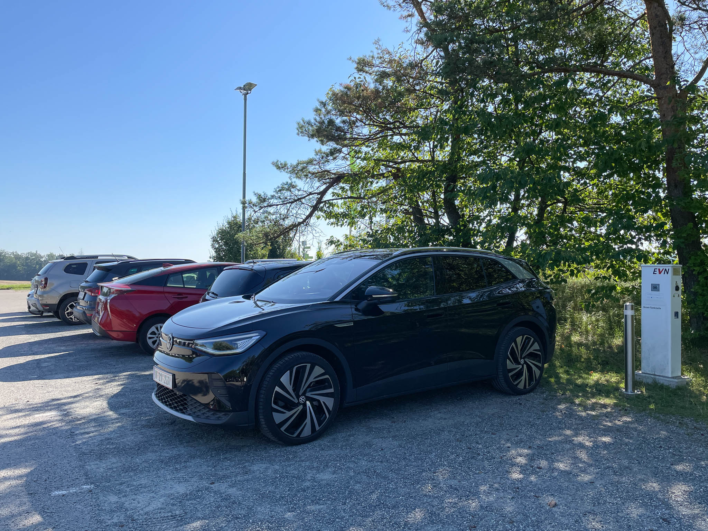
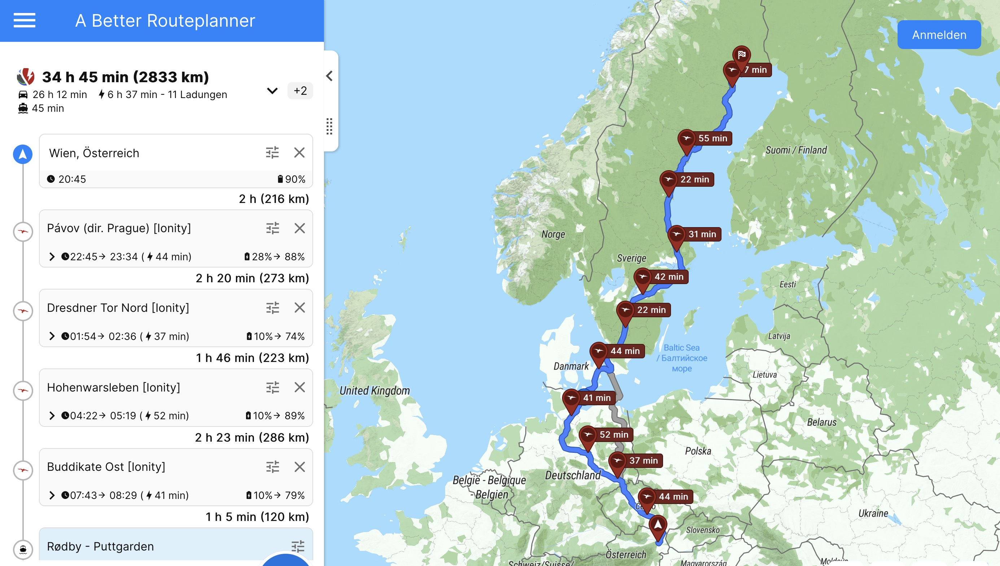

_Foto: Stehen und laden sind gedanklich eins_

## Nutze Stehzeiten als Ladezeiten
Das typische Nutzungsprofil eines Fahrzeuges umfasst einen überwiegenden Anteil an Stehzeiten. Ein Beispiel dafür ist eine Fahrt zu einem Wochenend-Ausflugsziel. Man kommt an, parkt das Auto, verbringt ein paar Stunden dort, und fährt dann wieder mit dem Auto heim. Stehzeiten wie diese kann man meist als ideale Ladezeiten fürs Fahrzeug nutzen, da bei vielen typischen Destinationen wie Museen, Ausstellungen, Geschäften etc. Lademöglichkeiten angeboten werden. Das Titelbild zeigt das Besucherzentrum des Nationalparks Thayatal im nördlichsten Waldviertel - selbst dort lassen sich an einem von mehreren 11kW-Ladern einige Kilowattstunden während des Besuchs nachladen. 

## Setze auf ABRP für die Langstreckenplanung
Ein Elektroauto zu fahren erfordert etwas mehr Überlegung zur Routenwahl als dies bei einem Verbrenner nötig ist. Wenn man einmal weiter als die Reichweite des Fahrzeuges fahren möchte, empfiehlt sich der Einsatz einer guten Routenplanungsapp - in diesem Bereich gibt es nichts Besseres als [ABRP](https://abetterrouteplanner.com/). Damit lassen sich mit einer erstaunlichen Präzision die Reichweite, die Ladestopps, sowie die Gesamtzeit vorab ermitteln. Damit lässt es sich entspannt ins Auto einsteigen und gut ankommen.

## Minimiere das Risiko beim Schnellladen auf Langstrecken
Wenn man darauf angewiesen ist, schnell zu laden und rasch wieder weiterzufahren, sollte man bei der Planung der Route auf ein gewisses Risikomanagement achten. Es ist nichts ärgerlicher, als zu einem Ladestopp stehen zu bleiben und dann eine nicht verfügbare Ladesäule anzutreffen. Umso ärgerlicher, wenn es die einzige im Umkreis ist.

Auf Langstrecken würde ich in der Routenplanung zum Beispiel nie auf einzelne 2x150kW-Ladesäulen, die öfters bei Supermärkten oder Tankstellen stehen, setzen. Einerseits, weil diese meist systembedingt bei Doppelbelegung nicht oder nur langsam funktionieren. Andererseits, weil man bei Ausfall dieser einen Säule dann ohne Ersatz dasteht.

Wer Langstrecken mit dem Elektroauto möglichst ohne negative Überraschungen zurücklegen will, dem lege ich eine Routenplanung entlang von Ionity-Standorten ans Herz. Konzeptionell und was die Geschwindigkeit und Verfügbarkeit betrifft, kommt kein mir bekannter Anbieter an das Qualitätsniveau heran (ev. mit Ausnahme von Tesla). Der Ausbau von Ionity ist mittlerweile auch so gut, dass man beispielsweise mit einem VW ID.3 von Wien nach Luleå in Nordschweden fahren und dabei ausschließlich an Ionity laden kann.

## Ersetze Schallemissionen mit doppelter Aufmerksamkeit 
Ein großer Vorteil von Elektroautos ist gleichzeitig ein Nachteil. Gerade bei niedrigen Geschwindigkeiten, bevor Abroll- und Windgeräusche überwiegen, sind Elektroautos sehr leise.
Dies führt dazu, dass diese von anderen Verkehrsteilnehmer:innen öfter einmal überhört werden. Gerade auf Parkplätzen oder Zufahrten erlebt man dies regelmäßig.
Deshalb sollte die Devise sein, als Elektroautolenker:in gegenüber Fußgänger:innen und Radler:innen doppelt aufmerksam zu sein, um gefährlichen Situationen im Vorhinein vorzubeugen.

