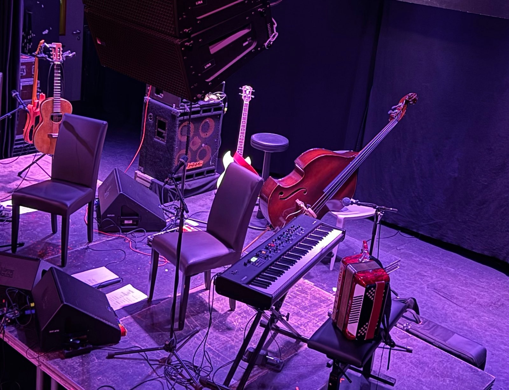

The year 2023 comes to an end, the new year will bring new challenges and opportunities at work.

To celebrate the arrival of 2024, I (*) created a team song - here it is!

## The Team Song for 2024

*We rocked this year like a steel*

*We forged our path and made it real*

*We worked as a team with loyalty and will*

*We conquered the challenges and fulfilled*

*We produced awesome products and quality*

*That pleased our customers and industry*

*We reached our benchmarks and standards*

*That proved our excellence and rewards*

*We also faced some complexity and pressure*

*That demanded our creativity and measure*

*We optimized and streamlined new ways*

*That made us faster and ready for the next phase*

*Now we're looking forward to 2024*

*With ambition and eagerness for more*

*We have new opportunities and markets*

*That will make us shine and lead*

*We're not daunted by the competition*

*We have the edge and the vision*

*We're a team of rock and steel*

*That will always rock our deal*

---

## Background

(*) I got a little help by GPT-4.

The question (prompt) I have given it is: *write an inspirational year end post for LinkedIn. write it in the style of rock music lyrics. mention team, steel, achievements and new opportunities for 2024*

It's remarkable what this type of AI can produce from this limited amount of input.

Looking forward to exploring what AI and LLMs will bring to our (work) lives, after the first wave of exceeded expectations is over. :)

**Happy 2024!**

If you would like to read more of my blog, check out the list of posts [here](../welcome_to_jakobs_professional_blog)!
