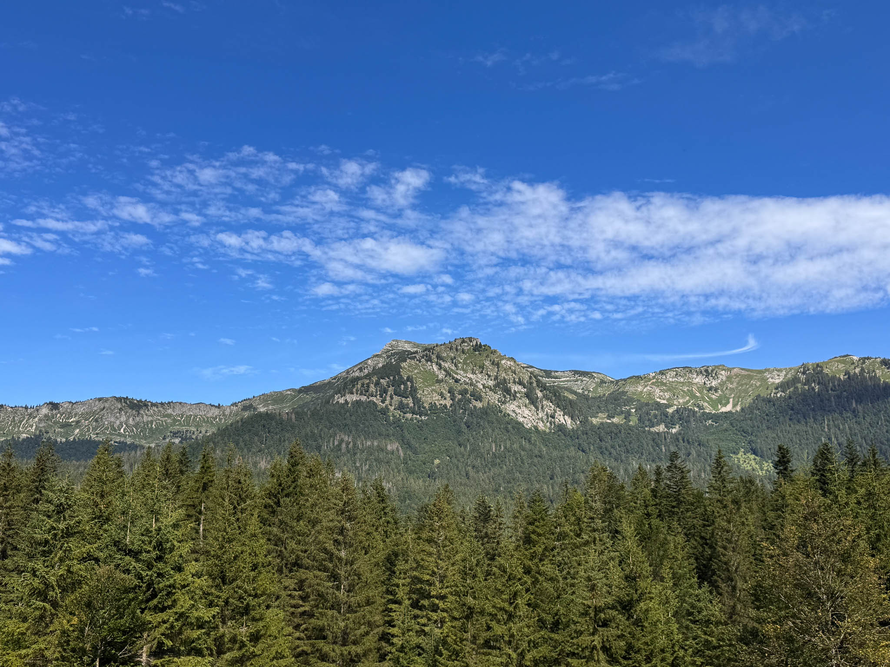
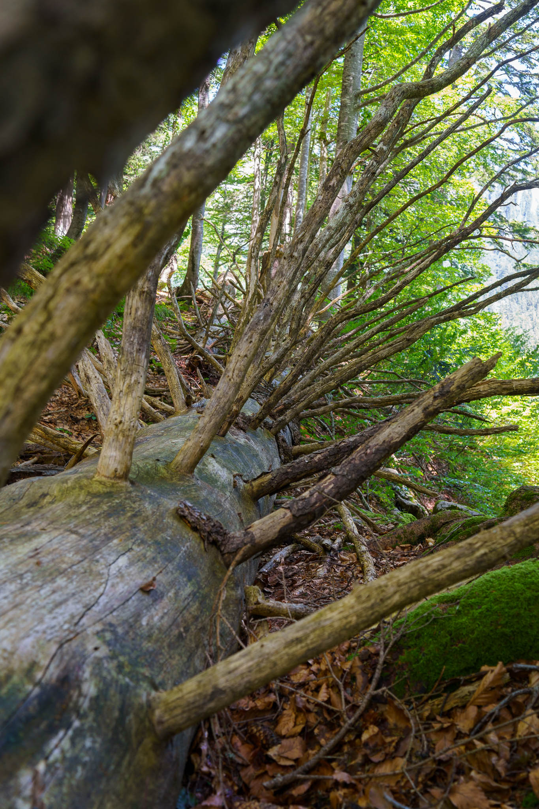
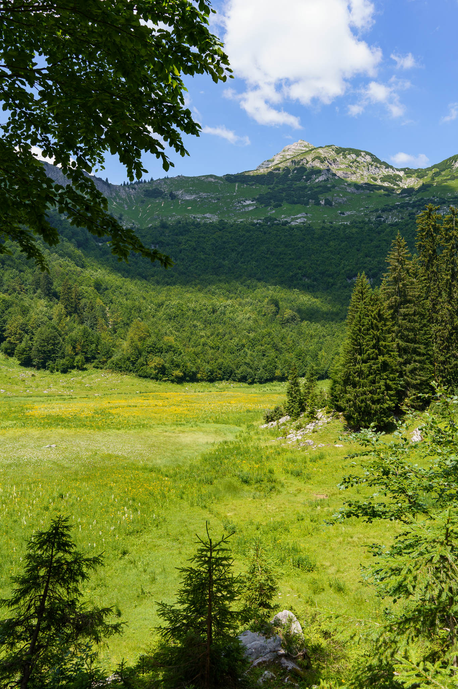
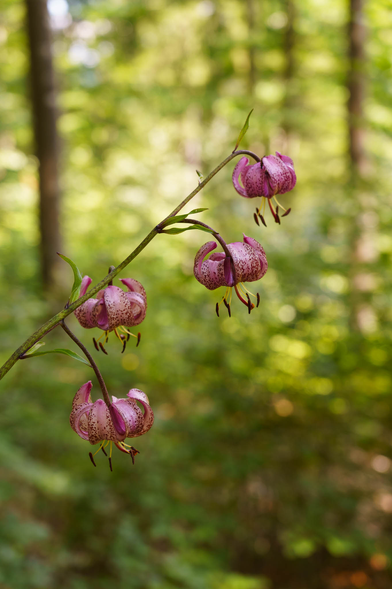
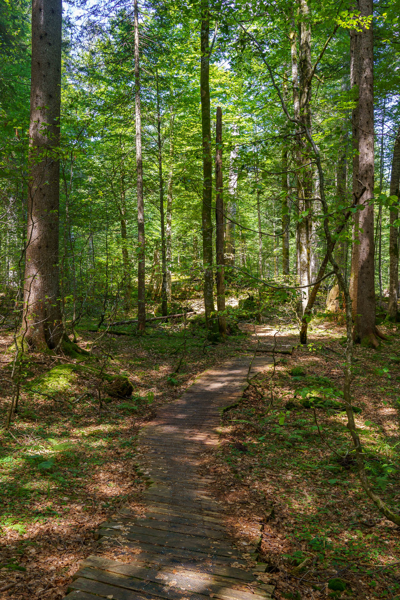

In July I had the unique opportunity to get a two-day tour into the UNESCO World Heritage Site "Wildnisgebiet Dürrenstein-Lassingtal".
Guided by an expert in ecology and local history, we had the chance to see some of the last remaining areas of primary forests in Central Europe.

It was certainly one of my personal highlights in 2024 ...

Pictures taken with the Sony A7C and the Sony FE 4-5.6/28-60mm.