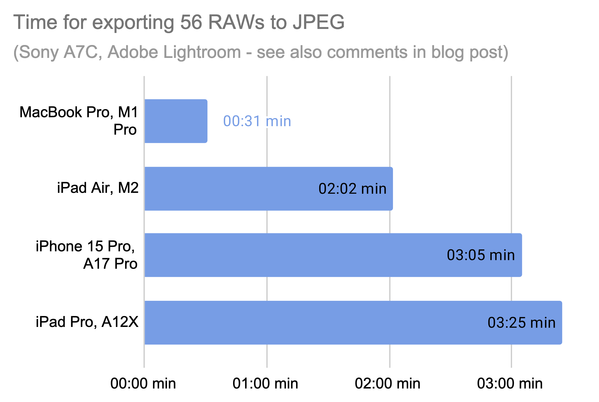

For more than 5 years I have used [Adobe Lightroom](../raw_workflow_with_adobe_lightroom) on my Laptop (now [MacBook Pro](../apple_macbook_pro_m1pro_for_personal_and_casual_photography_use)), iPad and iPhone and enjoy the great functionality and seamless synchronisation via the Adobe Cloud. The MacBook is traditionally the main device I use for importing RAWs from the memory card, for editing, organising and exporting to JPG. The iPad is used mainly as a viewing device, and from time to time also to edit and export images.

With the development of the iPad and its ever increasing computing power I asked myself whether the iPad could become the centre of my Lightroom workflow. As I am interested in a lean casual photography workflow, a slim and simple device seems like the perfect fit.

## Light and shadows

Overall the iPad is a great device I use every day. I like the portable size and low weight that makes it comfortable to carry and hold. The iPad’s screen is great for viewing and its touch input works better than on any other larger touch device I know.

Despite all the virtues of the iPad, I still see some essential advantages of using a laptop computer for photography. When it comes to efficient editing of larger sets of images, a computer operating system with mouse input is unmatched for both speed and precision. Having a proper file system for me is a prerequisite for convenient image sharing and archiving. The (as I feel it) rudimentary file handling in iPad OS for me is not satisfactory. 

Finally, if you want to work with higher megapixel files, or many images, the computing power of a computer is clearly superior. I recently upgraded to the recent iPad Air with M2 chip, since my old iPad’s screen broke. The M2 is a great chip, however, in the iPad its capabilities are limited (I assume due to passive cooling and limited RAM).

## Real-world performance benchmarking

I repeated my [Lightroom test from 2022](../apple_macbook_pro_m1max_a_casual_photographers_view) with the exact same set of Sony A7C RAWs. I used the latest Lightroom version on all devices, and locally saved the RAW files.

As you can see, the MacBook Pro with M1 Pro from model year 2022 still outpaces the M2-powered iPad Air from 2024 by a multiple of ~4.
Please note that the M1 Pro here was even faster than the M1 Max in February 2022. I have recognised it [before](../apple_macbook_pro_m1pro_for_personal_and_casual_photography_use) and assume this is due to software optimization.

So overall, I still see the need in my workflow for both the computer and the tablet - in tandem they are a perfect set of equipment for my type of [lean and quality-oriented photography](../leanest_highest_quality_casual_photography_setup/).
