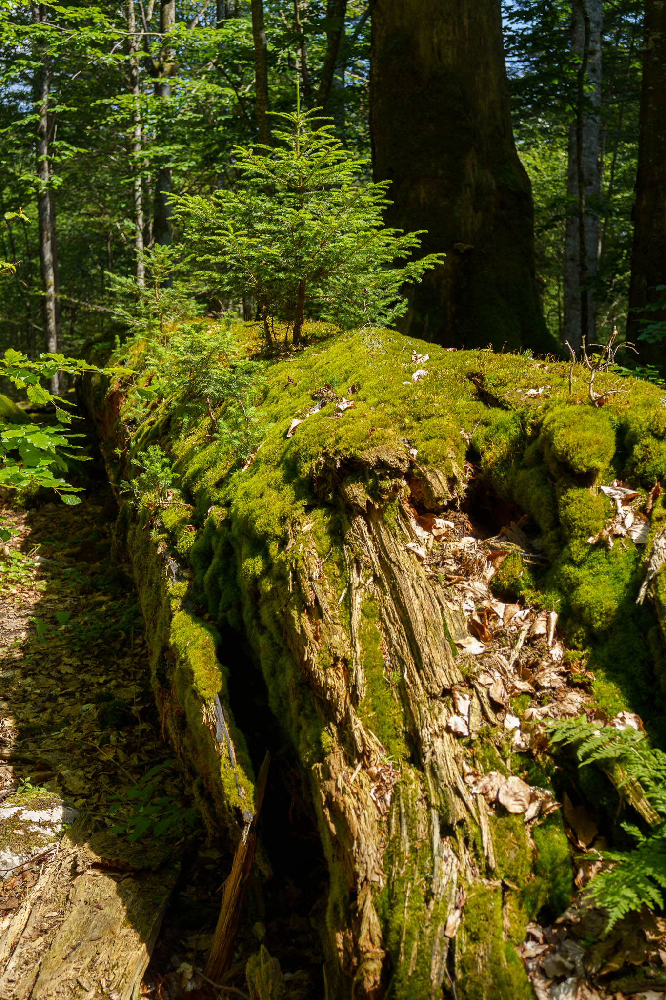
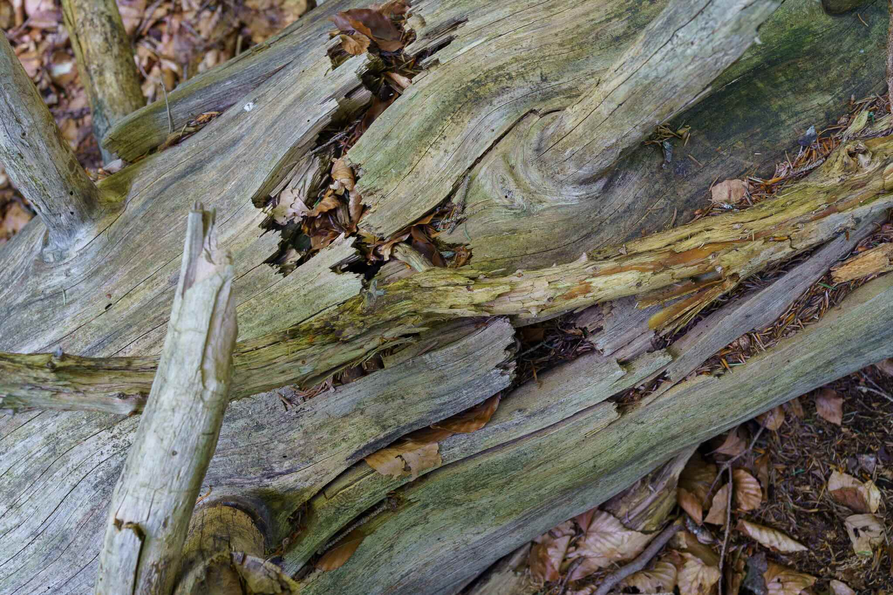

Im Sommer 2024 hatte ich das Privileg, [einen Blick](../wildnisgebiet_duerrenstein_lassingtal) in einen besonderen Wald zu werfen. Einen, der ohne direkte menschliche Einflüsse geblieben ist - den Urwald Rothwald mit dem umgebenden [Wildnisgebiet Dürrenstein-Lassingtal](https://www.wildnisgebiet.at/).
Als Teilnehmer einer geführten Exkursion durch das UNESCO Weltnaturerbe lernte ich an zwei intensiven Tagen unglaublich viel Neues über die Natur und das Leben. Vieles davon spielt nicht nur im Wald eine Rolle, sondern auch für unser modernes Leben und unseren eigenen Alltag.

Was ich damit meine, versuche ich im Folgenden anhand mehrerer Schlüsselerkenntnisse zu erklären.

## Auf Altem entsteht Neues

Sterben Bäume ab, wird aus ihnen Totholz. Der Name täuscht! Gerade abgestorbene Bäume sind besonders lebendig, sind sie doch Lebensraum für eine Vielzahl von Insekten und anderen Tieren. Aktives Wirken von Pilzen sorgt weiters dafür, dass die chemischen Bausteine abgestorbener Baum wieder verwertet werden können. Nicht selten wächst auf einem alten umgefallenen Baum ein junger, so sind beispielsweise tote Fichten eine idealer Boden für junge Fichtenkeimlinge. 

Kadaververjüngung ist der Fachausdruck dafür - klingt makaber, ist aber ein Erfolgsrezept der Natur, die damit auf Altem Neues entstehen lässt.

## Alles hängt mit allem zusammen

Man kann den Wald nicht begreifen, wenn man nur auf eine Art blickt. Der Wald ist nur auf den ersten Blick eine Ansammlung von Bäumen. In Wirklichkeit ist er ein komplexes Geflecht aus verschiedensten Arten wie Bäumen, Sträuchern, Gräsern *über* sowie deren Wurzeln oder Pilzen *unter* der Erde. Nicht nur jede Pflanzenart trägt ihren Teil zum Wald bei, sondern auch jede Tierart spielt im Zusammenleben eine Rolle.

Die Wissenschaft bringt dabei nach wie vor neue Erkenntnisse über das Zusammenwirken hervor. 
Sämtliche Eingriffe in das System Wald sind mit besonderer Vorsicht vorzunehmen, da die Auswirkungen nie vollständig abgeschätzt werden können.

## Um ein System zu verstehen, muss man Abhängigkeiten erkennen

In diesem Zusammenhang ein Beispiel: Im Wald gibt es sogenannte Mastjahre, in denen Bäume besonders viele Samen und Früchte hervorbringen. Dies sorgt für üppige Nahrung für Mäuse, deren Population daraufhin ebenfalls steigt. In weiterer Folge finden damit Greifvögel mehr Nahrung, wodurch die Greifvogelpopulation zunimmt. 

Möchte man verstehen, wieso es in einem Jahr besonders viele oder wenige Vertreter einer Art gibt, reicht es nicht, sich nur diese eine anzusehen. Man muss das System, sowie die jeweilige Art eingebettet in ganze Ketten von Zusammenhängen und Abhängigkeiten, betrachten.

## Auch Sonderlinge haben ihren Platz

In der Region und Höhenlage des Wildnisgebiets würde sich typischerweise auf lange Zeit eine Baumzusammensetzung von Fichten, Tannen und Buchen zu je einem Drittel einstellen. Trotzdem findet man im dortigen Wald auch Kiefern oder Ahorn.

Fragt man sich wieso, erkennt man, dass diese Arten besondere, einzigartige Stärken haben. Die Kiefer fühlt sich auch auf exponierten Felslagen praktisch ohne Erde, und dem Wind und dem Wetter ausgesetzt, wohl. Ein Ahornbaum kann mit Schnee und Steinschlag gut umgehen.
Man könnte sagen, es haben auch die Sonderlinge aufgrund ihrer besonderen Eigenschaften und Fähigkeiten ihren Platz in der Waldgemeinschaft.

## Evolution ist stetige Weiterentwicklung

Der Mensch neigt dazu, auf die gute alte Zeit zurückzublicken. Diese gab es wahrscheinlich nie - jedenfalls wäre sie nur ein Wimpernschlag der stetig fortschreitenden Geschichte gewesen.

Alles was wir Menschen im Moment sehen, ist ein Teil eines langen Prozesses, der lange vor uns begonnen hat und lange nach uns weiter wirkt. Eine wesentliche Eigenschaft der Evolution ist es, dass sie nicht mehr an den gleichen Punkt zurückkehrt. 

Wir werden die Welt, so wie sie früher einmal war, nie mehr erleben - aber das ist Teil des Lebens und es liegt an uns, das Beste daraus zu machen.

## Menschliche Zeiträume sind kurz

Ein für mich beeindruckendes Faktum ist der Unterschied der Dauer der Entwicklung des Waldes bzw. im Speziellen die Generationsabfolge von Bäumen im Vergleich zu Menschen. Gehen wir in der Menschheitsgeschichte zum Ende des Mittelalters zurück, hat der Mensch zwischenzeitlich viele revolutionäre politische, kriegerische, gesellschaftliche und technologische Umbrüche durchgemacht.

Für die Fichten im Wildnisgebiet war es entspannter, sie können 600 bis 700 Jahre alt werden, wenn der Mensch nicht eingreift. Das bedeutet, dass manche Bäume schon standen, als unser Mittelalter zu Ende ging. 

## Give it time. Let it grow.

Die vielleicht wichtigste Lektion für mich fasst ein Spruch gut zusammen, der Besucher:innen im Haus der Wildnis begrüßt. In unserer Zeit muss alles schnell gehen, wir sind hektisch und wollen alles sofort haben, die technologische Entwicklung von gestern ist heute schon wieder alt.

Ob das alles notwendig ist, und ob es uns zu einem besseren Leben führt, steht auf einem anderen Blatt. Wir sollten uns viel öfter ein Beispiel an der Natur nehmen - und dem Leben einfach einmal Zeit geben.
