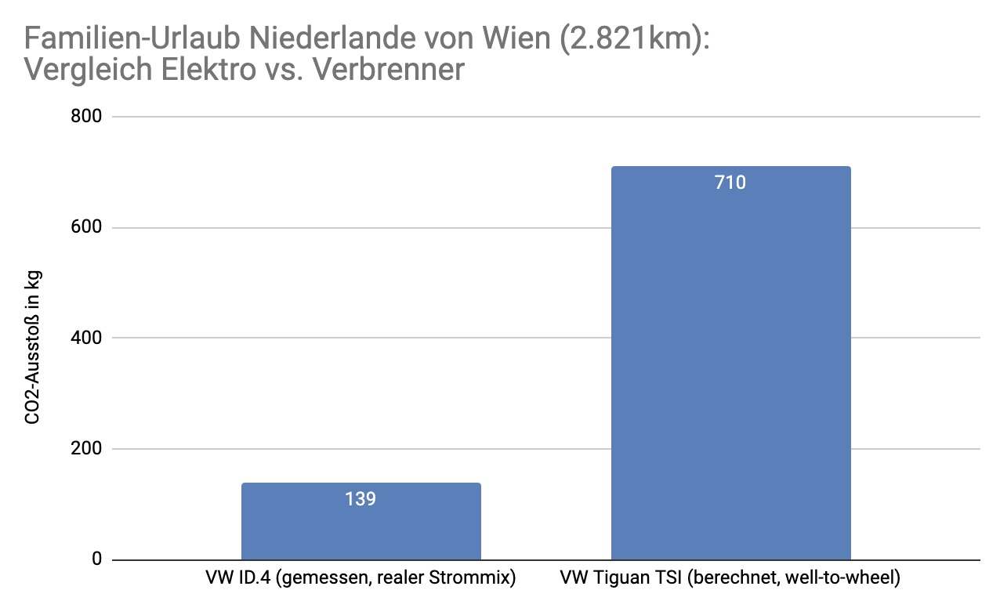

Unseren heurigen Sommerurlaub stellten wir wieder unter den Titel: “Europa erkunden".
Nach Dänemark im letzten Jahr ging es heuer in die Niederlande. Natürlich aus ökologischen Gesichtspunkten wieder mit dem Elektroauto.
Dass dies im Vergleich zum Verbrenner (und erst recht zum Flugzeug) sehr viel Sinn macht, zeigt die folgende Vergleichsrechnung.

## Elektro vs. Verbrenner

Basierend auf dem tatsächlich angefallenen Energieverbrauch (inkl. Ladeverluste) unseres VW ID.4 von 625 kWh und dem tagesaktuellen Strommix des jeweiligen Landes ergibt sich für die 2.800km-Fahrt eine CO2-Emission von 139 kg.

Im Vergleich dazu würde dieselbe Urlaubsfahrt mit einem vergleichbaren VW Tiguan mit Benzinmotor etwa 710 kg CO2 verursachen.

Der Unterschied beträgt Faktor 5 zugunsten des Elektroautos!

Wie sich wieder klar gezeigt hat, kann man dies in der Praxis auch ohne Abstriche beim Komfort umsetzen. Selbst die Gesamtdauer ist dieselbe, denn mit zwei Kindern im Auto sind regelmäßige Pausen ohnehin notwendig und die nächste gute Lademöglichkeit war auf unseren Routen stets in “Griffweite”.

## Wer es genauer wissen möchte … (+ Schätzspiel)

Wer die Zahlen genau nachvollziehen möchte, kann die Berechnung und die Quellen [hier nachlesen](https://docs.google.com/spreadsheets/d/1i_jJHJjevBsg62S7AUTlFe-zlrQlEKaFEi7EJrZuYFE/edit?usp=sharing).

Zusätzlich gibt es in dem verlinkten Berechnungsblatt auch weitere Infos, zum Beispiel wie der Vergleich zu Flug und Bahn aussieht.

Abschließend ein kleines Schätzspiel:

> Was glaubt ihr, womit wäre das Tanken/Laden auf unserer Urlaubsfahrt günstiger gewesen, Elektroauto oder Benziner?

Die Antwort findet ihr ebenfalls im verlinkten Berechnungsblatt.

