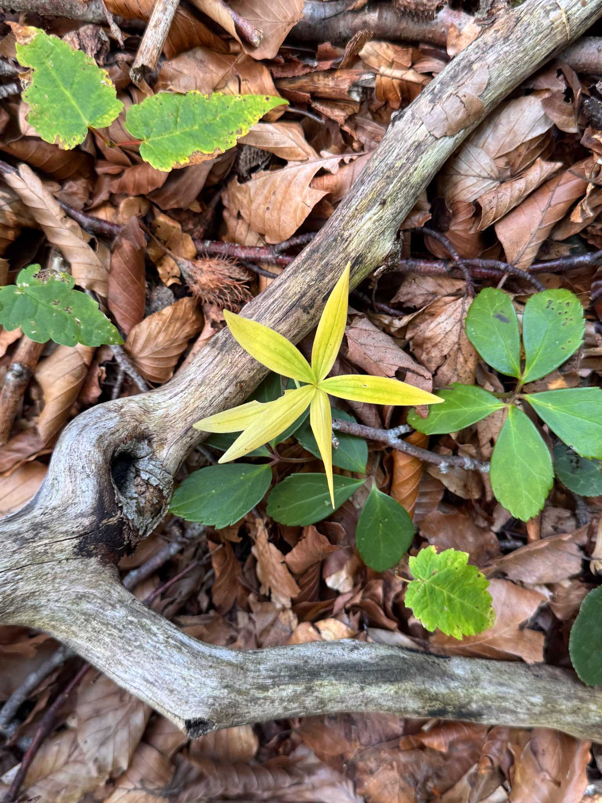
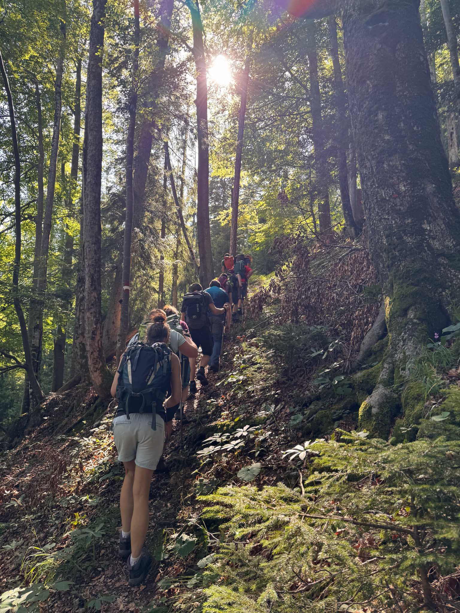
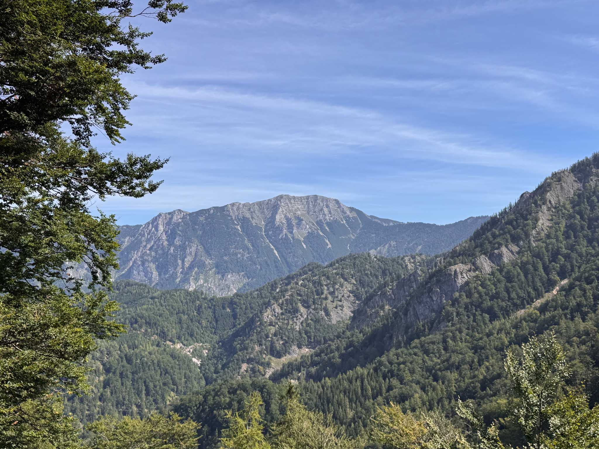
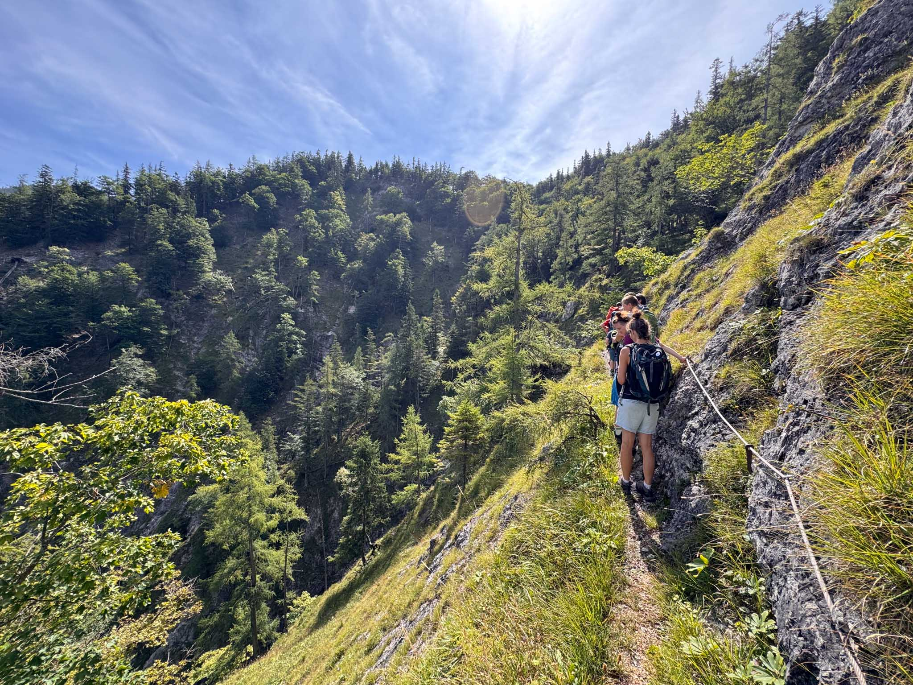
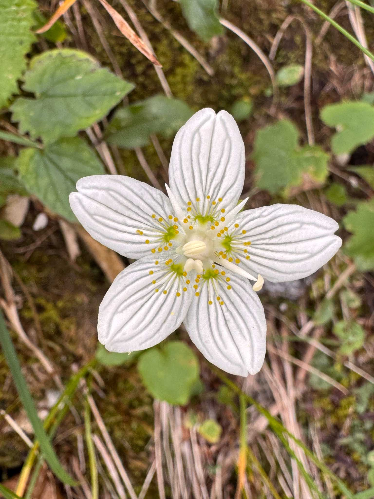
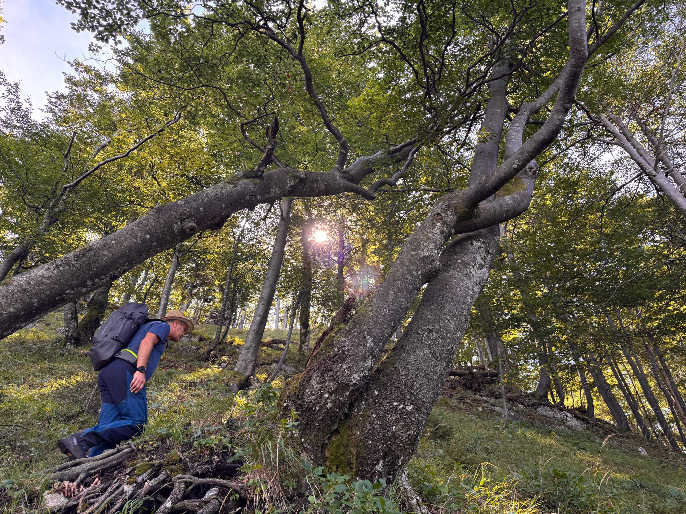
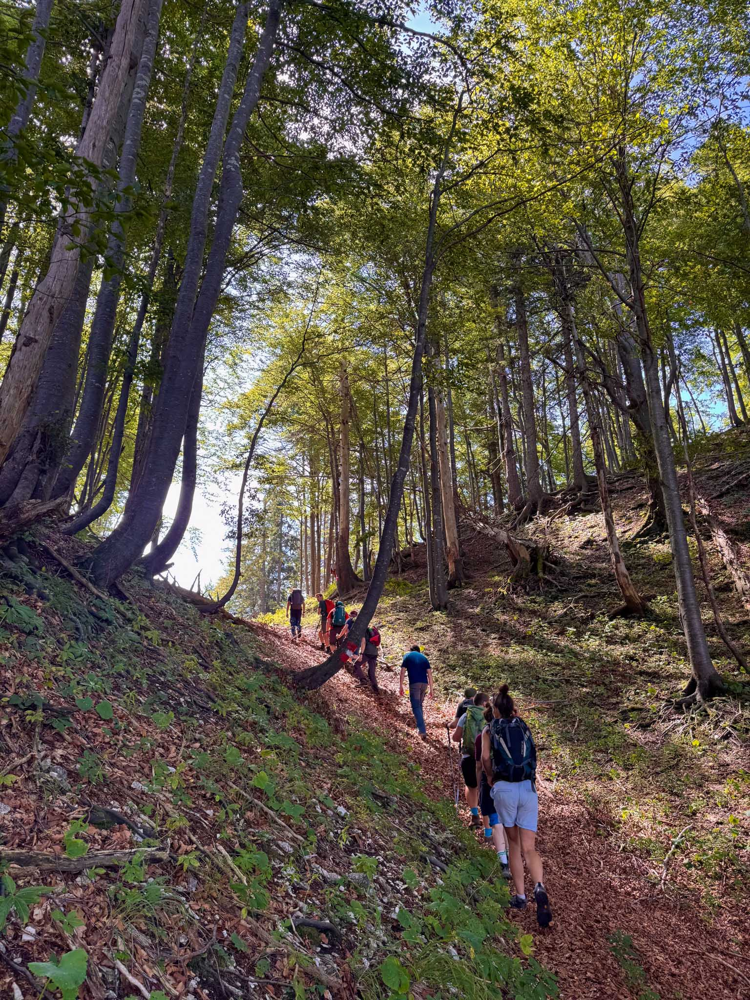

This year I [revisited](../was_uns_die_wildnis_lehrt_wildnisgebiet_duerrenstein_lassingtal_exkursion) the Wildnisgebiet Dürrenstein-Lassingtal in a guided tour.

If you are interested in visiting this UNESCO World Heritage Site, which is normally closed to the public, watch out for the guided tour program on the [Wildnisgebiet Dürrenstein-Lassingtal](https://www.wildnisgebiet.at/) website.

Pictures taken with the Apple iPhone 15 Pro.